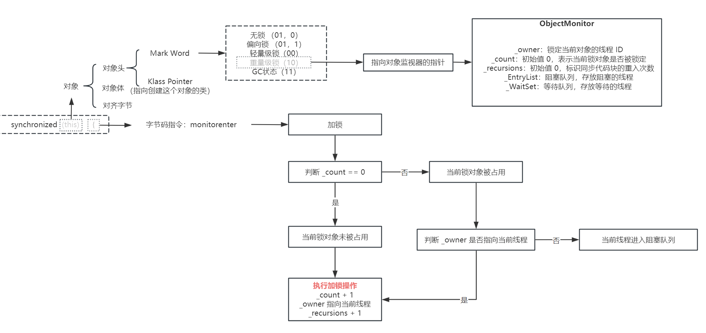
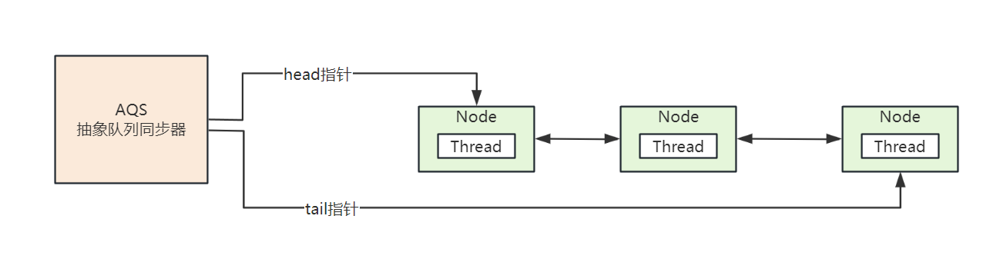
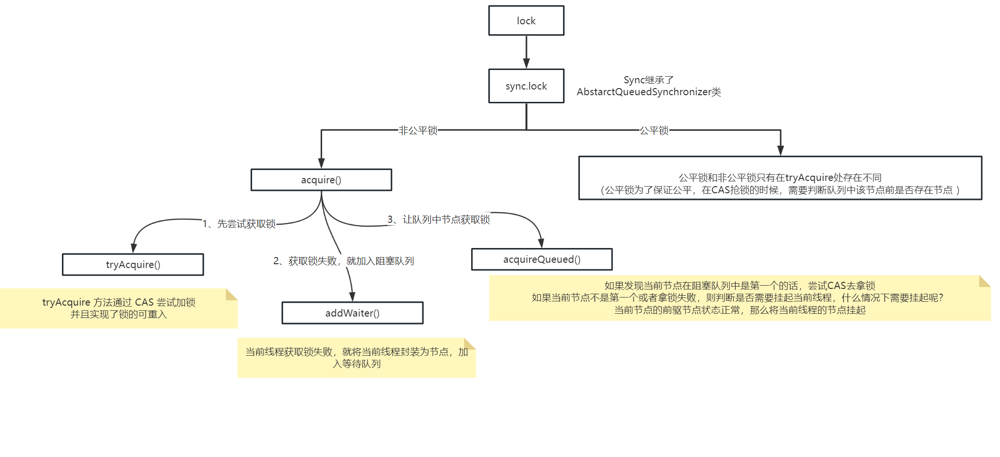

# Java并发编程


## synchronized 如何保证线程安全

JDK1.6 之前，synchronized 是一个重量级锁相比于JUC的锁显得非常笨重，存在性能问题

JDK1.6 及之后，Java 对 synchronized 进行的了一系列优化，性能与 JUC 的锁不相上下 

synchronized 可以保证并发程序的 `原子性、可见性、有序性`

synchronized 可以修饰方法和代码块


### synchronized如何保证可见性？

JMM 关于 synchronized 的两条规定：

- 线程解锁前：必须把自己本地内存中共享变量的最新值刷新到主内存中
- 线程加锁时：将清空本地内存中共享变量的值，从而使用共享变量时需要从主内存中重新读取最新的值


synchronized 实现可见性的过程为：

1. 同步获取锁
2. 清空线程本地内存变量
3. 从主内存拷贝最新变量副本到线程本地内存
4. 执行代码
5. 将更改后的变量副本从线程本地内存刷新到主内存中
6. 释放锁


### synchronized如何保证同步呢？

同步操作主要由两个 jvm 指令实现：`monitorenter、monitorexit`

对于下边代码：

```java
public class LockMain {
    public synchronized void insert() {
        System.out.println("synchronized 方法");
    }
    public void select() {
        synchronized (this) {
            System.out.println("synchronized 块");
        }
    }
}
```

在该类所在的路径，打开命令行执行：

```bash
# 先编译成字节码
javac .\LockMain.java
# 再通过 javap 指令反编译出来 JVM 指令 
# -v 可以输出更多详细信息
javap -v .\LockMain.class
```


反编译后，两个方法的 JVM 指令如下：

```java
public synchronized void insert();
  descriptor: ()V
  flags: ACC_PUBLIC, ACC_SYNCHRONIZED
  Code:
     0: getstatic     #7                  // Field java/lang/System.out:Ljava/io/PrintStream;
     3: ldc           #13                 // String synchronized 方法
     5: invokevirtual #15                 // Method java/io/PrintStream.println:(Ljava/lang/String;)V
     8: return

public void select();
  descriptor: ()V
  flags: ACC_PUBLIC
  Code:
     0: aload_0
     1: dup
     2: astore_1
     3: monitorenter 					  // monitorenter 指令进入同步代码块
     4: getstatic     #7                  // Field java/lang/System.out:Ljava/io/PrintStream;
     7: ldc           #21                 // String synchronized 块
     9: invokevirtual #15                 // Method java/io/PrintStream.println:(Ljava/lang/String;)V
    12: aload_1
    13: monitorexit						  // monitorexit 指令退出同步代码块
    14: goto          22
    17: astore_2
    18: aload_1
    19: monitorexit                       // monitorexit 指令退出同步代码块
    20: aload_2
    21: athrow
    22: return

```

- synchronized 加在方法上，可以看到 insert 方法的 flags 有一个 `ACC_SYNCHRONIZED` 关键字，那么 JVM 进行方法调用时，发现该关键字，就会先获取锁，再执行方法，底层也是基于 monitorenter 和 monitorexit 实现的


- synchronized 加在代码块上，有一个 monitorenter 对应了两个 monitorexit，这是因为编译器会为同步代码块添加一个隐式的 `try-finally`，在 finally 中也会调用 monitorexit 释放锁


## 管程

Java 中提供的并发包都是以管程技术为基础的，管程就是一把解决并发问题的万能钥匙

Java 采用的管程技术在哪里体现了呢？synchronized 关键字以及 wait()、notify()、notifyAll() 都是管程的组成部分

管程解决互斥问题的思路：将共享变量以及对共享变量的操作统一封装起来


## synchronized 锁的优化

JDK1.6 之前，synchronized 使用重量级锁，性能开销很高

JDK1.6 引入了锁的优化：`偏向锁和轻量级锁`

同步锁共有 4 个状态：`无锁、偏向锁、轻量级锁、重量级锁`，这 4 个状态会随着竞争激烈而逐渐升级


### 偏向锁

当一个线程第一次竞争到锁，则拿到的就是偏向锁，此时不存在其他线程的竞争

偏向锁的性能是很高的，他会偏向第一个访问锁的线程，持有偏向锁的线程不需要触发同步，连 CAS 操作都不需要

JDK15 以后逐渐废弃偏向锁，因为维护的开销比较大

### 轻量级锁

在线程竞争不太激烈的情况下，并且线程持有锁时间极短，本质就是 CAS 自旋

### 重量级锁

当 CAS 自旋达到一定次数，就会升级为重量级锁


这几种锁的状态存储在了对象头的 `Mark Word` 中，并且还指向了持有当前对象锁的线程


synchronized 加锁流程如下：




## volatile

synchronized 在多线程场景下存在性能问题

而 `volatile` 关键字是一个更轻量级的线程安全解决方案

volatile 关键字的作用：保证多线程场景下变量的可见性和有序性

- 可见性：保证此变量的修改对所有线程的可见性。
- 有序性：禁止指令重排序优化，编译器和处理器在进行指令优化时，不能把在 volatile 变量操作(读/写)后面的语句放到其前面执行，也不能将volatile变量操作前面的语句放在其后执行。遵循了JMM 的 happens-before 规则

线程写 volatile 变量的过程：

1. 改变线程本地内存中volatile变量副本的值；
2. 将改变后的副本的值从本地内存刷新到主内存

线程读 volatile 变量的过程：

1. 从主内存中读取volatile变量的最新值到线程的本地内存中
2. 从本地内存中读取volatile变量的副本


### volatile 实现原理

volatile 实现可见性就是基于 `内存屏障` 实现的

内存屏障是一种 `CPU 指令`，用于控制特定条件下的重排序和内存可见性问题

- 写操作时，在写指令后边加上 store 屏障指令，让线程本地内存的变量能立即刷到主内存中
- 读操作时，在读指令前边加上 load 屏障指令，可以及时读取到主内存中的值


JMM 中有 4 类`内存屏障`：（Load 操作是从主内存加载数据，Store 操作是将数据刷新到主内存）

- LoadLoad：确保该内存屏障前的 Load 操作先于屏障后的所有 Load 操作。对于屏障前后的 Store 操作并无影响屏障类型 


- StoreStore：确保该内存屏障前的 Store 操作先于屏障后的所有 Store 操作。对于屏障前后的Load操作并无影响
- LoadStore：确保屏障指令之前的所有Load操作，先于屏障之后所有 Store 操作
- StoreLoad：确保屏障之前的所有内存访问操作(包括Store和Load)完成之后，才执行屏障之后的内存访问操作。全能型屏障，会屏蔽屏障前后所有指令的重排


**volatile 的缺陷就是不能保证变量的原子性**

解决方案：可以通过加锁或者 `AtomicInteger`原子操作类来保证该变量操作时的原子性

```java
public static AtomicInteger count = new AtomicInteger(0);
```


## CAS

同步组件中大量使用 CAS 技术实现了 Java 多线程的并发操作。整个 AQS 同步组件、Atomic 原子类操作等等都是以 CAS 实现的

Java 中 ConcurrentHashMap 在 jdk1.8 的版本中也调整为了 CAS+Synchronized。可以说 CAS 是整个 JUC 的基石


CAS 操作主要涉及 3 个操作数：

1. V：要写的内存地址
2. E：预期值
3. N：新写入的值

当内存地址的值等于预期值时，将该内存地址的值写为新的值


Java 中的 CAS 通过 `Unsafe` 类实现


**CAS 缺陷：**

1. 循环时间过长：如果 CAS 自旋一直不成功，会给 CPU 带来很大开销

2. 只能针对一个共享变量

3. 存在 ABA 问题：CAS 只检查了值有没有发生改变，如果原本值为 A，被改为 B 之后，又被改为了 A，那么 CAS 是不会发现值被改编过了的

   ABA 问题解决方案：为每个变量绑定版本号，A-->B-->A 加上版本号为：A1-->B2-->A3


## Lock 锁与 AQS

JUC 包中提供的锁有：

- ReentrantLock 重入锁
- ReentrantReadWriteLock 读写锁
- StampedLock 重入读写锁，JDK1.8 引入


AQS 是抽象队列同步器，是 JUC 中的核心基础组件，AQS 是一个 FIFO 的双向队列，队列中存储的是 thread，JUC 中大部分同步工具类都是基于 AQS 的


线程在获取锁失败之后，会被封装成 Node 节点假如到 AQS 阻塞等待，当获取锁的线程释放锁之后，会从 AQS 队列中唤醒一个线程，AQS 队列如下：




ReentrantLock 加锁流程分析如下：

[AQS源码详细解析参考文章](https://javadoop.com/post/AbstractQueuedSynchronizer)




## synchronized 的缺陷


synchronized 锁缺陷：

1. 无法控制线程阻塞时长
2. 线程阻塞等待锁的状态不可以中断
3. 读多写少的情况下，synchronized 的性能很差


上边这几种缺陷都在 JUC 得到解决，JUC 提供了 `tryLock()` 方法来指定了线程阻塞获取锁的时间，也有读写锁提高读多写少情况下的性能，并提供了 `lockInterruptibly()` 方法，让线程在阻塞获取锁时可以被中断


