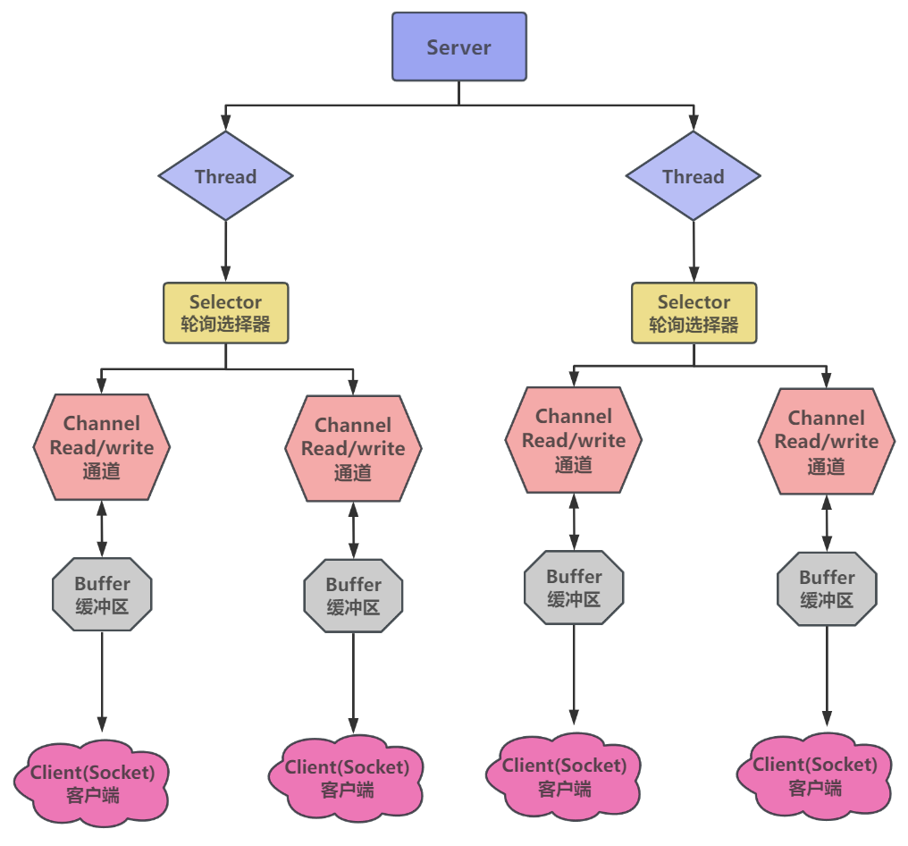
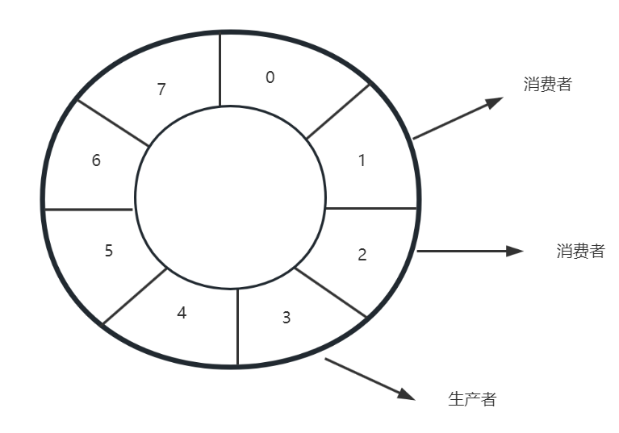

# Java 网络编程


## 深入理解BIO与NIO

### BIO

BIO 为 Blocked-IO（阻塞 IO），在 JDK1.4 之前建立网络连接时，只能使用 BIO

使用 BIO 时，服务端会对客户端的每个请求都建立一个线程进行处理，客户端向服务端发送请求后，先咨询服务端是否有线程响应，如果没有就会等待或者被拒绝


**BIO 基本使用代码：**

服务端：

```java
public class TCPServer {
    public static void main(String[] args) throws Exception {
        // 1.创建ServerSocket对象
        System.out.println("服务端 启动....");
        System.out.println("初始化端口 7777 ");
        ServerSocket ss = new ServerSocket(7777); //端口号
        while (true) {
            // 2.监听客户端
            Socket s = ss.accept(); //阻塞
            // 3.从连接中取出输入流来接收消息
            InputStream is = s.getInputStream(); //阻塞
            byte[] b = new byte[10];
            is.read(b);
            String clientIP = s.getInetAddress().getHostAddress();
            System.out.println(clientIP + "说:" + new String(b).trim());
            // 4.从连接中取出输出流并回话
            OutputStream os = s.getOutputStream();
            os.write("服务端回复".getBytes());
            // 5.关闭
            s.close();
        }
    }
}
```


客户端：

```java
public class TCPClient {
    public static void main(String[] args) throws Exception {
        while (true) {
            // 1.创建Socket对象
            Socket s = new Socket("127.0.0.1", 7777);
            // 2.从连接中取出输出流并发消息
            OutputStream os = s.getOutputStream();
            System.out.println("请输入:");
            Scanner sc = new Scanner(System.in);
            String msg = sc.nextLine();
            os.write(msg.getBytes());
            // 3.从连接中取出输入流并接收回话
            InputStream is = s.getInputStream(); //阻塞
            byte[] b = new byte[20];
            is.read(b);
            System.out.println("客户端发送消息:" + new String(b).trim());
            // 4.关闭
            s.close();
        }
    }
}
```


BIO 缺点：

- Server 端会为客户端的每一个连接请求都创建一个新的线程进行处理，如果客户端连接请求数量太多，则会创建大量线程


### NIO

从 JDK1.4 开始，Java 提供了一系列改进的输入/输出的新特性，被统称为 NIO(即 New IO)，NIO 弥补了 BIO 的不足，在服务端不需要为客户端大量的请求而建立大量的处理线程，只需要用很少的线程就可以处理很多客户端请求

NIO 和 BIO 有着相同的目的和作用，但是它们的实现方式完全不同；

- BIO 以流的方式处理数据，而 NIO 以块的方式处理数据，块 IO 的效率比流 IO 高很多。
- NIO 是非阻塞式的，这一点跟 BIO 也很不相同，使用它可以提供非阻塞式的高伸缩性网络。

NIO 有三大`核心部分`：

- Channel通道
- Buffer缓冲区
- Selector选择器


使用 NIO 时，数据是基于 `Channel` 和 `Buffer` 进行操作的，数据从 `Channel` 被读取到 `Buffer` 或者相反，Selector 用于监听多个 `Channel` 通道的事件（连接事件、读写事件），通过 Selector 就可以实现单个线程来监听多个客户端通道

NIO 中的 Channel 用来建立到目标的一个连接，在 BIO 中流是单向的，例如 FileInputStream 只能进行读取操作，而在 NIO 中 Channel 是双向的，既可以读也可以写


NIO 工作流程图如下：Server 端通过单线程来监听多个客户端 Channel 通道中的事件并进行处理




**NIO 使用示例**

服务端：

```java
public class NIOServer {
    public static void main(String[] args) throws Exception {
        // 1. 开启一个ServerSocketChannel通道
        ServerSocketChannel serverSocketChannel = ServerSocketChannel.open();
        // 2. 开启一个Selector选择器
        Selector selector = Selector.open();
        // 3. 绑定端口号8888
        System.out.println("服务端 启动....");
        System.out.println("初始化端口 8888 ");
        serverSocketChannel.bind(new InetSocketAddress(8888));
        // 4. 配置非阻塞方式
        serverSocketChannel.configureBlocking(false);
        // 5. Selector选择器注册ServerSocketChannel通道，绑定连接操作
        serverSocketChannel.register(selector, SelectionKey.OP_ACCEPT);
        // 6. 循环执行：监听连接事件及读取数据操作
        while (true) {
            // 6.1 监控客户端连接：selecto.select()方法返回的是客户端的通道数，如果为0，则说明没有客户端连接。
            if (selector.select(2000) == 0) {
                System.out.println("服务端等待客户端连接中~");
                continue;
            }
            // 6.2 得到SelectionKey,判断通道里的事件
            Iterator<SelectionKey> keyIterator = selector.selectedKeys().iterator();
            // 遍历所有SelectionKey
            while (keyIterator.hasNext()) {
                SelectionKey key = keyIterator.next();
                // 客户端连接请求事件
                if (key.isAcceptable()) {
                    System.out.println("服务端处理客户端连接事件：OP_ACCEPT");
                    SocketChannel socketChannel = serverSocketChannel.accept();
                    socketChannel.configureBlocking(false);
                    // 服务端建立与客户端之间的连接通道 SocketChannel，并且将该通道注册到 Selector 中，监听该通道的读事件
                    socketChannel.register(selector, SelectionKey.OP_READ, ByteBuffer.allocate(1024));
                }
                // 读取客户端数据事件
                if (key.isReadable()) {
                    // 数据在通道中，先拿到通道
                    SocketChannel channel = (SocketChannel) key.channel();
                    // 取到一个缓冲区，nio读写数据都是基于缓冲区。
                    ByteBuffer buffer = (ByteBuffer) key.attachment();
                    // 从通道中将客户端发来的数据读到缓冲区
                    channel.read(buffer);
                    System.out.println("客户端数据长度：" + buffer.array().length);
                    System.out.println("客户端发来数据：" + new String(buffer.array()));
                }
                //  6.3 手动从集合中移除当前key,防止重复处理
                keyIterator.remove();
            }
        }
    }
}
```


客户端：

```java
public class NIOClient {
    public static void main(String[] args) throws Exception {
        // 1. 得到一个网络通道
        SocketChannel channel = SocketChannel.open();
        // 2. 设置非阻塞方式
        channel.configureBlocking(false);
        // 3. 提供服务器端的IP地址和端口号
        InetSocketAddress address = new InetSocketAddress("127.0.0.1", 8888);
        // 4. 连接服务器端，如果用connect()方法连接服务器不成功，则用finishConnect()方法进行连接
        if (!channel.connect(address)) {
            // 因为接需要花时间，所以用while一直去尝试连接。在连接服务端时还可以做别的事，体现非阻塞。
            while (!channel.finishConnect()) {
                // nio 作为非阻塞式的优势，如果服务器没有响应（不启动服务端)，客户端不会阻塞，最后会报错，客户端尝试连接服务器连不上。
                System.out.println("客户端等待连接建立时，执行其他任务~");
            }
        }
        // 5. 得到一个缓冲区并存入数据
        String msg = "客户端发送消息：hello";
        ByteBuffer writeBuf = ByteBuffer.wrap(msg.getBytes());
        // 6. 发送数据
        channel.write(writeBuf);
        // 阻止客户端停止，否则服务端也会停止。
        System.in.read();
    }
}
```


### AIO

JDK 7 引入了 Asynchronous IO，即 AIO，叫做异步不阻塞的 IO，也可以叫做 `NIO2`

在进行 IO 编程中，常用到两种模式：Reactor模式 和 Proactor 模式

- NIO采用 Reactor 模式，当有事件触发时，服务器端得到通知，进行相应的处理
- AIO采用 Proactor 模式，引入异步通道的概念，简化了程序编写，一个有效的请求才启动一个线程，它的特点是先由操作系统完成后，才通知服务端程序启动线程去处理，一般适用于连接数较多且连接时间较长的应用


## 高性能队列框架-Disruptor

首先介绍一下 Disruptor 框架，Disruptor是一个通用解决方案，用于解决并发编程中的难题（低延迟与高吞吐量），**`Disruptor 在高并发场景下性能表现很好，如果有这方面需要，可以深入研究其源码`**

其本质还是一个队列（环形），与其他队列类似，也是基于生产者消费者模式设计，只不过这个队列很特别是一个环形队列。这个队列能够在无锁的条件下进行并行消费，也可以根据消费者之间的依赖关系进行先后次序消费。

使用 Disruptor 框架的好处就是：`速度快！`

生产者向 RingBuffer 写入，消费者从 RingBuffer 中消费，基于 Disruptor 开发的系统每秒可以支持 600 万订单


**下边介绍一下 Disruptor 框架中常见概念：**

### RingBuffer

基于数组实现的一个环，用于在不同线程间传递数据，RingBuffer 有一个 Sequencer 序号器，指向数组中下一个可用元素




### Sequencer 序号器

该类是 Disruptor 核心，有两个实现类：

- SingleProducerSequencer 单生产者
- MultiProducerSequencer 多生产者


### WaitStrategy 等待策略

消费者等待生产者将数据放入 RingBuffer，有不同的等待策略：

- `BlockingWaitStrategy`：阻塞等待策略，最低效的策略，但其对 CPU 的消耗最小并且在各种不同部署环境中能提供更加一致的性能表现。
- `SleepingWaitStrategy`：休眠等待策略，性能表现跟 BlockingWaitStrategy 差不多，对 CPU 的消耗也类似，但其对生产者线程的影响最小，适合用于异步日志类似的场景。
- `YieldingWaitStrategy`：产生等待策略，性能最好，适合用于低延迟的系统，在要求极高性能且事件处理线程数小于 CPU 逻辑核心数的场景中，推荐使用。是无锁并行


Disruptor 的设计中是没有锁的，在 Disruptor 中出现线程竞争的地方也就是 RingBuffer 中的下标 Sequence，Disruptor 通过 CAS 操作来代替加锁，从而提升性能，CAS 的性能大约是加锁操作性能的 8 倍，


### 伪共享问题

Disruptor 中还会出现`伪共享问题`

参考：《高性能队列——Disruptor》——美团技术团队

**缓存行**

Cache 是由很多个 cache line 组成，每个 cache line 通常是 64B，并且可以有效地引用主内存中的一块地址。

Java 中 long 类型变量是 8B，因此一个 cache line 可以存储 8 个 long 类型变量

CPU 每次从主存中拉取数据时，会把相邻的数据也存入同一个 cache line，那么在访问一个 long 数组时，如果数组中的一个值被加入缓存中，那么也会加载另外 7 个


**伪共享问题**

在 ArrayBlockingQueue 中有 3 个成员变量：

- takeIndex：需要被取走元素下标
- putIndex：可被插入元素下标
- count：队列元素数量

这 3 个变量如果在同一个 cache line 中的话，假如此时有两个线程对这 3 个变量进行操作，线程 A 修改了 takeIndex 变量，那么会导致线程 B 中这个变量所在的 cache line 失效，需要从内存重新读取

这种无法充分利用 cache line 特性的线程，成为 `伪共享`

解决方案就是，增大数组元素之间的间隔，使得不同线程存取的元素位于不同的 cache line 上，通过空间换时间

> 在jdk1.8中，有专门的注解 `@Contended` 来避免伪共享，更优雅地解决问题。


**Disruptor 通过哪些设计来解决队列速度慢的问题了呢？**

- 环形数组 RingBuffer

  采用环形数组，空间重复利用，避免垃圾回收，并且数组对于缓存机制更加友好

- 元素位置定位

  数组长度 2^n，通过位运算，加快定位速度

- 无锁设计

  通过 CAS 代替锁来保证操作的线程安全

  在美团内部，很多高并发场景借鉴了Disruptor的设计，减少竞争的强度。其设计思想可以扩展到分布式场景，通过无锁设计，来提升服务性能


**Disruptor 多个生产者、多个消费者原理**

在 Disruptor 中，多个生产者生产数据时，每个线程获取不同的一段数组空间再加上 CAS 操作，可以避免多个线程重复写同一个元素

在读取时，如何避免读取到未写的元素呢？

Disruptor 中新创建了一个与 RingBuffer 大小相同的 available Buffer，当某个位置写入成功，就在 available Buffer 中标记为 true，通过该标记来读取已经写好的元素


### Disruptor 单生产者单消费者实战

首先引入依赖：

```xml
<dependency>
    <groupId>com.lmax</groupId>
    <artifactId>disruptor</artifactId>
    <version>3.3.4</version>
</dependency>
```


定义订单：

```java
/**
 * 订单对象，生产者要生产订单对象，消费者消费订单对象
 */
public class OrderEvent {
    // 订单的价格
    private long value;

    public long getValue() {
        return value;
    }

    public void setValue(long value) {
        this.value = value;
    }
}
```


定义工厂类，用于创建订单对象：

```java
/**
 * 建立一个工厂类，用于创建Event的实例（OrderEvent)
 */
public class OrderEventFactory implements EventFactory<OrderEvent> {
    @Override
    public OrderEvent newInstance() {
        // 生产对象
        return new OrderEvent();
    }
}
```


定义事件处理器，用于监听消费订单：

```java
/**
 * 消费者
 */
public class OrderEventHandler implements EventHandler<OrderEvent> {
    @Override
    public void onEvent(OrderEvent orderEvent, long l, boolean b) {
        System.err.println("消费者:" + orderEvent.getValue());
    }
}
```


定义生产者，用于生产订单：

```java
public class OrderEventProducer {

    // ringBuffer 用于存储数据
    private RingBuffer<OrderEvent> ringBuffer;

    public OrderEventProducer(RingBuffer<OrderEvent> ringBuffer) {
        this.ringBuffer = ringBuffer;
    }

    // 生产者向 ringBuffer 中生产消息
    public void sendData(ByteBuffer data) {
        // 1. 生产者先从 ringBuffer 拿到可用的序号
        long sequence = ringBuffer.next();
        try {
            // 2.根据这个序号找到具体的 OrderEvent 元素, 此时获取到的 OrderEvent 对象是一个没有被赋值的空对象
            OrderEvent event = ringBuffer.get(sequence);
            // 3. 设置订单价格
            event.setValue(data.getLong(0));
        } catch (Exception e) {
            e.printStackTrace();
        } finally {
            // 4. 提交发布操作
            ringBuffer.publish(sequence);
        }
    }
}
```


测试类：

```java
public class Main {
    public static void main(String[] args) {
        // 初始化一些参数
        OrderEventFactory orderEventFactory = new OrderEventFactory();
        int ringBufferSize = 8;
        ExecutorService executor = Executors.newFixedThreadPool(Runtime.getRuntime().availableProcessors());
        /**
         * 参数说明：
         * eventFactory:消息(event)工厂对象
         * ringBufferSize: 容器的长度
         * executor:线程池，建议使用自定义的线程池，线程上限。
         * ProducerType:单生产者或多生产者
         * waitStrategy:等待策略
         */
        // 1. 实例化disruptor对象
        Disruptor<OrderEvent> disruptor = new Disruptor<OrderEvent>(
                orderEventFactory,
                ringBufferSize,
                executor,
                ProducerType.SINGLE,
                new BlockingWaitStrategy());
        // 2. 向 Disruptor 中添加消费者，消费者监听到 Disruptor 的 RingBuffer 中有数据了，就会进行消费
        disruptor.handleEventsWith(new OrderEventHandler());
        // 3. 启动disruptor
        disruptor.start();
        // 4. 拿到存放数据的容器：RingBuffer
        RingBuffer<OrderEvent> ringBuffer = disruptor.getRingBuffer();
        // 5. 创建生产者
        OrderEventProducer producer = new OrderEventProducer(ringBuffer);
        // 6. 通过生产者向容器 RingBuffer 中存放数据
        ByteBuffer bb = ByteBuffer.allocate(8);
        for (long i = 0; i < 100; i++) {
            bb.putLong(0, i);
            producer.sendData(bb);
        }

        // 7.关闭
        disruptor.shutdown();
        executor.shutdown();
    }
}

```


### Disruptor 多生产者和多消费者实战


定义消费者，用于从 ringBuffer 中消费订单：

```java
public class ConsumerHandler implements WorkHandler<Order> {

    // 每个消费者有自己的id
    private String comsumerId;

    // 计数统计，多个消费者，所有的消费者总共消费了多个消息。
    private static AtomicInteger count = new AtomicInteger(0);

    private Random random = new Random();

    public ConsumerHandler(String comsumerId) {
        this.comsumerId = comsumerId;
    }

    // 当生产者发布一个 sequence，ringbuffer 中一个序号，里面生产者生产出来的消息，生产者最后publish发布序号
    // 消费者会监听，如果监听到，就会ringbuffer去取出这个序号，取到里面消息
    @Override
    public void onEvent(Order event) throws Exception {
        // 模拟消费者处理消息的耗时，设定1-4毫秒之间
        TimeUnit.MILLISECONDS.sleep(1 * random.nextInt(5));
        System.out.println("当前消费者:" + this.comsumerId + ", 消费信息 ID:" + event.getId());
        // count 计数器增加 +1，表示消费了一个消息
        count.incrementAndGet();
    }

    // 返回所有消费者总共消费的消息的个数。
    public int getCount() {
        return count.get();
    }
}
```


定义订单：

```java
@Data
public class Order {

    private String id;

    private String name;

    private double price;

    public Order() {
    }
}
```


定义生产者，用于向 ringBuffer 中生产订单：

```java
public class Producer {
    private RingBuffer<Order> ringBuffer;

    // 为生产者绑定 ringBuffer
    public Producer(RingBuffer<Order> ringBuffer) {
        this.ringBuffer = ringBuffer;
    }

    // 发送数据
    public void sendData(String uuid) {
        // 1. 获取到可用sequence
        long sequence = ringBuffer.next();
        try {
            Order order = ringBuffer.get(sequence);
            order.setId(uuid);
        } finally {
            // 2. 发布序号
            ringBuffer.publish(sequence);
        }
    }
}
```


测试类：

```java
public class TestMultiDisruptor {
    public static void main(String[] args) throws InterruptedException {
        // 1. 创建 RingBuffer，Disruptor 包含 RingBuffer
        RingBuffer<Order> ringBuffer = RingBuffer.create(ProducerType.MULTI, // 多生产者
                new EventFactory<Order>() {
                    @Override
                    public Order newInstance() {
                        return new Order();
                    }
                }, 1024 * 1024, new YieldingWaitStrategy());
        // 2. 创建 ringBuffer 屏障
        SequenceBarrier sequenceBarrier = ringBuffer.newBarrier();
        // 3. 创建多个消费者数组
        ConsumerHandler[] consumers = new ConsumerHandler[10];
        for (int i = 0; i < consumers.length; i++) {
            consumers[i] = new ConsumerHandler("C" + i);
        }
        // 4. 构建多消费者工作池
        WorkerPool<Order> workerPool = new WorkerPool<Order>(ringBuffer, sequenceBarrier, new EventExceptionHandler(), consumers);
        // 5. 设置多个消费者的 sequence 序号，用于单独统计消费者的消费进度。消费进度让RingBuffer知道
        ringBuffer.addGatingSequences(workerPool.getWorkerSequences());
        // 6. 启动 workPool
        workerPool.start(Executors.newFixedThreadPool(5)); // 在实际开发，自定义线程池。
        //
        final CountDownLatch latch = new CountDownLatch(1);
        // 100 个生产者向 ringBuffer 生产数据，每个生产者发送 100 个数据，共 10000 个数据
        for (int i = 0; i < 100; i ++) {
            final Producer producer = new Producer(ringBuffer);
            new Thread(new Runnable() {
                @Override
                public void run() {
                    try {
                        // 先等待创建完 100 个生产者之后，再发送数据
                        latch.await();
                    } catch (Exception e) {
                        e.printStackTrace();
                    }
                    // 每个生产者发送 100 个数据
                    for (int j = 0; j < 100; j ++) {
                        producer.sendData(UUID.randomUUID().toString());
                    }
                }
            }).start();
        }
        // 把所有线程都创建完
        TimeUnit.SECONDS.sleep(2);
        // 唤醒线程让生产者开始发送数据，开始运行100个线程
        latch.countDown();
        // 等待数据发送完毕
        TimeUnit.SECONDS.sleep(10);
        System.out.println("任务总数:" + consumers[0].getCount());
    }

    static class EventExceptionHandler implements ExceptionHandler<Order> {
        //消费时出现异常
        @Override
        public void handleEventException(Throwable throwable, long l, Order order) {
        }

        //启动时出现异常
        @Override
        public void handleOnStartException(Throwable throwable) {
        }

        //停止时出现异常
        @Override
        public void handleOnShutdownException(Throwable throwable) {
        }
    }
}
```


### Disruptor 与 Netty 结合大幅提高数据处理性能

使用 Netty 接收处理数据时，不要在工作线程上进行处理，降低 Netty 性能，可以使用异步机制，通过线程池来处理，异步处理的话，就是用 Disruptor 来作为任务队列即可

即在 Netty 收到处理数据请求时，封装成一个事件，向 Disruptor 中推送，再通过多消费者来进行处理，可以提升 Netty 处理数据时的性能，流程图如下（绿色部分为通过 Disruptor 优化部分）：

