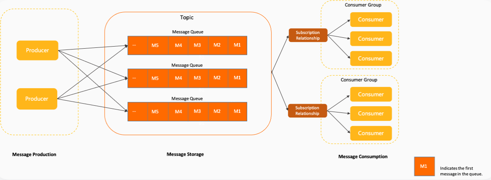

# RocketMQ


## MQ 之间的对比

三种常用的 MQ 对比，ActiveMQ、Kafka、RocketMQ

性能方面：

- 三种 MQ 吞吐量级别为：万，百万，十万
- 消息发送时延：毫秒，毫秒，微秒
- 可用性：主从，分布式，分布式

扩展性方面：

- 水平伸缩能力：均支持
- 技术栈：Java，Java/Scala，Java

功能维度方面：

- 消息重试能力：均支持
- 消息堆积能力：跟吞吐量成正相关，三种 MQ 分别为：弱，强，强
- 消息过滤：支持，不支持，支持
- 延迟消息：均支持
- 消息回溯（用于消费者宕机恢复后，回溯到宕机前消费的位置）：不支持，支持，支持


## RocketMQ 领域模型

- Topic：主题，可以理解为类别、分类的概念
- MessageQueue：消息队列，存储数据的一个容器（队列索引数据），默认每个 Topic 下有 4 个队列被分配出来存储消息
- Message：消息，真正携带信息的载体概念
- Producer：生产者，负责发送消息
- Consumer：消费者，负责消费消息
- ConsumerGroup：众多消费者构成的整体或构成的集群，称之为消费者组
- Subscription：订阅关系，消费者得知道自己需要消费哪个 Topic 下的哪个队列的数据




<<<<<<< HEAD
=======


## Spring Cloud Alibaba 集成 RocketMQ 最佳实践

SpringBoot 相对于 SSM 来说已经很大程度上简化了开发，但是使用 SpringBoot 集成一些第三方的框架，还是需要花费一些力气

因此，SpringCloud 出现的宗旨就是简化 SpringBoot 集成第三方框架的过程，SpringCloud 内置集成了很多第三方插件，但是 SpringCloud 前期很重的依赖了 Netflix 组件， 但是 Netflix 组件不再维护了

因此，基于 SpringCloud 又出现了 SpringCloudAlibaba，可以灵活的进行扩展、替换插件，那么通过 SpringCloudAlibaba 集成 RocketMQ 之后，关系图如下：


[SpringCloudAlibaba 集成 RocketMQ 官方文档](https://sca.aliyun.com/zh-cn/docs/2022.0.0.0/user-guide/rocketmq/quick-start)


### 集成依赖引入

```xml
<parent>
  <artifactId>spring-boot-starter-parent</artifactId>
  <groupId>org.springframework.boot</groupId>
  <version>2.3.12.RELEASE</version>
</parent>

<properties>
  <project.build.sourceEncoding>UTF-8</project.build.sourceEncoding>
  <maven.compiler.source>1.8</maven.compiler.source>
  <maven.compiler.target>1.8</maven.compiler.target>
  <com.alibaba.cloud.version>2.2.8.RELEASE</com.alibaba.cloud.version>
  <com.cloud.version>Hoxton.SR12</com.cloud.version>
</properties>


<dependencyManagement>
  <dependencies>
    // 集成 SpringCloudAlibaba
    <dependency>
      <groupId>com.alibaba.cloud</groupId>
      <artifactId>spring-cloud-alibaba-dependencies</artifactId>
      <version>${com.alibaba.cloud.version}</version>
      <type>pom</type>
      <scope>import</scope>
    </dependency>
    // 集成 SpringCloud
    <dependency>
      <groupId>org.springframework.cloud</groupId>
      <artifactId>spring-cloud-dependencies</artifactId>
      <version>${com.cloud.version}</version>
      <type>pom</type>
      <scope>import</scope>
    </dependency>
  </dependencies>
</dependencyManagement>
```


要定制多个 topic 的话，自己定义 CustomSink 和 CustomSource 注解，集成原来的 Sink 和 Source

并且 yml 文件中进行配置


引入 DashBoard 来观测 Broker 中消息累积以及消费的进度


跟踪消息轨迹：

在出现消息丢失情况下，可以判断消息的传输在哪里出现了问题

使用消息轨迹的话，需要设计消息的 key，之后通过消息的 key 进行检索


SPMC 集群实战：

>>>>>>> 3e8fb52 (更新)
