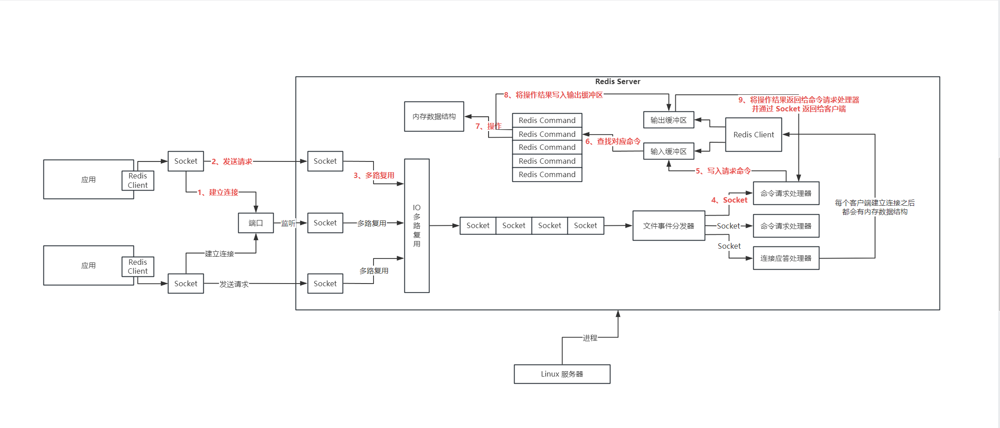
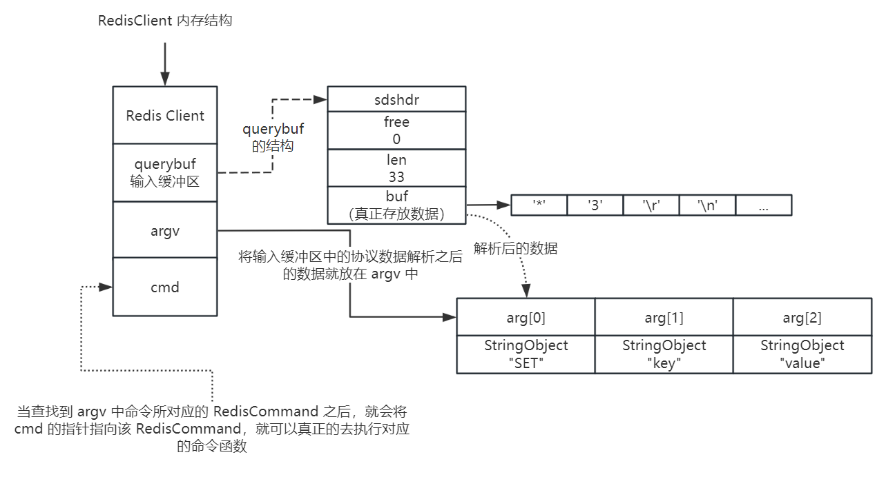
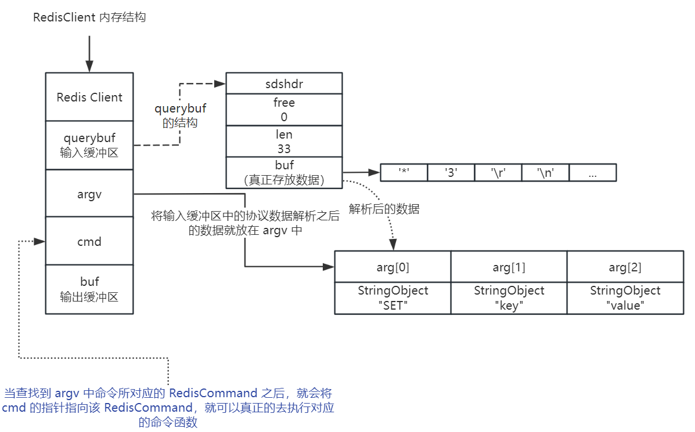

# Redis 深入理解


## Redis Server 运行原理




## Redis 服务器中 Socket 网络建立以及文件事件模型

一个 redis 单机，可以抗几百上千的并发，这里的并发指的就是同时可以有几百个 client 对这个 redis server 发起请求，都需要去建立网络连接，同时间可能会有几百个 redis client 通过 socket 和我们的 redis server socket 建立网络连接


如果自己使用 java socket 编程，无论使用 nio、bio，一旦要是说一个 server 和一个 client 完成了一个网络连接之后，就会多出来一个 socket，socket 是抽象出来通信的模型，通过一个 socket 就可以跟对方的 socket 形成一个连接


那么对于 redis server 而言，内部为了支撑并发访问的大量的 redis client，redis server 内部就会有几百个 socket，网络连接同时在维持着

因此呢，在 bio 模式下，一个 socket 连接就对应了一个线程来监听请求

在 nio 模式下，可以实现 IO 多路复用，一个线程就可以监听多个 socket 的网络事件

在 redis server 中，就是通过 `FileEventHandler` 进行多路复用

socket 中会产生一些网络事件，accept（连接应答）、read（有数据可以读的事件）、write（有数据可以写的事件）、close（连接被关闭） 在 redis 中这些`网络事件`都被抽象为`文件事件`

## 基于队列串行化的文件事件处理机制

针对 server 端的大量的 socket，不太可能每一个 socket 都使用一个线程来监听，因为线程资源不够，所以不会采用 bio 模式，因此解决方案就是针对大量的 socket，使用一个线程监听 n 多个 socket，采用 IO 多路复用模式

当 server 端保持了大量的 redis client 的连接，可能在同一时间，大量的 redis client 并发的给 server 端发送大量的请求，redis server 内部大量的 socket 会突然同一时间产生大量的事件（例如 read 事件，write 事件）

对于这些网络事件的处理，有两种解决方案（Redis Server 中就采用了第一种，使用队列进行串行化处理）：

- 使用 queue 队列，将接收到事件的 socket 放入 queue 中进行排队，串行化进行处理
- 将有事件发生的 socket 分发给不同的线程，来进行并发的处理，开启大量的多线程，多个线程并发的去处理不同的 socket 里面的事件


client 和 server 端建立连接的流程为：

我们会有一个专门的 socket 去监听端口，用于监听来自客户端的连接请求，这个连接请求经过 IO 多路复用，由 `连接应答处理器` 进行处理，处理的操作其实也就是服务端和客户端进行 TCP 三次握手建立连接，建立好连接之后服务端就会创建一个新的 socket，这个 socket 就是接收客户端对应的事件

那么连接建立之后，客户端对于服务端的一些读写请求就会通过 socket 进行请求，请求到达服务端之后，通过 IO 多路复用将任务分发给不同的事件处理器进行处理，如果是读写请求，就将读写的响应通过 socket 响应给客户端


## Redis 串行化单线程模型为什么能高并发？

首先 Redis 是通过 `串行化 + 单线程` 来应对高并发的

Redis 首先是基于内存操作，速度很快，并且当大量请求进入后，都放入队列中，进行串行化处理，由单个线程直接基于内存进行操作，并且单线程的情况下也不需要加锁以及线程上下文切换（多线程是很占用 CPU 资源的），核心就在于 Redis 通过单线程基于内存进行操作！

## Redis 内核级请求处理流程

Redis Server 其实就是 Linux 服务器中的一个进程

主要还是下图的流程

1. 应用先和 server 端建立 TCP 连接
2. 建立连接之后，server 端就会有一个与该客户端通信的 socket，客户端的读写请求发送到服务端的 socket
3. 那么通过 IO 多路复用，收到读写请求的 socket 会到队列中排队等待处理
4. 由文件事件分发器将事件分发给对应的命令请求处理器
5. server 端内部也是有一个 Redis Client 的，由这个 Client 来处理对数据的操作，这个 Client 有一个输入缓冲区和输出缓冲区，先将读写命令写入输入缓冲区
6. 再去找到对应的 Redis Command 也就是查找到对应的命令
7. 之后就去操作内存中的数据
8. 操作后将操作结果写入输出缓冲区中
9. 最终命令请求处理器将输出缓冲区中的响应结果通过 Socket 发送给客户端


## Redis 内核中的请求数据结构

Redis 协议说明文档：http://www.redis.cn/topics/protocol.html

```bash
# *3 表示有 3 个命令字符串
# $3 表示长度
# \r\n 也就是换行操作
*3\r\n$3\r\nSET\r\n$3\r\nkey\r\j$5\r\nvalue\r\n

# 把\r\n翻译成换行，数据就为下边这个样子
*3
$3
SET
$3
key
$5
value
```

对于 `set key value` 命令来说，通过协议组织成上边的数据，那么从 client 端发送到 server 需要序列化成字节数据流，之后再通过 socket 进行传输，server 端收到字节流数据之后，会进行反序列化，将字节流数据转为了 `*3\r\n$3\r\nSET\r\n$3\r\nkey\r\j$5\r\nvalue\r\n`，这个数据就会被放到 server 端的 RedisClient 的输入缓冲区中

那么这个协议数据在 server 中的 Redis Client 中，就会被解析成 argv 的一个参数，也就是具体的命令，如下图：



那么在 argv 中就解析出来了真正需要执行的命令了，下一步就要执行对应的命令了


## Redis 内核中命令函数的查找

在 Redis Server 中将所有的命令都放在了一个`命令查找表`中，那么在上边的 argv 中拿到了命令的名称，就可以去命令查找表中去查找对应的 RedisCommand，在 Redis Client 的输入缓冲区中有一个变量 `cmd` 就会去指向该命令所对应的 RedisCommand，之后就可以真正的去调用命令函数，来操作 Redis 中的内存数据结构，之后将操作的结果还是按照 Redis 的协议给放入到 Redis Client 的输出缓冲区中，之后就可以通过 Socket 将结果返回给客户端了




## Redis Server 启动流程分析

Redis 我们作为缓存使用比较多

其实 Redis 本质上是一个基于内存的 Nosql 数据存储服务，只是因为 Redis 是基于内存进行操作，比较快，所以我们用来做缓存

