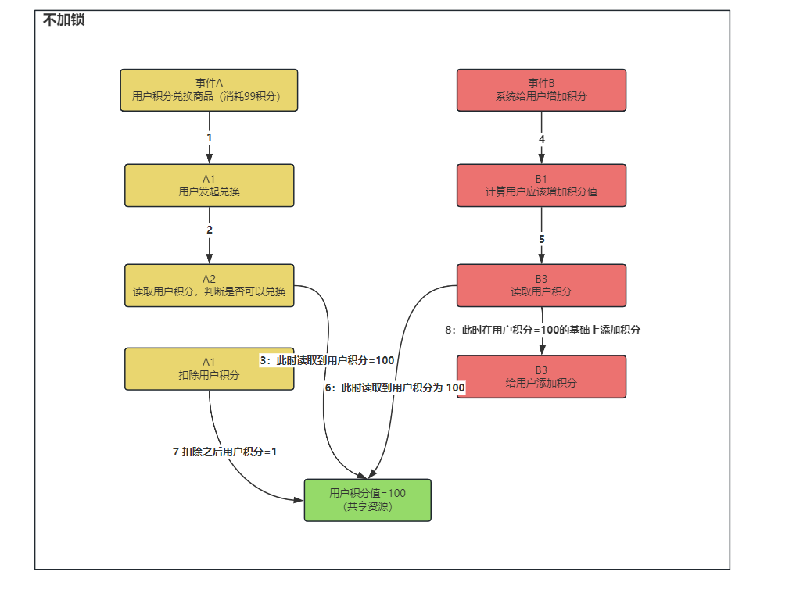

## Redisson 分布式锁？在项目中哪里使用？多久会进行释放？如何加强一个分布式锁？

答：

**什么时候需要使用分布式锁呢？**

在分布式的场景下，使用 Java 的单机锁并不可以保证多个应用的同时操作共享资源时的安全性，需要通过分布式锁保证多个进程同步访问共享资源

**举一个使用分布式锁的场景吧？**

在积分场景下需要使用分布式锁，因为积分属于是共享资源，需要保证多个应用对积分的同步访问才行，那么如下图，则为不添加分布式锁时，如何造成了数据不安全：




首先入门级别的分布式锁是通过 `setnx` 进行实现，使用 `setnx` 实现有四个注意点

1. 需要设置锁的超时时间（如果不设置，在释放锁时，如果机器宕机，会导致锁无法释放）

2. 需要设置一个唯一 ID，表示这个锁是哪个用户添加的，必须由添加锁的用户释放

   （如果不设置，线程1在执行任务时，可能锁的超时时间已经达到，被自动释放，此时线程2加锁，开始执行业务，但正好线程1执行完毕，释放锁，由于没有唯一ID表示，线程1将线程2加的锁给释放掉了）

3. 需要`锁续命` 

   有可能锁的过期时间设置的太短，导致业务没有执行完毕，锁就被自动释放，因此要使用锁续命来解决（大概逻辑是使用子线程执行定时任务，定时任务间隔时间要小于 key 的过期时间，子线程隔一段时间判断主线程是否在执行，如果在执行，就重新设置一下过期时间）

4. 可重入问题：setnx 实现的分布式锁不可重入，这样获取锁的线程在重复进入相同锁的代码块中会造成死锁

而在 Redission 中已经帮我们实现好了分布式锁，下来看一下 Redission 中的分布式锁：


**Redission 中获取锁逻辑：**

在 Redission 中加锁，通过一系列调用会到达下边这个方法

他的可重入锁的原理也就是使用 hash 结构来存储锁，key 表示锁是否存在，如果已经存在，表示需要重复访问同一把锁，会将 value + 1，即每次重入一次 value 就加 1，退出一次 value 就减 1

下列方法有三个参数分别为：

- KEYS[1] ： 锁名称
- ARGV[1]： 锁失效时间
- ARGV[2]： id + “:” + threadId; 锁的小key

```java
    <T> RFuture<T> tryLockInnerAsync(long leaseTime, TimeUnit unit, long threadId, RedisStrictCommand<T> command) {
        internalLockLeaseTime = unit.toMillis(leaseTime);

        return commandExecutor.evalWriteAsync(getName(), LongCodec.INSTANCE, command,
                  "if (redis.call('exists', KEYS[1]) == 0) then " +
                      "redis.call('hset', KEYS[1], ARGV[2], 1); " +
                      "redis.call('pexpire', KEYS[1], ARGV[1]); " +
                      "return nil; " +
                  "end; " +
                  "if (redis.call('hexists', KEYS[1], ARGV[2]) == 1) then " +
                      "redis.call('hincrby', KEYS[1], ARGV[2], 1); " +
                      "redis.call('pexpire', KEYS[1], ARGV[1]); " +
                      "return nil; " +
                  "end; " +
                  "return redis.call('pttl', KEYS[1]);",
                    Collections.<Object>singletonList(getName()), internalLockLeaseTime, getLockName(threadId));
    }
```


**Redission 中锁续命原理：**

Redission 底层有个看门狗机制，加锁成功后会有一个定时任务，默认锁的失效时间是 30s，该定时任务每隔锁失效时间的 1/3 就会去续约锁时间，也就是每隔 10s 进行锁续命


**如何加强一个分布式锁？**

也就是如何提升一个分布式锁的性能，分布式锁本质上是将并行操作改为串行，那么我们可以通过使用`分段锁`来提升性能，比如说有 1000 个库存的话，读入到缓存中将分为 10 份进行存储，即 `product_stock_1 = 100, product_stock_2 = 100, ...`，给每一份都加上所，那么多个线程来竞争这 10 把锁，比原来竞争 1 把锁的性能提高 10 倍


