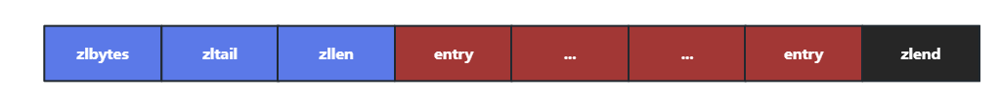

## Redis 的 SDS 了解吗？

答：

Redis 创建了 SDS（simple dynamic string） 的抽象类型作为 String 的默认实现

SDS 的结构如下：

```c++
struct sdshdr {
  // 字节数组，用于保存字符串
  char buf[];
  // buf[]中已使用字节数量，称为SDS的长度
  int len;
  //  buf[]中尚未使用的字节数量
  int free;
}
```


**为什么 Redis 不使用 C 语言默认的字符串呢？（Redis 是用 C 实现的）**

- **提升获取长度性能**：使用 SDS 可以以 `O(1)` 的时间复杂度取到字符串的长度，因为 SDS 中存储了字符串的长度；在 C 语言的字符串中，需要遍历才可以获取长度

- **保障二进制安全**：C 字符串只能包含符合某种编码格式的字符，如 ASCII、UTF-8，并且除了字符串末尾外，不能含有 `'\0'`，这是因为 C 字符串是以 `'\0'` 结尾的，而在视频、图片中的数据以 `'\0'` 作为分隔符很常见，因此 C 字符串无法存储这些数据；而在 SDS 中存储了字符串的长度，因此不需要分隔符

- **减少内存再分配数**：SDS 采用了`空间预分配策略`，每次 SDS 进行空间扩展时，程序会同时分配所需空间和额外的未使用空间，以减少内存的再分配次数。额外分配的未使用空间大小取决于空间扩展后SDS的len属性值。

  - 如果len < 1M，那么分配的未使用空间大小与 len 相同
  - 如果len >= 1M，那么分配的未使用空间大小为 1M

  SDS 也采用了`惰性空间释放策略`，即 SDS 字符串长度变短，并不会立即释放空间，而是将未使用的空间添加到 free 中，以便后期扩展 SDS 时减少内存分配次数


## Redis 的 zipList

答：

Redis 的压缩列表即 ziplist，可以包含多个节点，每个节点可以保存一个长度受限的字符数组或者整数

因为 ziplist  节约内存的性质，哈希键、列表键和有序集合键初始化的底层实现皆采用 ziplist

ziplist 底层结构由 3 部分组成：head、entries、end，这三部分在内存上连续存放

- **head**

  head由三部分组成

  - `zlbytes`：占4B，表示 zipList 整体所占字节数，包括 zlbytes 本身长度
  - `zltail`：占4B，用于存放 zipList 最后一个 entry 在整个数据结构中的偏移量，可用于定位链表末尾的 entry
  - `zllen`：占2B，存放列表包含的 entry 个数

- **entries**

  entries 是真正的列表，由很多 entry 构成，由于元素类型、数值不同，每个 entry 的长度也不同

  entry由三部分组成

  - `prevlength`：记录上一个 entry 的长度，用于逆序遍历，默认长度为 1 字节，如果上一个 entry 的长度 >= 254B，prevlength 就会扩展为 5B
  - `encoding`：标志后面的 data 的具体类型。如果 data 为整数，encoding 固定长度为1B，如果data为字符串，encoding可能为1B、2B、5B，data字符串不同的长度，对应着不同的encoding长度
  - `data`：真正存储的数据，数据类型只能是整数或字符串

- **end**

  end只包含一部分，称为 zlend，占1B，值为255，也就是8个1，表示 zipList 列表的结束




## Redis 的 listPack

答：

Redis 的 zipList 存在一些缺点：

- 实现复杂，为了实现逆序遍历，每一个 entry 都存储了前一个 entry 的长度，这样在插入和更新时可能会造成`连锁更新`

  连锁更新举例：假如 ziplist 中每一个 entry 都是很接近但又不到 254B，此时每个 entry 的 prevlength 使用 1 个字节就可以保存上个节点的长度，但是此时如果向 ziplist 中间插入一个新的节点，长度大于 254B，那么新插入节点后边的节点需要把 prevlength 扩展为 5B 来存储新插入节点的长度，那么扩展后该节点长度又大于 254B，因此后边节点需要再次扩展 prevlength 来存储该节点的长度，导致了插入节点后边的所有节点都需要更新 prevlength 的值，这属于是极端情况下才会发生

因此为了更好的性能，在 Redis7.0 中，将 ziplist 全部替换为了 listpack，但是为了兼容，还是保留了 ziplist 的相关属性

- **head**

  head包括两部分：

  - `totalBytes`：占4B，存放 listPack 整体所占字节数，包含 totalBytes 本身
  - `elemNum`：占 2B，存放 entry 个数

- **entries**

  entries是真正的列表，由很多entry组成，每个entry长度不同

  entry包括三部分`（删除了prevlength，增加了element-total-len）`：

  - `encoding`：标志后面的 data 的具体类型。如果 data 为整数，encoding 固定长度为 1B，如果 data 为字符串，encoding 可能为 1B、2B 或 5B，data 字符串不同的长度，对应着不同的 encoding 长度
  - `data`：存储真正数据
  - `element-total-len`：记录当前 entry 长度，用于实现逆序遍历，占1、2、3、4或5字节


