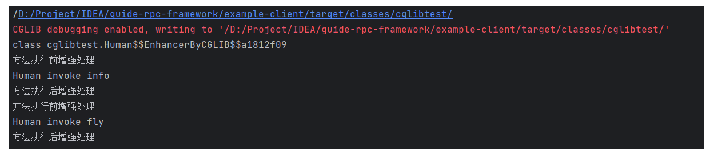

## JDK 动态代理和 CGLIB 动态代理对比

1. JDK 动态代理只能代理实现了接口的类，而 CGLIB 可以代理未实现任何接口的类。另外CGLIB 动态代理是通过生成一个被代理类的子类来拦截被代理类的方法调用，因此不能代理声明为final 类型的类和方法
2. 就二者的效率来说，大部分情况都是JDK 动态代理更优秀，随着 JDK 版本的升级，这个优势更加明显。
3. JDK 动态代理利用了拦截器、反射机制生成一个代理接口的匿名类，在调用具体方法前调用 InvokeHandler 来处理；CGLIB 动态代理利用了 ASM 框架，将代理对象类的 class 文件加载进来，通过修改其字节码生成子类来处理

**JDK动态代理底层原理：**

假如目前有一个接口 `HelloService`、实现类`HelloServiceImpl（包含一个 say() 方法，需要被增强）`、增强类`MyInvocationHandler`

在 JDK 动态代理中，生成的代理类 `$Proxy1` 是继承 Proxy 并且实现 `HelloService` 接口，当调用代理类的方法时，会进入到拦截器 `MyInvocationHandler` 的 invoke 方法中，下边为代理类生成代码：

```java
// 生成代理对象
HelloService helloService = (HelloService) Proxy.newProxyInstance(MyInvocationHandler.class.getClassLoader(), new Class[]{HelloService.class}, new MyInvocationHandler());
helloService.say();
```

通过上述代码拿到的 helloService 对象其实就是 JDK 动态代理对象，我们可以通过添加 VM options 来将动态代理对象保存下来，添加 VM options 如下：

`-Dsun.misc.ProxyGenerator.saveGeneratedFiles=true`

之后生成的动态代理对象如下（这里为了更直观的看代理类，因此只保留了最关键的代码），say() 其实就是定义在 HelloService 中需要被增强的方法，那么当调用 `helloService.say()` 时，其实就是调用 `$Proxy1.say()` 方法，在该方法中会调用 `h.invoke()` 方法，这里的 h 就是我们自己定义的 `MyInvocationHandler` 拦截器，之后就会进入到拦截器的 `invoke` 方法，

```java
import com.example.nettystudy.JdkProxyTest.HelloService;
import java.lang.reflect.InvocationHandler;
import java.lang.reflect.Method;
import java.lang.reflect.Proxy;
import java.lang.reflect.UndeclaredThrowableException;

public final class $Proxy1 extends Proxy implements HelloService {
    private static Method m1;
    private static Method m2;
    private static Method m3;
    private static Method m0;

    ...
    
    public final void say() throws  {
        try {
            super.h.invoke(this, m3, (Object[])null);
        } catch (RuntimeException | Error var2) {
            throw var2;
        } catch (Throwable var3) {
            throw new UndeclaredThrowableException(var3);
        }
    }

    ...
}

```


下边来看一下拦截器的 invoke 方法，该方法有 3 个参数，第一个参数 proxy 也就是上边的代理类对象， method 就是接口中的 say 方法，那么在拦截器中就会执行我们自己添加的增强操作了

```java
public class MyInvocationHandler implements InvocationHandler {

    @Override
    public Object invoke(Object proxy, Method method, Object[] args) throws Throwable {
        System.out.println("方法执行前");
        // 这里 HelloServiceImpl 是被代理对象，被代理对象执行方法
        Object result = method.invoke(new HelloServiceImpl(), args);
        System.out.println("方法执行后");
        return result;
    }
}

```


**cglib动态代理底层原理**

cglib 采用底层的字节码技术，为一个类创建子类，并且在子类中使用方法去拦截所有的父类调用，并织入横切逻辑

cglib 使用如下：

```java
// Human.java
public class Human {
    public void info() {
        System.out.println("Human invoke info");
    }
    public void fly() {
        System.out.println("Human invoke fly");
    }
}

// CGLibProxy.java  拦截器
class CGLibProxy implements MethodInterceptor {
     
  
	 // CGLib需要代理的目标对象 
    private Object targetObject;
  
    public Object getProxyInstance(Object obj) { 
     
        this.targetObject = obj;  
        //1. 创建一个工具类
        Enhancer enhancer = new Enhancer();
        // 2.设置父类--可以是类或者接口
        enhancer.setSuperclass(obj.getClass());  
        //3. 设置回调函数
        enhancer.setCallback(this);  
        //4. 创建子类对象，即代理对象
        Object proxyObj = enhancer.create();  
        // 返回代理对象 
        return proxyObj;
    }  
  
    public Object intercept(Object proxy, Method method, Object[] args,
                            MethodProxy methodProxy) throws Throwable {
        System.out.println("方法执行前增强处理");
        // 执行目标目标对象方法
        Object obj = method.invoke(targetObject, args);
        System.out.println("方法执行后增强处理");
        return obj;
    }  
}

// TestCglibProxy.java 测试类
public class TestCglibProxy {
	public static void main(String[] args) {
		// 创建被代理对象
		Human man = new Human();
		// 添加如下代码，获取代理类源文件
		String path = CGLibProxy.class.getResource(".").getPath();
		System.out.println(path);
		System.setProperty(DebuggingClassWriter.DEBUG_LOCATION_PROPERTY, path);

		CGLibProxy cgLibProxy = new CGLibProxy();
		Object obj = cgLibProxy.getProxyInstance(man);
		System.out.println(obj.getClass());
		Human hu = (Human)obj;
		hu.info();
		hu.fly();
	}
}
```

上边程序输出为：



可以根据红色输出的路径找到我们生成的代理类的 class 文件

在这个 Human 类，也就是需要被增强的类中，我们定义了两个方法 `info()、fly()`，那么 cglib 生成的子类会继承 Human 类，并且重写这两个方法，生成的代理类如下：

> 在代理类中，会先将拦截器赋值给 `var10000`，之后再调用 `var10000.intercept` 这个方法，也就是我们自己定义的拦截器的拦截方法`CGLibProxy#intercept()`

```java
public class Human$$EnhancerByCGLIB$$a1812f09 extends Human implements Factory {
	// ...    省略其余代码
    public final void info() {
        MethodInterceptor var10000 = this.CGLIB$CALLBACK_0;
        if (var10000 == null) {
            CGLIB$BIND_CALLBACKS(this);
            var10000 = this.CGLIB$CALLBACK_0;
        }

        if (var10000 != null) {
            var10000.intercept(this, CGLIB$info$0$Method, CGLIB$emptyArgs, CGLIB$info$0$Proxy);
        } else {
            super.info();
        }
    }
    // ...
}

```


