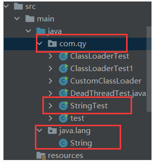
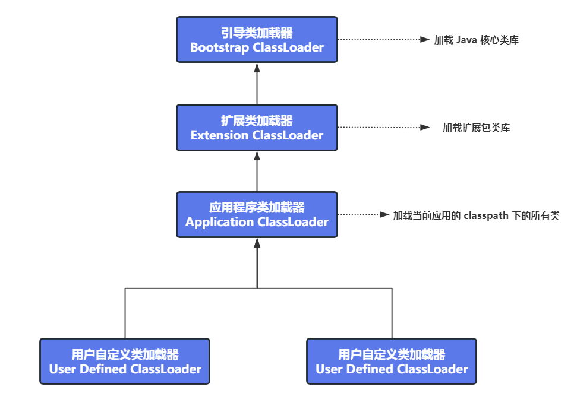

## 双亲委派模型

class 文件是通过 `类加载器` 装在到 JVM 中的，为了防止内存中存在多份同样的字节码，使用了双亲委派模型

双亲委派模型对于保证 Java 程序的稳定运行至关重要


**双亲委派模型的原理为：**

（1）如果一个类加载器收到了类加载请求，会先将请求委托给父类的加载器去执行

（2）如果父类加载器还存在父类，则继续向上委托，直至到达顶层的引导类加载器

（3）如果父类加载器可以完成类加载，就返回；否则，子类加载器才会尝试自己去加载


**双亲委派模型演示：**

1. 创建一个java.lang包，包下创建一个String类
2. 我们来测试创建String对象的时候加载的是系统的String类，还是我们创建的String类



```java
package java.lang;

// 自己创建的java.lang.String类
public class String {
   static {
      System.out.println("我是自己创建的String类中的静态代码块！");
   }
}

package com.qy;

// 测试类
public class StringTest {
   public static void main(String[] args) {
      String str = new String();
      /**
      测试结果：并没有输出，说明加载的是系统中的String类，而不是自定义的
      */
   }
}
```


**那么为什么加载的不是自定义的String类呢？**

根据双亲委派的工作原理，加载 String 类的时候，`系统类加载器`收到了类加载的请求，会向上委托给`扩展类加载器`，扩展类加载器会再向上委托给`引导类加载器`，`引导类加载器`会加载java包下的类，因此 String 类由引导类加载器加载，所以不会加载自定义的 String 类。

如果需要加载 StringTest 类的话，会一直向上委派到引导类加载器，但是该加载器并不加载 StringTest 类，所以最终仍然由系统类加载器完成对 StringTest 类的加载。


**使用双亲委派模型的优势是什么呢？**

- 避免类的重复加载
- 可以保护程序安全，防止核心 API 被随意篡改（如上例中我们自定义 java.lang.String 类，如果没有双亲委派机制，导致加载了我们自定义的 String 类，会导致程序不安全）


**扩展：类加载器的分类**

虚拟机默认提供了 3 个类加载器，为：`引导类加载器（Bootstrap ClassLoader）、扩展类加载器（Extension ClassLoader）、应用程序类加载器（Application ClassLoader）`

除了这三种类加载器之外，还有一种`用户自定义类加载器（User Defined ClassLoader）`



查看类加载器层级关系：

```java
public class ClassLoaderTest {
   public static void main(String[] args) {

      // 获取系统类加载器
      ClassLoader systemClassLoader = ClassLoader.getSystemClassLoader();
      System.out.println(systemClassLoader); // sun.misc.Launcher$AppClassLoader@18b4aac2

      // 获取其上层：扩展类加载器
      ClassLoader extClassLoader = systemClassLoader.getParent();
      System.out.println(extClassLoader); // sun.misc.Launcher$ExtClassLoader@1b6d3586

      // 获取其上层：获取不到引导类加载器
      ClassLoader bootstrapClassLoader = extClassLoader.getParent();
      System.out.println(bootstrapClassLoader); // null

      // 对于用户自定义类来说：默认使用系统类加载器进行加载
      ClassLoader classLoader = ClassLoaderTest.class.getClassLoader();
      System.out.println(classLoader); // sun.misc.Launcher$AppClassLoader@18b4aac2

      // String类使用引导类加载器进行加载的 ---> java的核心类库都是使用引导类加载器进行加载的
      ClassLoader classLoader1 = String.class.getClassLoader();
      System.out.println(classLoader1); // null
   }
}
```


