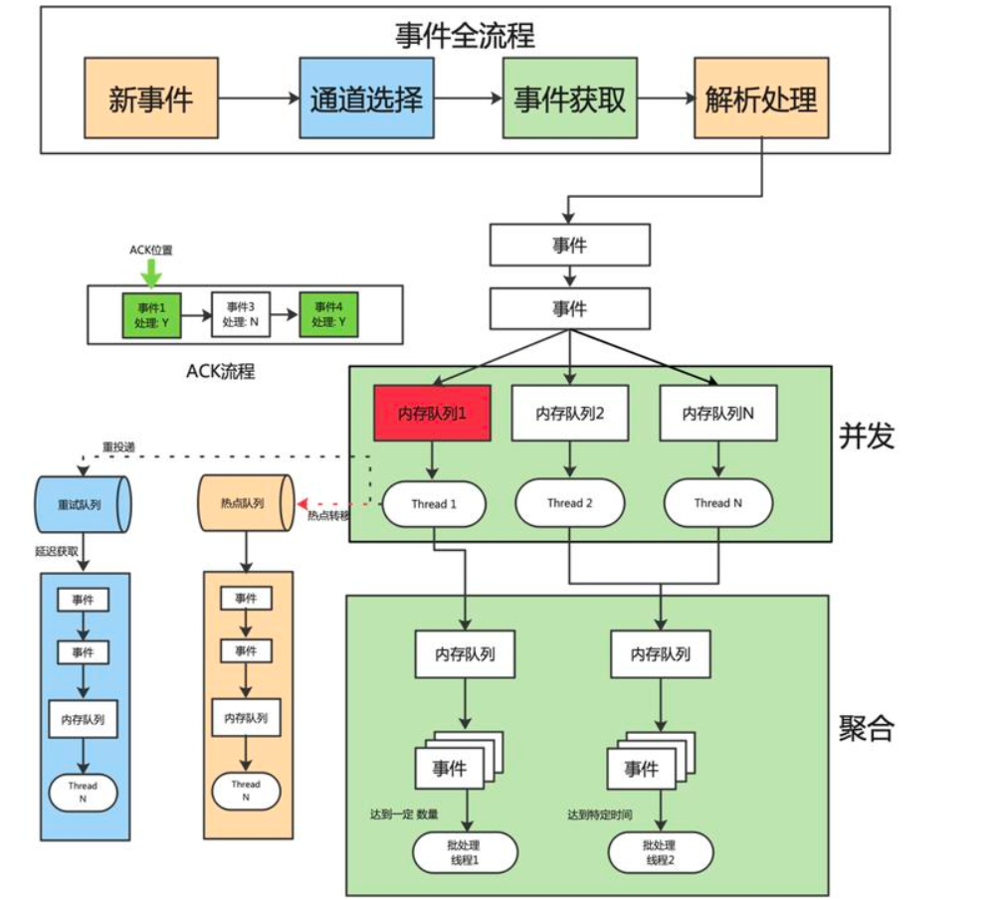

- 多看优秀的场景设计文章

- [牛客网 Java 学习路线总结](https://www.nowcoder.com/discuss/551083645553954816)

- [小傅哥简历指导](https://wx.zsxq.com/dweb2/index/columns/48411118851818)

- [小傅哥Java基础考题自测 100 题（★★★）](https://docs.qq.com/form/page/DT3JKRWN5bkh4U2J2#/fill)

- 性能优化：https://wx.zsxq.com/dweb2/index/topic_detail/214251284118481

- sql 刷题建议牛客网

- Kafka、RocketMQ、RabbitMQ 学习资源推荐：https://articles.zsxq.com/id_i16imeqka5ip.html

- 算法刷哪些题？：https://wx.zsxq.com/dweb2/index/topic_detail/588124821214444

- SpringCloud常见组件：https://articles.zsxq.com/id_mcfcqao0ptha.html

- 技术资源/技术问题：

  1. 支付系统学习资料和开源项目推荐：<https://t.zsxq.com/11wxKtaWK>
  2. 腾讯课堂-马士兵教育-源码五班：<https://t.zsxq.com/11OCvwDA8>
  3. 代码场景设计实践专栏 ：<https://t.zsxq.com/11DvHH3Bk>
  4. 《深入理解缓存原理与实战设计》：<https://t.zsxq.com/11LNrIgaX>
  5. 沈剑老师的架构师之路干货精选：<https://t.zsxq.com/11ndmliJW>
  6. 常见的脱敏工具总结：<https://t.zsxq.com/11rvTAIRR>
  7. OHC（堆外缓存）资料推荐：<https://t.zsxq.com/11G56hsji>
  8. 如何通过IP 地址找到用户的地址：<https://t.zsxq.com/11BDUhHVh>
  9. 转转游戏的账号订单流程重构之路：<https://t.zsxq.com/110G8VIov>
  10. 从1到亿，如何玩好异步消息？CQRS架构下的异步事件治理实践：<https://t.zsxq.com/11hHcUJ2s>
  11. Redis学习路线的补充：[【学习笔记】Redis学习路线的补充](https://t.zsxq.com/115otI0gs)
  12. 算法学习路径：[【学习笔记】算法学习路径](https://t.zsxq.com/117aydfBp)
  13. 计算机网络学习体系&计划：[计算机网络学习体系&计划](https://t.zsxq.com/11vSZ0eQf)
  14. Devops学习资料推荐：<https://t.zsxq.com/115sbW6RX>

- Bilibili 高并发下点赞功能的实现：[文章链接](https://mp.weixin.qq.com/s/mwZQYk1vJu6rOGzxuNeGyg)

- [典型系统设计案例](https://articles.zsxq.com/id_juvseuue9xa3.html)

- [通用架构设计](https://insights.thoughtworks.cn/common-architecture-design/)

- 集合源码

  这周抽时间完善了一下JavaGuide上集合源码分析部分的内容，新增了 LinkedList  和  CopyOnWriteArrayList 核心源码解析，清晰易懂

  1、ArrayList 源码分析：[ArrayList 源码分析 | JavaGuide(Java面试   学习指南)](https://javaguide.cn/java/collection/arraylist-source-code.html)
  2、LinkedList 源码分析：[LinkedList 源码分析 | JavaGuide(Java面试   学习指南)](https://javaguide.cn/java/collection/linkedlist-source-code.html)
  3、HashMap 源码分析：[HashMap 源码分析 | JavaGuide(Java面试   学习指南)](https://javaguide.cn/java/collection/hashmap-source-code.html)
  4、ConcurrentHashMap 源码分析：[ConcurrentHashMap 源码分析 | JavaGuide(Java面试   学习指南)](https://javaguide.cn/java/collection/concurrent-hash-map-source-code.html)
  5、CopyOnWriteArrayList 源码分析：[CopyOnWriteArrayList 源码分析 | JavaGuide(Java面试   学习指...](https://javaguide.cn/java/collection/copyonwritearraylist-source-code.html)

- [两年经验面试题](https://articles.zsxq.com/id_8awjlbk832bx.html)

- [美团面试题](https://articles.zsxq.com/id_l51aorwxj01s.html)

- 海量数据处理：https://blog.csdn.net/qq_44797267/article/details/120228705、https://blog.csdn.net/v_july_v/article/details/7382693


待办：

- ConcurrentHashMap 源码分析整理


观看记录

Java Guide：2023-05-15 09:03


# 简历编写

- 使用  Redis+Caffeine 多级缓存优化热门数据（如首页、热门商品）的访问，解决了缓存击穿和穿透问题，查询速度毫秒级，QPS 30w+。
- 性能优化指南

很多球友不知道如何从性能角度优化项目，这里推荐几个比较容易实现的点，单体项目和分布式项目都适用，涉及到多线程、JVM、数据库/缓存、数据结构优化这4个常见的性能优化方向：

多线程方向优化：

1、如何在 SpringBoot 中使用异步方法优化 Service 逻辑提高接口响应速度? - 2022: [如何在SpringBoot中使用异步方法优化Service逻辑提高接口响应速度?_springboo...](https://blog.csdn.net/weixin_43441509/article/details/119855613)
2、asyncTool: [asyncTool: 解决任意的多线程并行、串行、阻塞、依赖、回调的并行框架，可以任意组合各线程的执...](https://gitee.com/jd-platform-opensource/asyncTool)（京东零售开源的一个并行框架，里面大量使用到了 CompletableFuture ，可以学习其精华来运用在自己的项目上）
3、CompletableFuture 原理与实践-外卖商家端 API 的异步化 - 美团技术团队- 2022: [CompletableFuture原理与实践-外卖商家端API的异步化 - 知乎](https://zhuanlan.zhihu.com/p/515993095)
4、简述 CompletableFuture 异步任务编排 - 掘金 - 2022: [简述CompletableFuture异步任务编排 - 掘金](https://juejin.cn/post/7168261825165787149)

JVM方向优化：

5、JVM 调优实战 - 掘金 - 2022: [JVM调优-JVM调优实践一 - 掘金](https://juejin.cn/post/7128377003224334373)

数据库/缓存方向：

6、MySQL 索引与查询优化 - 西召 - 2019: [MySQL索引与查询优化 - 掘金](https://juejin.cn/post/6844903818056974350)
7、基于 Spring 接口，集成 Caffeine+Redis 两级缓存 - 码农参上 - 2022: [基于Spring接口，集成Caffeine Redis两级缓存 - 掘金](https://juejin.cn/post/7117497031714865159)
8、J2Cache: [J2Cache: Java 两级缓存框架，可以让应用支持两级缓存框架 ehcache(Caffein...](https://gitee.com/ld/J2Cache)（基于内存和 Redis 的开源两级 Java 缓存框架）
9、MySQL 读写分离实战 - 遇见0和1 - 2023：[MySQL8读写分离集群](https://mp.weixin.qq.com/s/N81ES1TGmBb3DJMyROvGBQ)
10、MaxScale 实现 MySQL读写分离 - 爱可生开源社区 - 2022：[技术分享 | MaxScale 实现 MySQL读写分离](https://mp.weixin.qq.com/s/lInWPsTfrywUjT6VgZCbyQ)

数据结构结构方向优化：

11、换个数据结构，一不小心节约了 591 台机器！ - why 技术 - 2022: [换个数据结构，一不小心节约了 591 台机器！ - why技术 - 博客园](https://www.cnblogs.com/thisiswhy/p/16066548.html)（将系统中的本地缓存实现由 HashMap 替换为了 IntObjectHashMap(这个类出自 Netty)节约了2364C 的服务器资源。）
12、这个队列的思路是真的好，现在它是我简历上的亮点了。 - why 技术 - 2022: [java - 这个队列的思路是真的好，现在它是我简历上的亮点了。 - 个人文章 - SegmentF...](https://segmentfault.com/a/1190000041943100)


# 线上常见问题

https://wx.zsxq.com/dweb2/index/topic_detail/185425252544152

https://articles.zsxq.com/id_izrmpuk43owr.html


> 1. 你在做这个项目的时候遇到了什么问题？（OOM问题、GC问题等等）


> 2. 你用过哪些分析定位 Java 故障/性能的工具？（JDK 自带工具、MAT、Arthas 等等）


> 3. 如果项目遇到了 OOM 问题，你会如何排查？（常用 MAT）


> 4. 有什么办法可以监控到 JVM 的实时运行状态？（Arthas）


> 5. 生产环境有一个接口很慢，如何排查？（Arthas）


> 6. 你是如何定位线上问题的？（说说自己了解的工具，然后根据面试官提示继续深入聊即可）


> 7. 有一个程序占用大量cpu，并且一直运行，怎么排查？


> 8. Redis延迟问题全面排查


https://mp.weixin.qq.com/s/mIc6a9mfEGdaNDD3MmfFsg


> 1. 线上问题：

   环境 suse + redis4 （3台虚拟机，3主3从）

   分析日志： redis 访问超时偶然发生，大部分超时在应用重试后可正常访问。

   排查结果： 容器与 redis 连接正常、网络设备负载正常、cpu 使用率正常、redis 的 qps 正常、redis 无慢查询

   运维给出结论：redis 连接数过多，性能达到瓶颈

   生产处置：

- redis 服务重启，为缓解
- 收集系统日志，低峰期重启 redis 所在虚拟机，现象缓解

   后续排查结果：

   redis 配置文件中 `tcp-backlog` 参数可能会导致该现象。每个 TCP 请求都要经过半连接队列 -> 已完成队列 -> redis 主线程 的排队执行过程，发生问题的机器 `tcp-backlog` 使用默认值时为 511，由于 `redis` 为单线程，出现连接队列满的情况时，后续 tcp 请求将会被丢弃，客户端发生超时。并且 `tcp-backlog` 对应系统层 `net.coire.somaxconn`，该参数虚拟机设置为 2048，将 `tcp-backlog` 改为 2048，该现象消失。

   最终结论：tcp 请求半连接队列打满，导致后续 tcp 请求被丢弃，发生超时

   后续处理：

- 部署虚拟机监控，监控 overflowed 增长情况
- redis 设施升级，改为7主7从，redis 升级为 6


# 项目难点

> 1. 登陆日志原本是同步写入库的，后来为了提升效率，加入了队列，先写队列后消费入库，做解耦，但是队列用了同步操作，有一个 mq 挂了，导致登陆服务不可用，这种事不可以接受的，记录日志不能影响登录，所以将其改为了异步方式


> 2. 讲讲项目难点以及怎么解决的


> 3. 你的rpc轮子怎么划分模块的


> 4. （手写 rpc 项目中）你自定义的序列化方式偏向于Json还是Protobuf？这俩序列化有啥区别？和你的自定义序列化性能差异对比？怎么解决分包粘包？怎么注册注销？讲一下你的SPI实现依赖倒置？动态桩讲一下？可以客户端指定调用ip吗


> 5. 如何跟面试官聊项目？


这个问题挺有意思的，聊项目主打一个交心。
简单说下我的看法：
（1）首先简历上的项目需要比较丰富，这里的丰富不是对项目的功能的堆砌，而是要从以下几个方面进行阐述：
   1.项目背景
   2.项目规模
   3.你负责的核心模块、开发的功能
   4.项目痛点、难点
   5.你做了什么事情，用到了那些技术，解决了什么难题，达成了什么效果，带来了什么效益，还有哪些可以改进的地方
（2）然后你得把你学过的一些技术带入进来，尽量让面试官对你运用的技术感兴趣，然后如何用这些技术解决问题的。
（3）最后你可以说下如何改进方案，引导面试官提供一些其他的建议。

相信经过这么几个来回，面试官会对你“很有意思的”。


# 计算机基础


# Java 基础


# 设计模式

> 1. 你对设计模式的了解？最近用了什么 


> 2. 为什么用代理模式，用继承不行吗 


## Nginx

### Nginx 负载均衡算法的实现

https://www.taohui.tech/2021/02/08/nginx/%E6%B7%B1%E5%85%A5%E5%89%96%E6%9E%90Nginx%E8%B4%9F%E8%BD%BD%E5%9D%87%E8%A1%A1%E7%AE%97%E6%B3%95/

- **Least Conn 最少连接数算法：**

在upstream中加入least_conn指令，就可以开启最少连接数算法：

```conf
upstream {
	server localhost:8001 weight=1;
	server localhost:8002 weight=2;
	least_conn;
}
```


# 锁

> 1. 什么是滑块锁?


> 2. synchronized 锁升级？


> 3. 公平与不公锁的区别


> 4. 介绍一下volatile？


> 5. 比较一下悲观锁和乐观锁？乐观锁的使用场景


> 6. 分布式锁

1、分布式锁介绍：[https://javaguide.cn/distributed-system/distribute...](https://javaguide.cn/distributed-system/distributed-lock.html)
2、分布式锁常见实现方案总结：[https://javaguide.cn/distributed-system/distribute...](https://javaguide.cn/distributed-system/distributed-lock-implementations.html)


> 7. 说一下synchronized的实现原理？


# 消息队列

> 1. 除了使用 mq 解耦发奖流程外，有没有别的解决方案？

   答：异步MQ的方案非常成熟，也没有见到其他更合适的方案（如果面试官问了，可以反问他）

   这里mq的用途可以看作是中转分流的任务。中转分流不止MQ可以做，网关也是在中转分流，只不过是没有存储功能。

   无非就是你设计一个能分发任务的路由层，保证任务分发前别丢了，就行。这就是思想，出题人要的是这个。然后再谈具体实现，这又是基本功了。


> 2. RabbitMQ 的消息可靠性


> 3. RabbitMQ 的消息幂等性


> 4. 为什么用 MQ 不用 HTTP？

削峰、解耦、异步


> 5. rocketmq怎么保证消费顺序性


> 6. 怎么解决重复消费


> 7. mq 能解决什么问题


## Netty

参考文章：

https://blog.csdn.net/crazymakercircle/article/details/124588880

https://www.yuque.com/snailclimb/mf2z3k/wlr1b0

https://blog.csdn.net/zhiyikeji/article/details/131131367

《Netty原理解析与开发实战》


# JVM

> 1. 写代码时候有没有什么方式尽量减少Full GC的概率?

   答：

1. 避免一次性加载大量数据加载到内存，比如excel导入导出，jdbc数据库查询
2. 避免大对象的代码处理业务链流程过长，比如aop中获取到了对象参数，大对象捕获到了，导致对象生命周期变长了，没及时释放。
3. 禁止使用system.gc方法
4. 避免在使用threalocal后，未主动调用remove方法，尽量避免大对象的使用，以及频繁的创建和销毁。更要避免全局锁的竞争等。


> 2. 什么是gc，gc怎么排查，怎么手动让JAVA虚拟机OOM？ OOM的场景？


> 3. Full GC 耗时很长，怎么排查，怎么优化，具体到怎么写命令？


> 4. staic和final关键字结合jvm来讲


> 5. 讲讲垃圾回收和死亡对象判断方法，具体讲讲可达性分析


> 6. 发生频繁的fullgc可能由什么原因导致


> 7. CMS收集流程


> 8. 了解过 jvm 内存模型吗


> 9. 能不能说一下堆区具体怎么划分，为什么这样划分


> 10. JVM每个区具有什么功能？


> 11. GC底层算法，常见的垃圾回收器，双亲委派的类加载流程；


> 12. 标记整理法的缺点是什么？


> 13. 元空间是起到什么作用？


> 14. 自定义类加载的过程是什么？


> 15. 怎么释放一个用完的大对象的内存空间？


> 16. 对象的生命周期（new一个对象的过程）？


> 17. 什么时候会有内存泄漏，怎么排查？

答：

首先内存泄漏是堆中的一些对象不会再被使用了，但是无法被垃圾收集器回收，如果不进行处理，最终会导致抛出 `java.lang.OutOfMemoryError` 异常。

内存泄露：

- 不需要使用的对象被其他对象不正确的引用，导致无法回收。
- 对象生命周期过长


内存泄漏的8中情况：

1. 大量使用静态集合类（`HashMap、LinkedList`等），静态变量的生命周期和JVM程序一致，在程序结束之前，静态变量不会被释放，导致内存泄漏。（属于生命周期过长）

2. 单例模式的静态特性，也会导致生命周期过长，如果单例对象持有外部对象的引用，会导致外部对象不会被回收。

3. 内部类持有外部类：每个非静态内部类都会持有外部类的隐式引用，假如`a`为非静态内部类，`b`为`a`的外部类，如果`b`包含了大量对象的引用，非常占用内存空间，那么如果我们创建了非静态内部类`a`，此时即使`b`对象不再被使用了，也无法回收，占用内存空间，导致内存泄漏。

   解决办法：如果内部类不需要访问外部类的成员信息，可以考虑转换为静态内部类。

4. 各种连接（数据库连接、网络连接和IO连接）未及时关闭，导致大量对象无法回收，造成内存泄漏。

5. 变量不合理的作用域：一个变量的定义的作用范围大于其适用范围，很有可能造成内存泄露。

6. 改变哈希值：

   当一个对象被存储进HashSet集合中以后，就不能修改这个对象中的那些参与计算哈希值的字段了。

   否则，对象修改后的哈希值与最初存入HashSet集合时的哈希值就不同了，这种情况下，即使在contains方法使用该对象的当前引用作为参数去HashSet集合中检索对象，也将返回找不到对象的结果，这也会导致HashSet集合中无法单独删除当前对象，造成内存泄漏

   为什么改变哈希值之后找不到对象？因为根据存入时的哈希值去寻找放入的位置，而改变哈希值之后，再去查找就按照新的哈希值所对应的位置去查找，肯定找不到。

   这也是 String 为什么被设置成了不可变类型，我们可以放心的把 String 存入 HashSet，或者把String当作 HashMap 的 key 值。

   ```java
   public class ChangeHashCodeTest {
       public static void main(String[] args) {
           HashSet<Point> set = new HashSet<>();
           Point cc = new Point();
           cc.setX(10); // hashCode = 10
           set.add(cc);
           cc.setX(20); // hashCode = 20
           System.out.println("set remove = " + set.remove(cc));
           set.add(cc);
           System.out.println("set.size = " + set.size());
           /**
            * 输出：
            * set remove = false
            * set.size = 2
            */
       }
   }
   class Point {
       int x;
       public int getX() {
           return x;
       }
       public void setX(int x) {
           this.x = x;
       }
       @Override
       public boolean equals(Object o) {
           if (this == o) return true;
           if (o == null || getClass() != o.getClass()) return false;
           Point point = (Point) o;
           return x == point.x;
       }
       @Override 
       public int hashCode() {
           return x;
       }
   }
   ```

7. 缓存泄露：

   一旦把对象引用放入到缓存中，他就很容易遗忘。比如：之前项目在一次上线的时候，应用启动奇慢，就是因为代码会加载一个表的数据到缓存中，测试环境只有几百条数据，而生产环境有几百万的数据。

   对于这个问题，可以使用WeakHashMap代表缓存，此Map的特点是：当除了自身有key的引用外，此key没有其他引用，那么此map会自动丢弃此值。

8. ThreadLocal

   ThreadLocal的实现中，每个Thread维护一个ThreadLocalMap映射表，key是ThreadLocal实例本身，value是真正需要存储的Object。

   ThreadLocalMap使用ThreadLocal的弱引用作为key，如果一个ThreadLocal没有外部强引用来引用它，那么系统GC时，这个ThreadLocal势必会被回收，这样一来，ThreadLocalMap中就会出现key为null的Entry，就没有办法访问这些key为null的Entry的value。

   如果当前线程迟迟不结束的话，这些key为null的Entry的value就会一直存在一条强引用链：Thread Ref -> Thread -> ThreaLocalMap -> Entry -> value永远无法回收，造成内存泄漏。

   如何解决此问题？

   第一，使用ThreadLocal提供的remove方法，可对当前线程中的value值进行移除；

   第二，不要使用ThreadLocal.set(null) 的方式清除value，它实际上并没有清除值，而是查找与当前线程关联的Map并将键值对分别设置为当前线程和null。

   第三，最好将ThreadLocal视为需要在finally块中关闭的资源，以确保即使在发生异常的情况下也始终关闭该资源。

   ```java
   try {
       threadLocal.set(System.nanoTime());
   } finally {
       threadLocal.remove();
   }
   ```

   ​


**排查内存泄漏：**

可以查看`泄露对象`到`GC Roots`的引用链，找到泄露对象在哪里被引用导致无法被回收


> 18. JVM常见配置


堆设置

```yaml
-Xms3550m   初始堆大小 
-Xmx3550m   最大堆大小 
-XX:NewSize=1024     设置年轻代大小 
-XX:NewRatio=4       设置年轻代和年老代的比值.如:为3,表示年轻代与年老代比值为1:3,年轻代占整个年轻代年老代和的1/4 
-XX:SurvivorRatio=8  设置年轻代中Eden区与一个Survivor区的比值，默认为8
-XX:MaxPermSize=256m 设置持久代大小
```


收集器设置

```
-XX:+UseSerialGC:设置串行收集器 
-XX:+UseParallelGC:设置并行收集器 
-XX:+UseParalledlOldGC:设置并行年老代收集器 
-XX:+UseConcMarkSweepGC:设置并发收集器
```


垃圾回收统计信息

```
-XX:+PrintGC 
-XX:+PrintGCDetails 
-XX:+PrintGCTimeStamps 
-Xloggc:filename
```


并行收集器设置

```
-XX:ParallelGCThreads=n:设置并行收集器收集时使用的CPU数.并行收集线程数. 
-XX:MaxGCPauseMillis=n:设置并行收集最大暂停时间 
-XX:GCTimeRatio=n:设置垃圾回收时间占程序运行时间的百分比.公式为1/(1+n)
```


并发收集器设置

```
-XX:+CMSIncrementalMode:设置为增量模式.适用于单CPU情况. 
-XX:ParallelGCThreads=n:设置并发收集器年轻代收集方式为并行收集时,使用的CPU数.并行收集线程数.
```


> 19. JVM的堆配置过大的副作用有哪些?


答：JVM的堆内存配置过大，可能要面临的问题有：

- 回收大块堆内存而导致的长时间的时间停顿。
- 如果因为程序设计失误，将大对象从磁盘读取到内存中，可能会导致大对象在分配时直接进入老年代，没有在 Minor GC 中被清理掉。这样会导致频繁的发生 Full GC，给用户的体验是程序每个几分钟就停顿十几秒，非常卡顿。

**扩展：JVM的堆配置过小的副作用有哪些？**

- Minor GC 过于频繁


> 20. 如果出现堆内存溢出 `java.lang.OutOfMemoryError  Java heap space`，该如何解决？

答：解决思路如下：

- 首先需要拿到`堆转储快照`进行分析，查看导致 OOM 的对象是否有必要存在，并且分析清除是因为哪些对象导致了 OOM
- 如果是内存泄漏导致 OOM，可以查看`泄露对象`到`GC Roots`的引用链，找到泄露对象在哪里被引用导致无法被回收
- 如果不是内存泄漏，那么说明内存中的对象都是存活的，导致 OOM，这时应该检查虚拟机的堆内存设置是否有向上调整的空间。并且检查是否存在`对象生命周期过长`、`存储结构不合理`的情况，减少程序运行中的内存消耗。 


**扩展说明：因为存储结构不合理导致堆内存溢出（来自于《深入理解Java虚拟机第3版》）**

举例：使用 `HashMap<Long, Long>` 存储大量的数据，会导致浪费大量的空间，因为 HashMap 的空间效率使用太低。

对于一个 `HashMap<Long, Long>`来说，有效数据只有 Key、Value 的两个 long 型数据，占 16字节，long 数据被包装为 java.lang.Long 对象后，就分别具有 8 字节的 Mark Word、8字节的 Klass 指针、8字节的 long 型数值。两个 Long 对象组成 Map.Entry 之后，又多了 16 字节的对象头、8字节的 next 字段、4字节的 int 型的 hash 字段、4字节的空白填充（为了对齐）还有 HashMap 中对这个 Entry 的 8 字节的引用，这样实际占用的内存为：`(Long(24byte) * 2) + Entry(32byte) + HashMap Ref(8byte)=88byte`，空间效率仅仅为  16byte / 88byte = 18%。


# Spring 


# Spring Cloud

> 1. Spring Cloud 和 Dubbo 的区别


> 2. Sentinel 熔断机制


> 3. Spring Gateway 网关的作用


> 4. 注册中心是做什么的？


# Dubbo

> 1. dubbo 的请求处理流程


# 分布式

> 1. raft 算法选举流程？


> 2. 怎么理解 Rpc？


> 3. RPC的延展技术，就是gRPC,Dubbo了解吗？


> 4. RPC 、Http、Rset 使用场景有什么不同？


> 5. rpc有多少dubbo的功能？如何暴露服务？服务挂了怎么办？


> 6. rpc过程和用户态内核态的关系


# Linux

> 1. linux命令问题，如何在一个文件里搜索一关键字（grep）如果想找第一个呢？找最后一个呢？（head和tail?)


> 2. linux 常用命令


# 工作流相关资源（未整理）

总结了一些工作流引擎相关的优质文章和开源项目，分享一下，最近有好几个球友问到。内容较多，建议收藏，后续如果看到比较优质的工作流学习资源会持续同步到这里来。

一些讲解工作流引擎的优质文章：

1. 老板要我开发一个简单的工作流引擎（ [老板要我开发一个简单的工作流引擎 - MCTW - 博客园](https://www.cnblogs.com/duck-and-duck/p/14436373.html) ）：比较有意思的一篇文章，通过过关的形式讲解工作流引擎的开发设计。
2. 一文读懂工作流（ [一文读懂工作流 - 知乎](https://zhuanlan.zhihu.com/p/113387814) ）：网上关于工作流引擎有比较多的简介，也有很多工作流的实际应用场景。本文结合笔者多年对工作流的经验来阐述一下对工作流的理解。
3. 工作流引擎原理-打造一款适合自己的工作流引擎（ [工作流引擎原理-打造一款适合自己的工作流引擎 - 掘金](https://juejin.cn/post/6844904167463485453) ）：作为开发人员或多或少都会接触过工作流引擎，如 activiti、 jbpm 等，这些工作流引擎都会比较重。在小项目中引入就会显得不是很优雅。本文主要简单介绍工作流引擎的原理并讲述如何慢慢打造一款适合自己的工作流引擎。
4. Flowable 开篇，流程引擎扫盲（ [Flowable 开篇，流程引擎扫盲 - 掘金](https://juejin.cn/post/7148248663762927653) ） ：介绍了为什么需要流程引擎，以及开发工作流时用到的一些工具。
5. SpringBoot+Vue+Flowable，模拟一个请假审批流程（ [SpringBoot Vue Flowable，模拟一个请假审批流程！ - 掘金](https://juejin.cn/post/7130150061257785351) ） ：一个很不错的基于 Flowable 的请假审批流程实战。

开源工作流引擎：

1. Flowable ：[Open Source](https://flowable.com/open-source/)
2. Activiti：<https://www.activiti.org/>

开源工作流实战项目：

1. [RuoYi-flowable: 🌟 基于RuoYi-vue    flowable 6.7.2 的工...](https://gitee.com/tony2y/RuoYi-flowable)：基于RuoYi-Vue +Flowable6.x的工作流管理平台。
2. [RuoYi-Flowable-Plus: 本项目基于 RuoYi-Vue-Plus 进行二次开发扩展...](https://gitee.com/KonBAI-Q/ruoyi-flowable-plus)：基于 RuoYi-Vue-Plus 进行二次开发扩展Flowable工作流功能，支持在线表单设计和丰富的工作流程设计能力。

国内用的比较多的还是 Flowable 和 Activiti 这两个，参考资料也蛮多的。Camunda 也不错，更轻量，功能也很完善，性能和稳定性也很不错。关于开源流程引擎的选择，可以参考这篇文章：[开源流程引擎哪个好，如何选型？ - 知乎](https://zhuanlan.zhihu.com/p/369761832) 。

多提一点，国内比较火的工作流引擎 LiteFlow（ [LiteFlow](https://liteflow.cc/) ） 只做基于逻辑的流转，而不做基于角色任务的流转。如果你想做基于角色任务的流转，推荐使用 Flowable 和 Activiti 这两个框架。也就是说，像审批流（A 审批完应该是 B 审批，然后再流转到 C 角色）这种 LiteFlow 就不适合了。LiteFlow 适用于拥有复杂逻辑的业务，比如说价格引擎，下单流程等，这些业务往往都拥有很多步骤，这些步骤完全可以按照业务粒度拆分成一个个独立的组件，进行装配复用变更。


# 算法题

> 1. 单例模式实现

**静态内部类（推荐）**

```java
public class Singleton {
    // 私有化构造方法
    private Singleton() {
    }

    // 对外提供获取实例的公共方法
    public static Singleton getInstance() {
        return SingletonInner.INSTANCE;
    }

    // 定义静态内部类
    private static class SingletonInner{
        private final static Singleton INSTANCE = new Singleton();
    }
}
```

优点：

1. INSTANCE 的唯一性、创建过程的线程安全性都由 JVM 保证。
2. 支持延时加载，当 Singleton 类加载时，不会创建静态内部类，调用 `getInstance()` 方法时，才会创建实例。


**双重校验锁**


```java
public class Singleton {

    private volatile static Singleton uniqueInstance;

    // 私有化构造方法
    private Singleton() {
    }

    public  static Singleton getUniqueInstance() {
       //先判断对象是否已经实例过，没有实例化过才进入加锁代码
        if (uniqueInstance == null) {
            //类对象加锁
            synchronized (Singleton.class) {
                if (uniqueInstance == null) {
                    uniqueInstance = new Singleton();
                }
            }
        }
        return uniqueInstance;
    }
}
```

`uniqueInstance` 采用 `volatile` 关键字修饰也是很有必要的， `uniqueInstance = new Singleton();` 这段代码其实是分为三步执行：

1. 为 `uniqueInstance` 分配内存空间
2. 初始化 `uniqueInstance`
3. 将 `uniqueInstance` 指向分配的内存地址

但是由于 JVM 具有指令重排的特性，执行顺序有可能变成 1->3->2。指令重排在单线程环境下不会出现问题，但是在多线程环境下会导致一个线程获得还没有初始化的实例。例如，线程 T1 执行了 1 和 3，此时 T2 调用 `getUniqueInstance`() 后发现 `uniqueInstance` 不为空，因此返回 `uniqueInstance`，但此时 `uniqueInstance` 还未被初始化。


> 2. 算法:手撕LRU


> 3. 用程序实现两个线程交替打印 0~100 的奇偶数。


# k8s


https://t.zsxq.com/13G5IiAbm


# DDD

1、阿里技术专家详解 DDD 系列 第一讲- Domain Primitive：[阿里技术专家详解DDD系列第一讲-DomainPrimitive-知乎](https://zhuanlan.zhihu.com/p/340911587)
2、阿里技术专家详解 DDD 系列 第二讲 - 应用架构：[阿里技术专家详解DDD系列第二讲-应用架构-知乎](https://zhuanlan.zhihu.com/p/343388831)
3、阿里技术专家详解 DDD 系列 第三讲 - Repository 模式：[阿里技术专家详解DDD系列第三讲-Repository模式-知乎](https://zhuanlan.zhihu.com/p/348706530)
4、阿里技术专家详解 DDD 系列 第四讲 - 领域层设计规范：[阿里技术专家详解DDD系列第四讲-领域层设计规范-知乎](https://zhuanlan.zhihu.com/p/356518017)
5、阿里技术专家详解 DDD 系列 第五讲：聊聊如何避免写流水账代码：[阿里技术专家详解DDD系列第五讲聊聊如何避免写流水账代码-知乎](https://zhuanlan.zhihu.com/p/366395817)
6、DDD 系列文章 - ThoughtWorks 洞见：[您正搜索DDD-Thoughtworks洞见](https://insights.thoughtworks.cn/?s=DDD)
7、手把手教你落地 DDD : [手把手教你落地DDD](https://mp.weixin.qq.com/s/TU5G2o_HOctjWvuyOEK_tA)
8、探秘微信业务优化：DDD 从入门到实践：[探秘微信业务优化DDD从入门到实践](https://mp.weixin.qq.com/s/kFjfzwTOdaKA2ym63VR3DQ)
9、领域驱动设计 DDD ｜从入门到代码实践：[领域驱动设计DDD从入门到代码实践](https://mp.weixin.qq.com/s/HMLpjcE0UENUTfMK0Z9n8A)


# 性能压测

> 1. 性能压测怎么做的，性能如何？


# CQRS


今天下午认真看了一篇很不错的文章：[从1到亿，如何玩好异步消息？CQRS架构下的异步事件治理实践](https://mp.weixin.qq.com/s/mwZQYk1vJu6rOGzxuNeGyg) （从 1 到亿，如何玩好异步消息？CQRS 架构下的异步事件治理实践 - 哔哩哔哩技术 - 2023），分享给球友们。

这篇文章循序渐进，一步一步地教你构建微服务+ CQRS 的高并发架构，以点赞功能作为例子（见图1）。

这篇文章提到了核心之一在于 CQRS 模式的运用。CQRS 是“命令和查询责任分离（Command Query Responsibility Segregation）”的英文缩写，它是一种将数据存储的读取操作和更新操作分离的模式。

要理解 CQRS 模式，我们可以把它分成两个部分：命令（Command）和查询（Query）。命令是指对数据进行修改的操作，比如用户点赞行为。查询是指对数据进行读取的操作，比如用户查看点赞数。在传统的模式中，命令和查询都是直接对同一个数据库进行操作，这样会导致一些问题，比如数据库锁竞争、性能瓶颈等。

在 CQRS 模式中，命令和查询被分离到不同的服务或数据库中，使用消息队列或事件流来同步数据。你可以将 Command 作为一个独立的微服务，它主要的任务是不断地创建新事件比如用户点赞行为。这些事件会被存储下来（比如消息队列存储），并经过一系列的处理。通常处理这些事件的服务是另外的微服务。Command 服务不需要等待数据库的结果，就可以直接返回给用户。并且，即使数据库出现故障，也不会影响用户的操作，等数据库恢复之后再进行消费即可。

关于 CQRS 模式的详细介绍，可以参考下面这几篇文章：

- [CQRS 模式 - Azure Architecture Center | Microsoft Le...](https://learn.microsoft.com/zh-cn/azure/architecture/patterns/cqrs) 
- [CQRS](https://martinfowler.com/bliki/CQRS.html)

高并发下，使用 CQRS 模式能规避锁竞争以及解决写流程直接依赖 DB 的问题。

以点赞服务为例，CQRS 模式下：

- 用户点赞时，点赞服务将消息投递给 Kafka 后就直接返回，用户体验很好。新增了一个 Job 服务负责消费异步事件，从 Kafka 中获取到消息后处理和写入至后续的 MySQL 和缓存中。即使数据库出现故障，也不会影响用户点赞，等数据库恢复之后再进行消费即可。
- 对于数据库锁竞争的问题，只要避免对同一条记录同时写入就可以规避 ，设置 Kafka 的生产者分区策略为 Key-Ordering，然后将视频 id 当做消息键，这样同一个视频的消息只会被一个单个 job 消费串行处理，竞争问题解决了。

既然引入了 Job 服务，那我们就要考虑如何去保证 Job 服务的高可用？Job 服务出现故障或者重启，会不会导致消息的丢失或者重复处理？消费能力不足怎么办？

在这篇文章中：

- 消息重复消费问题是通过行为表（记录点赞信息比如用户点赞了哪条视频）来规避的，用户点赞的时候会先从行为表中检查是否已经点赞过了。
- 消费能力不足的问题是通过增加消费节点和单节点消费能力来解决的。
- 消息丢失问题是将消息有序串联起来并对处理完的消息标记 ACK 解决的（某个消息前面所有的事件都被处理后，才将消息设置 ACK 状态）。并且，文中还提到了如何减少 ACK 来进一步优化性能。
- MQ 系统虽然是多副本高可用的，但是总有例外会导致失效。针对 MQ 故障问题，这篇文章介绍了一种新的降级方式：正常情况下生产方发送消息到 kafka，被 job 节点消费，当 kafka 故障时，发送方自动切换到降级模式，将消息直接推向消费方

在数据库中会有一张专门的表用来记录某个视频的点赞数量 count。为了减少对数据库的操作，可以将同一个视频的 N 个点赞聚合起来，一次性对 count（点赞数量） 加 N。

为了应对热点事件，还可以对热点问题做一下事件隔离，避免影响到其他的视频。

最后，附送一张处理流程图，如下图所示（图二）。




# 计算机网络

给 JavaGuide 的各位小伙伴推荐一下我的计算机网络学习计划。

这是一篇我认真总结出来的计算机网络学习方法 & 学习计划，我也在亲身实践。事实证明精华的学习路线起码 10 年为一个周期的话，不会过时。

我觉得最重要的就是**看书(博客) + 实践**。

首先是看书。

## **书籍推荐**

书也分为不同的层次，最基础的入门书籍有

### **网络是怎样连接的**

这是我推荐给你的第一本书。

这本书是日本人写的，它和《程序是怎样运行的》、《计算机是怎样跑起来的》统称为图解入门系列，最大的特点就是**风趣幽默，简单易懂**。这本书通过多图来解释浏览器中从输入网址开始，一路追踪了到显示出网页内容为止的整个过程，以图配文，讲解了网络的全貌，并重点介绍了实际的网络设备和软件是如何工作的。

本书图文并茂，通俗易懂，非常适合计算机、网络爱好者及相关从业人员阅读。

所以如果大家是新手的话，强烈推荐一下这本书。

日本人就爱图解，同样图解系列的入门书籍还有《图解 HTTP》、《图解 TCP/IP》。

### **图解 HTTP**

这是我推荐给你的第二本书。


《图解 HTTP》是 HTTP 协议的入门书籍，当然 HTTP 也是属于计算机网络的范畴，这本书适合于**想要对 HTTP 有基本认知的程序员，同样也适合查漏补缺**。

这类书看起来就毫无难度了，不得不说图解系列是给小白的圣经，它能增强你的自信，让你觉得计算机其实没那么难，这是非常重要的。初学者，最怕的就是劝退了。

### **图解 TCP/IP**

这是我推荐给你的第三本书


上面的图解 HTTP 是针对 HTTP 协议的，那么《图解 TCP/IP》就是针对 TCP/IP 协议簇中的协议了，这本书我已经看了 80% 了，还是比较系统的一本书，**基本上涵盖了 TCP/IP 协议簇中的所有协议知识了，这本书看完了完全就可以直接深入理解 TCP/IP 协议簇了**。

对于新手来说，最重要的一点就是帮助你理解，怎么简单怎么来，这样才能快速入门，对于快餐式的社会来说，快速理解当然是当仁不让的首选了。

如果上面这几本书你都搞定了的话，那你就可以读一下 《计算机网络：自顶向下方法》这本书了，这本书可以作为基础书籍也可以作为进阶书籍，这里我归为了进阶书籍，因为里面有一些章节不是那么好理解，比如介绍网络层的时候，会分为数据平面和控制平面，介绍 TCP 和 UDP 的时候，也会聊到一些原理性问题。

### **计算机网络：自顶向下方法**

这是我推荐给你的第四本书

这本书是一本计算机网络的圣经书籍，圣经就在于人人都应该读一下这本书，原著非常经典，翻译也很不错，我自己也马上就看完了，这本书会从顶层也就是网络层逐步下探到物理层，一层一层的带你入门，解释各层之间的协议，主要特征是什么，一个数据包的发送历程。这本书并不局限于某个具体的协议，而是从宏观的角度来看待计算机网络到底是什么，里面有一些专业名词，理解并掌握后会对深入学习计算机网络非常有用。

### **计算机网络：谢希仁版**

这是我推荐给你的第五本书籍

这本书是很多大学的教材，也是一本非常好的进阶书籍，这本书相对于自顶向下方法更多是对于通信网络的阐述。

这本书的特点是**突出基本原理和基本概念的阐述**，同时力图反映计算机网络的一些最新发展。本书可供电气信息类和计算机类专业的大学本科生和研究生使用，对从事计算机网络工作的工程技术人员也有参考价值

现在我们接着聊，如果上面这两本书随便一本看完了，那么恭喜你已经是一个老手了，你的网络基础能打败 90% 以上的人了，如果你还不满足的话，那你就需要继续深入，继续深入也是我推荐给你的提高书籍。

### **HTTP 权威指南**

这是我推荐给你的第六本书


HTTP 权威指南是深入 HTTP 非常值得一看的书，这本书写的非常全了。

此书第一部分是 HTTP 的概述，如果你没有时间，通读第一部分就能让你应付普通的日常开发工作。

第二部分主要讲现实世界中 HTTP 的架构，也可以看作 HTTP 的全景图，包括 Web Server/Cache/Proxy/Gateway，是全书中精华的部分。

第三部分主要是 HTTP 安全，其中 Basic 和 Digest 概略看下即可，现实世界中用的应该不多。看 HTTPS 最好有一些计算机安全基础，这样会顺畅很多。

第四部分主要是关于 HTTP Message Body 的部分，包括 Content Negotiation，MIME Type，chunked encoding等，概略看下即可。

第五部分的内容，Web Hosting 可以认真看下，了解下 Virtual Host(话说我上学的时候一直搞不懂 Virtual Host，一个 IP 怎么能同时 Host 两个不同域名的 Web 页面呢)。

剩下三章已经过时，基本可以忽略。最后的附录，可以用作边用边学的字典，如果你自己来写 Web Server，那么这一部分是极有价值的参考。

总而言之，无论你是前端还是后端，只要是 Web 相关的，那么此书就是必读的。

**TCP/IP 详解**

这是我推荐给你的第七本书

这是一本被翻译耽误的经典书，两个硬核作者 Kevin R. Fall 和 W. Richard Stevens 被南开大学的某计算机系的译者给毁了。我第一开始读这本书以为是自己智商不够，原来是翻译瞎TM翻啊。语句不通且不说，您好歹走点心，改点措辞也行啊，纯粹是生搬硬套谷歌翻译啊，哎。


来看看豆瓣读者们对这本书的评价吧，比我有力量多了。


这个回答给我看乐了，嗯，把这本书当作一本 Google 词典确实是一种不错的选择。

不过这本书确实是一本非常好的书，这本书的关注点在于 TCP/IP 协议栈上，可以说把 TCP/IP 讲透讲细了，比如讲 TCP 就会分别从连接管理、TCP 超时重传、TCP 拥塞控制、TCP 保活机制来讲起，不管你是从事哪个技术栈的研究，不管你是程序员还是网络工程师，这本书都是你值得一读的一本，不过要读最好还是读英文版。

TCP/IP 详解有三本，第二本是


这本黑皮书主要是介绍如何实现 TCP/IP 协议的，这本书很难入门。书中给出了约 500 个图例，15000 行实际操作的 C 代码，采用举例教学的方法帮助你掌握 TCP/IP 实现。

本书不仅说明了插口 API 和协议族的关系以及主机实现与路由器实现的差别。还介绍了 4.4BSD-Lite 版的新的特点。本书适用于希望理解 TCP/IP 协议如何实现的人，包括编写网络应用程序的程序员以及利用 TCP/IP 维护计算机网络的系统管理员。

第三卷是 tcp 事务协议、http、nntp 和 unix 域协议


这本书看的人就更少了。

第 3 卷详细介绍了当今 TCP/IP 程序员和网络管理员必须非常熟悉的四个基本主题：TCP 的扩展、Hyper 文本传输协议、网络新闻传输协议和 UNIX 域协议。与前两卷一样，本书介绍了 4.4BSD-Lite 网络代码中的示例和实现细节。

嗯。。。有一些沉重了，其实这些深入协议底层的书籍我们 99% 的人都接触不到，但是为了回答的完整性，我就都列出来了，这样的好处是让你能系统了解。

上面都是一些理论书籍，下面是稍微偏实战一些的书籍了。

计算机网络实战最有效的当然就属于抓包了，有很多抓包工具比如 **wireshark、sniffer、httpwatch、iptool、fiddle** 等，但是我用的和使用频率最高的应该就是 wireshark 了，关于 wireshark 还有几本实战方面的书你需要知道

### **wireshark 数据包分析实战**

这是我推荐给你的第八本书


初学者必备，介绍了 wireshark 安装，嗅探网络流量，wireshark 的基本使用，用 wireshark 分析了一圈常用的TCP，UDP 协议，也简要分析了 HTTP 等应用层协议，概要介绍了一些 TCP 重传的机制，最后是无线分析。

整个书定位应该是入门级别的，基本上每章都是简要介绍，并没有特别深入大张阔斧地进行描述。文章行文思路清晰，译者的翻译水平也不错。**总的来说，是初步认识和了解 wireshark 的好书**。

### **wireshark 网络分析就是这么简单**

这是我推荐给你的第九本书


读的时候你会忍不住笑的，区别于《Wireshark数据包分析实战》，本书就像一本侦探小说集，以幽默风趣的语言风格，借助wireshark以理性的思考来不断探险，根据蛛丝马迹来侦破案情。总结，读完数据包分析实战来读这本。

### **Wireshark网络分析实战**

这是我推荐给你的第十本书


其内容涵盖了 Wireshark 的基础知识，抓包过滤器的用法，显示过滤器的用法，基本/高级信息统计工具的用法，Expert Info 工具的用法，Wiresahrk 在 Ethernet、LAN 及无线 LAN 中的用法，ARP 和 IP 故障分析，TCP/UDP故障分析，HTTP 和 DNS 故障分析，企业网应用程序行为分析，SIP 多媒体和 IP电话，排除由低带宽或高延迟所引发的故障，认识网络安全等知识。

书籍推荐大概就是上面那些，除了书之外，还有一些视频、博客、官网网站可以学习

## **视频推荐**

很烦微信公众平台怎么不支持外链呢，这个体验就很差啊。

今天在 b 站看视频的时候，看到了一句话**众所周知，b 站是用来搞学习的**，对于我们学习编程的童鞋来说，b 站有着非常多的学习资源，但是有一些质量并不是很好，看了之后不容易理解，这也是写这一篇文章的原因，为大家分享一些质量超高的计算机基础的学习视频，往下看就完了。

### **1. 计算机网络微课堂（有字幕无背景音乐版）（陆续更新中......）_哔哩哔哩 (゜-゜)つロ 干杯~-bilibili**

学习计算机网络，我首先推荐的 UP 主湖科大教书匠，他讲的计算机网络十分通俗易懂，重点的地方讲的十分细致，并且还有一些实验，更好的是有考研 408 的难题的讲解，也是非常适合考研党，除了课程内容外还有很多习题讲解视频，特别赞的一点是每天动态里都会更新一道考研题，播放量也非常的多。


### **2. 2019 王道考研 计算机网络_哔哩哔哩 (゜-゜)つロ 干杯~-bilibili**

既然说到了考研，那我就不得不提一下王道考研了，恭喜你发现了宝藏。王道考研的计算机网络视频，播放量非常多，而且老师是一位小姐姐，声音十分动听，声音这么好听的老师给你讲课，妈妈再也不用担心我的学习了呢，总之，这个视频的质量也非常高，弹幕全是对小姐姐的高度评价。（王道考研其他的视频也不错哦，暗示一下：操作系统，数据结构等等）


### **3. 韩立刚计算机网络 谢希仁 第7版 2020年12月_哔哩哔哩 (゜-゜)つロ 干杯~-bilibili**

韩立刚老师所讲的计算机网络视频，内容比较多，但是讲解的通俗易懂，并且老师讲课的经验也十分的丰富。配套的教材是谢希仁老师的计算机网络教材，韩老师的最近的一个视频视频比较新，播放量还比较少，但是他讲的是真的不错，相比于王道考研所讲的计算机网络，韩老师更加细致一些。


### **4. 计算机网络（谢希仁第七版）-方老师_哔哩哔哩 (゜-゜)つロ 干杯~-bilibili**

在计算机网络方面，我还想推荐的一位老师就是方老师，也是一位小姐姐老师。她的视频配套的教材也是谢老师的网络教材，在线看的小伙伴也超多，弹幕都是对方老师的评价。


## **博客推荐**

推荐几个不错的学习博客。

互联网协议入门-阮一峰：<http://www.ruanyifeng.com/blog/2012/05/internet_protocol_suite_part_i....>

网络协议-兰亭风雨：<http://blog.csdn.net/ns_code/article/category/1805481>

HTTP协议：<http://www.cnblogs.com/TankXiao/category/415412.html>

Unix 网络编程：<http://blog.csdn.net/chenhanzhun/article/category/2767131/2>

TCP/IP详解：<http://blog.csdn.net/chenhanzhun/article/category/2734921/1>

计算机网络面试题：<http://blog.csdn.net/shadowkiss/article/details/6552144>

国外优秀计算机网络站点：<http://www.tcpipguide.com/free/t_TCPSlidingWindowAcknowledgmentSystemForDataTranspo-6.htm>

当然最硬核的就是 RFC 文档了 <https://tools.ietf.org/rfc/index>

学习 HTTP ，必须要看一下 MDN 官网 <https://developer.mozilla.org/zh-CN/docs/Web/HTTP>

学习计算机网络，Cloudflare 你必须要去看 [https://www.cloudflare.com/zh-cn/learning/](https://www.cloudflare.com/zh-cn/learning)

GeeksforGeeks 学习计算机网络也非常不错 [https://www.geeksforgeeks.org/basics-computer-networking/](https://www.geeksforgeeks.org/basics-computer-networking)

Tutorialspoint 系统学习计算机，不仅仅局限于计算机网络 <https://www.tutorialspoint.com/computer_fundamentals/computer_networking.htm>

国外优秀的学习网站不能少了 javapoint <https://www.javatpoint.com/types-of-computer-network>

------------------------分割线------------------------

原文链接：[计算机网络学习计划](https://mp.weixin.qq.com/s?__biz=MzI0ODk2NDIyMQ==&mid=2247488287&idx=1&sn=cb169ed027447d691923dba9ae83d887&chksm=e999e60ddeee6f1b0ff69018aa8e4eb826306a99d8279ea4f8aa834bb870803f35cb2b69590d&token=1010811083&lang=zh_CN#rd) ，这篇文章的作者也是我的个人公众号，有兴趣的小伙伴们可以点个关注呀。