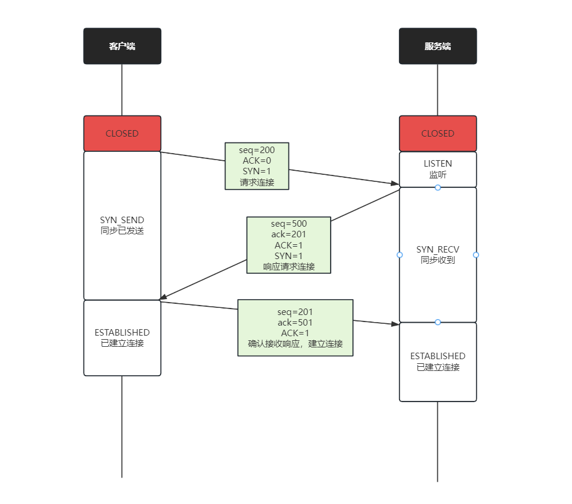
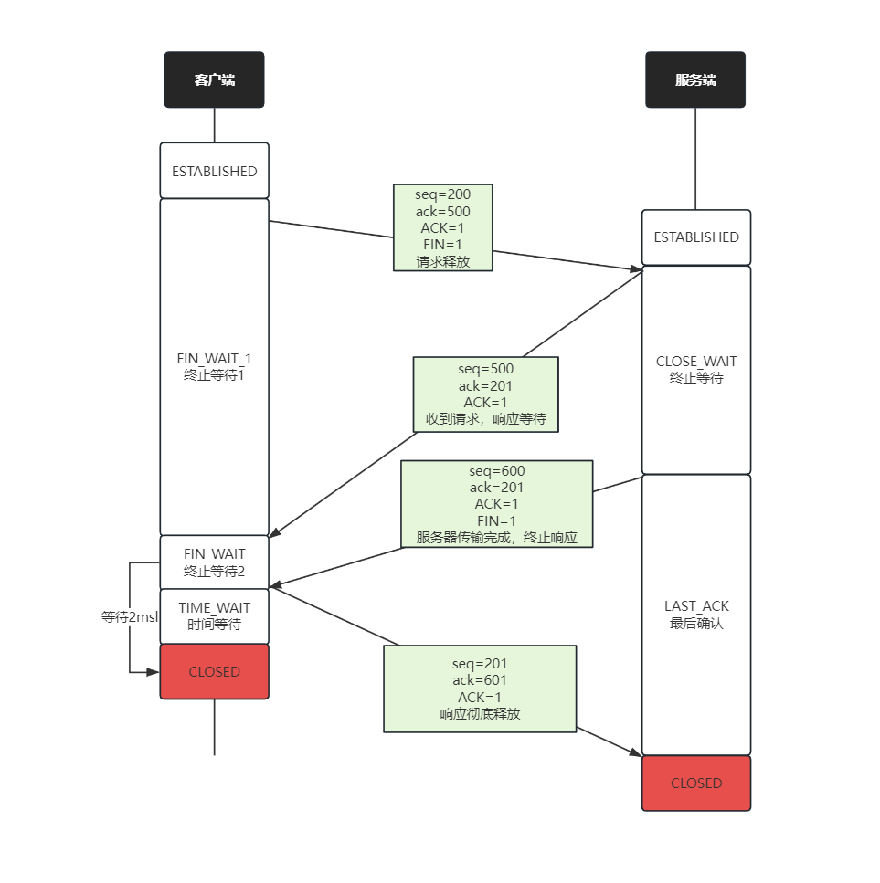

# 计算机基础
## TCP 三次握手/四次挥手

| 参数      | 用途                                    |
| ------- | ------------------------------------- |
| SYN     | 用于启动和建立连接时，同步设备之间的序列号。0到2^32 - 1的随机数。 |
| ACK     | 向另一端确认已经收到 SYN，数值为收到 SYN 增一。          |
| SYN-ACK | 确认之前收到了 SYN，数值为自定义值。                  |
| FIN     | 终止连接。                                 |
| RST     | 重置连接。                                 |

### 三次握手

三次握手流程为：

1. 第一次握手：client 请求建立连接，发送 SYN 包到主机 B，并进入 SYN_SEND 状态，等待 server  回应
2. 第二次握手：server 向 client 发送 SYN+ACK 包，表示也想和 client 建立连接并确认 client 的报文，并进入 SYN_RECV 状态
3. 第三次握手：client 收到 server 发送的 SYN+ACK 包，向 server 发送 ACK 包

**为什么需要三次握手？**

有很多种说法，这里列出以下两种说法（自我感觉第一种说法比较浅显易懂）：

- 因为经过了三次握手，主机 A 和主机 B 才可以保证自己的发送能力和接收能力都是正常的，那么理论上双方`收发能力`正常，证明网络可靠，可以进行通信。
- 在谢希仁版《计算机网络》中是这样说的，如果 client 发送的第一个 SYN 包并没有丢失，只是在网络中滞留，以致于延误到连接释放以后的某个时间才到达 server。本来这是一个早已失效的报文，但 server 收到此失效报文后，就误认为是 client 再次发出的一个新的连接，于是向 client 发出 SYN+ACK 包，`如果不采用三次握手`，只要 server 发出 SYN+ACK 包，就建立连接，会导致 client 没有发出建立连接的请求，因此不会理会 server 的 SYN+ACK 包，但是 server 却以为新的连接建立好了，并一直等待 client 发送数据，导致资源被浪费

### 四次挥手

四次挥手流程为：

1. 第一次挥手：客户端想要终止连接时，向服务端发送 FIN，客户端进入 `FIN_WAIT_1` 状态，表示客户端没有数据要发送给服务端了，但是如果服务端还有数据没有发送完，服务端可以继续发送数据
2. 第二次挥手：服务端收到客户端终止请求后，回复 ACK 确认 FIN，表示已经收到客户端的中断请求，但是服务端还有数据需要发，此时客户端进入 `FIN_WAIT_2` 状态，继续等待服务端的 FIN（中断连接） 报文
3. 第三次挥手：TCP 的连接是相互独立的，当服务端已经发送完数据了，向客户端发送 FIN=1 报文，告诉客户端数据已经发送完毕，准备好关闭连接了，服务端此时进入 `LAST_ACK` 状态
   - 如果服务端一直没有收到客户端返回的 ACK 报文，那么就会触发超时重传，服务端会重传 FIN 报文
4. 第四次挥手：客户端收到服务端的 FIN 后，知道可以关闭连接了，因此向服务端发送 ACK 报文，并进入 TIME_WAIT 状态（如果客户端不向服务端发送 ACK ，那么服务端并不请求客户端是否收到了服务端关闭连接的请求，假如服务端发送给客户端的 FIN 报文丢失，那么客户端就一直以为服务端没有请求关闭连接，导致连接无法关闭）
   - 如果客户端在 2msl 内，再次收到了来自服务端的 FIN 报文，说明服务器端没有收到客户端的 ACK 报文，客户端重新向服务端发送 ACK 报文，计时器重置
   - 如果客户端再 2msl 内没有收到服务端的 FIN 报文，说明服务端正常接收了 ACK 确认报文，客户端可以进入 CLOSED 状态

**为什么客户端的 TIME_WAIT 时间是 2msl 呢？**

首先 msl 是报文的最大生存时间，如果超过 msl，那么报文就会被丢弃

那么客户端等待 2msl 是因为，客户端的 ACK 到达服务端最多花费 1msl，而服务端重发 FIN 报文也最多花费 1msl，因此如果客户端的 ACK 报文丢失，最多 2msl 的时间就可以收到服务端重发的 FIN 报文

**为什么要第四次挥手呢？**
其实很容易，我们想一下如果没有通过第四次挥手对 server 发给 client 的 FIN 报文进行确认，如果第三次握手报文丢失的话，客户端就不知道需要关闭连接了，服务端也不知道报文丢失，也不重发，导致客户端一直认为连接处于打开状态

> 1. 堆和树的区别？应用场景？二叉搜索树是什么？

> 1. 进程间的通信方式？死锁条件？怎么解决？

> 1. 操作系统内存满了怎么办？如何回收？有什么影响

> 1. 什么是僵尸进程？应该怎么去操作？

> 1. 为什么会有线程安全的问题，如何解决？

> 1. 乐观锁和悲观锁？CAS？aba问题是什么，如何解决？

> 1. http 常见的方法和状态码有哪些？502是什么错误？如何排查问题？讲一下反向代理？

> 1. token 和 cookie 的区别？

> 1. https 怎么存放密钥？

> 1. cpu 爆了怎么排查，怎么优化，具体怎么写命令？

> 1. 共享内存，如何控制读取写入的一致性（信号量）

> 1. 进程可以忽视信号吗（可以，不过看级别）

> 1. HTTP协议的组成？报文格式？头和body如何分割？cookie在哪一部分？如何让请求携带cookie？

> 1. 计算机网络分层模型

> 1. TCP的可靠性怎么保障的，怎么保证接收到的内容是正确的

> 1. HTTPS校验的哈希算法是什么

> 1. HTTP 2.0和HTTP 1的区别？

> 1. 什么是队头阻塞？2.0为什么不用UDP？

> 1. HTTPS与HTTP区别

> 1. HTTPS TLS层四次握手

> 1. CA证书的认证

> 1. 建立 TCP 连接后，客户端下线了会发生什么

> 1. 介绍一下知道哪些 IO 模型，IO 多路复用了解吗

> 1. 对网络方面有了解吗？讲解一下TCP/IP协议的网络分层；

> 1. 讲讲ARP，ICMP

> 1. 什么时候不用查ARP表

> 1. ICMP是哪个路由器回的，什么地方用了icmp，traceroute怎么做的。

