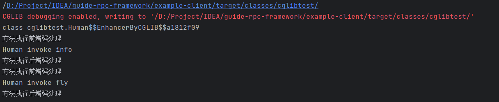

# Java 基础

项目推荐：京东的 asyncTool 并发框架，大量使用到了 `CompletableFuture`。


> 1. 如何设计一个能够根据优先级来执行的线程池？

首先对于阻塞队列，可以考虑使用 `PriorityBlockingQueue `作为任务队列。

`PriorityBlockingQueue` 是一个支持优先级的无解阻塞队列，要想对任务进行排序，需要让提交到线程池的任务实现 `Comparable` 接口，并重写 `compareTo` 方法来指定任务之间的优先级比较规则，还有一种方式就是创建 `PriorityBlockingQueue` 时传入一个 Comparator 对象来制定任务之间的排序规则（推荐第二种方式）。

但是还存在几个问题：

1. 在使用优先级任务队列时，当生产者速度快于消费者时，时间长之后会造成 OOM，因为该队列并不会阻塞生产者，只会阻塞消费者，当没有任务消费时，会阻塞消费者
2. 会导致饥饿问题，即优先级低的任务长时间不执行
3. 由于对队列中的元素进行排序以及保证线程安全（并发控制采用的可重入锁 ReentrantLock），因此会降低性能

对于 OOM 问题，可以继承 `PriorityBlockingQueue` 并且重写 `offer` 方法，即入队逻辑，当插入的元素数量超过指定值就返回 false

饥饿问题可以通过优化设计来解决，比如等待时间过长的任务会被移除，并重新添加到队列中，并且提升优先级


> 1. 线程池原理？线程池如何回收线程？（怎么知道任务处理完毕？）依据什么去设置核心线程数？(CPU密集型和IO密集型）


> 1. threadlocal 底层实现


> 1. 为什么threadlocal的key是弱引用


> 1. 怎么处理线程安全的问题？（我说了死锁和threadlocal)


> 1. thread内存泄漏


> 1. 怎么获取子线程的返回值？


> 1. 子线程抛异常，主线程try-catch 是否可以获取到异常 。


## 创建对象构造方法执行顺序

构造方法、构造代码块、静态代码块加载顺序，以及子类继承父类加载顺序

```java
public class A {
    public A() {
        System.out.println("A构造方法");
    }
    {
        System.out.println("A构造代码块");
    }
    static {
        System.out.println("A静态代码块");
    }
}

public class B extends A{
    public B() {
        System.out.println("B构造方法");
    }
    {
        System.out.println("B构造代码块");
    }
    static {
        System.out.println("B静态代码块");
    }
    public static void main(String[] args) {
        new B();
    }
    /**
     * A静态代码块
     * B静态代码块
     * A构造代码块
     * A构造方法
     * B构造代码块
     * B构造方法
     */
}
```


## 了解泛型吗？

参考文章：https://blog.csdn.net/qq_43546676/article/details/128790980

泛型就是在编译时检查类型安全，并且不需要强制进行类型转换

**泛型擦除了解吗？**

泛型擦除即在编译生成的字节码中，所有声明泛型的地方都会被擦除，擦除之后设置的类型会根据是否指定泛型上界而不同：

- 如果没有指定泛型上界，则所有的泛型类型在编译之后都替换为 Object 类型

  即在 `generic.set("张三")` 时，会将 String 类型的参数擦除为 Object 类型

  通过反编译指令 `javap -c` 得到字节码，发现在 11 行 set 值类型为 Object，在 15 行 get 值类型为 Object，在 18 行编译器会插入 `checkcast` 语句将 Object 类型转为 String 类型

  ```java
  public class GenericTest<T> {
      private T t;
      public T get(){
          return t;
      }
      public void set(T t) {
          this.t = t;
      }
      public static void main(String[] args) {
          GenericTest<String> generic = new GenericTest<>();
          generic.set("张三");
          generic.get();
      }
  }
  // 通过 javap -c 反编译得到字节码指令
    public static void main(java.lang.String[]);
      Code:
         0: new           #3                  // class com/example/nettystudy/AlgorithmTest/GenericTest
         3: dup
         4: invokespecial #4                  // Method "<init>":()V
         7: astore_1
         8: aload_1
         9: ldc           #5                  // String 张三
        11: invokevirtual #6                  // Method set:(Ljava/lang/Object;)V
        14: aload_1
        15: invokevirtual #7                  // Method get:()Ljava/lang/Object;
        18: checkcast     #8                  // class java/lang/String
        21: astore_2
        22: return

  ```

  ​

- 如果指定泛型上界，则所有的泛型类型在编译之后都替换为 String 类型（也就是上界的类型）

  可以发现在字节码第 11 行和第 15 行即 set 和 get 时，类型都为 String 类型，而不是 Object 类型

  ```java
  public class GenericTest<T extends String> {
      private T t;
      public T get(){
          return t;
      }
      public void set(T t) {
          this.t = t;
      }
      public static void main(String[] args) {
          GenericTest<String> generic = new GenericTest<>();
          generic.set("张三");
          String s = generic.get();
      }
  }
  // 通过 javap -c 反编译得到字节码
  public static void main(java.lang.String[]);
    Code:
       0: new           #3                  // class com/example/nettystudy/AlgorithmTest/GenericTest
       3: dup
       4: invokespecial #4                  // Method "<init>":()V
       7: astore_1
       8: aload_1
       9: ldc           #5                  // String 张三
      11: invokevirtual #6                  // Method set:(Ljava/lang/String;)V
      14: aload_1
      15: invokevirtual #7                  // Method get:()Ljava/lang/String;
      18: astore_2
      19: return
  ```

  ​

## JDK 动态代理和 CGLIB 动态代理对比

1. JDK 动态代理只能代理实现了接口的类，而 CGLIB 可以代理未实现任何接口的类。另外CGLIB 动态代理是通过生成一个被代理类的子类来拦截被代理类的方法调用，因此不能代理声明为final 类型的类和方法
2. 就二者的效率来说，大部分情况都是JDK 动态代理更优秀，随着 JDK 版本的升级，这个优势更加明显。
3. JDK 动态代理利用了拦截器、反射机制生成一个代理接口的匿名类，在调用具体方法前调用 InvokeHandler 来处理；CGLIB 动态代理利用了 ASM 框架，将代理对象类的 class 文件加载进来，通过修改其字节码生成子类来处理

**JDK动态代理底层原理：**

假如目前有一个接口 `HelloService（包含一个 say() 方法，需要被增强）`、实现类`HelloServiceImpl`、增强类`MyInvocationHandler`

在 JDK 动态代理中，生成的代理类 `$Proxy1` 是继承 Proxy 并且实现 `HelloService` 接口，当调用代理类的方法时，会进入到拦截器 `MyInvocationHandler` 的 invoke 方法中，下边为代理类生成代码：

```java
// 生成代理对象
HelloService helloService = (HelloService) Proxy.newProxyInstance(MyInvocationHandler.class.getClassLoader(), new Class[]{HelloService.class}, new MyInvocationHandler());
helloService.say();
```

通过上述代码拿到的 helloService 对象其实就是 JDK 动态代理对象，我们可以通过添加 VM options 来将动态代理对象保存下来，添加 VM options 如下：

`-Dsun.misc.ProxyGenerator.saveGeneratedFiles=true`

之后生成的动态代理对象如下（这里为了更直观的看代理类，因此只保留了最关键的代码），say() 其实就是定义在 HelloService 中需要被增强的方法，那么当调用 `helloService.say()` 时，其实就是调用 `$Proxy1.say()` 方法，在该方法中会调用 `h.invoke()` 方法，这里的 h 就是我们自己定义的 `MyInvocationHandler` 拦截器，之后就会进入到拦截器的 `invoke` 方法，

```java
import com.example.nettystudy.JdkProxyTest.HelloService;
import java.lang.reflect.InvocationHandler;
import java.lang.reflect.Method;
import java.lang.reflect.Proxy;
import java.lang.reflect.UndeclaredThrowableException;

public final class $Proxy1 extends Proxy implements HelloService {
    private static Method m1;
    private static Method m2;
    private static Method m3;
    private static Method m0;

    ...
    
    public final void say() throws  {
        try {
            super.h.invoke(this, m3, (Object[])null);
        } catch (RuntimeException | Error var2) {
            throw var2;
        } catch (Throwable var3) {
            throw new UndeclaredThrowableException(var3);
        }
    }

    ...
}

```


下边来看一下拦截器的 invoke 方法，该方法有 3 个参数，第一个参数 proxy 也就是上边的代理类对象， method 就是接口中的 say 方法，那么在拦截器中就会执行我们自己添加的增强操作了

```java
public class MyInvocationHandler implements InvocationHandler {

    @Override
    public Object invoke(Object proxy, Method method, Object[] args) throws Throwable {
        System.out.println("方法执行前");
        // 这里 HelloServiceImpl 是被代理对象，被代理对象执行方法
        Object result = method.invoke(new HelloServiceImpl(), args);
        System.out.println("方法执行后");
        return result;
    }
}

```


**cglib动态代理底层原理**

cglib 采用底层的字节码技术，为一个类创建子类，并且在子类中使用方法去拦截所有的父类调用，并织入横切逻辑

cglib 使用如下：

```java
// Human.java
public class Human {
    public void info() {
        System.out.println("Human invoke info");
    }
    public void fly() {
        System.out.println("Human invoke fly");
    }
}

// CGLibProxy.java  拦截器
class CGLibProxy implements MethodInterceptor {
     
  
	 // CGLib需要代理的目标对象 
    private Object targetObject;
  
    public Object getProxyInstance(Object obj) { 
     
        this.targetObject = obj;  
        //1. 创建一个工具类
        Enhancer enhancer = new Enhancer();
        // 2.设置父类--可以是类或者接口
        enhancer.setSuperclass(obj.getClass());  
        //3. 设置回调函数
        enhancer.setCallback(this);  
        //4. 创建子类对象，即代理对象
        Object proxyObj = enhancer.create();  
        // 返回代理对象 
        return proxyObj;
    }  
  
    public Object intercept(Object proxy, Method method, Object[] args,
                            MethodProxy methodProxy) throws Throwable {
        System.out.println("方法执行前增强处理");
        // 执行目标目标对象方法
        Object obj = method.invoke(targetObject, args);
        System.out.println("方法执行后增强处理");
        return obj;
    }  
}

// TestCglibProxy.java 测试类
public class TestCglibProxy {
	public static void main(String[] args) {
		// 创建被代理对象
		Human man = new Human();
		// 添加如下代码，获取代理类源文件
		String path = CGLibProxy.class.getResource(".").getPath();
		System.out.println(path);
		System.setProperty(DebuggingClassWriter.DEBUG_LOCATION_PROPERTY, path);

		CGLibProxy cgLibProxy = new CGLibProxy();
		Object obj = cgLibProxy.getProxyInstance(man);
		System.out.println(obj.getClass());
		Human hu = (Human)obj;
		hu.info();
		hu.fly();
	}
}
```

上边程序输出为：



可以根据红色输出的路径找到我们生成的代理类的 class 文件

在这个 Human 类，也就是需要被增强的类中，我们定义了两个方法 `info()、fly()`，那么 cglib 生成的子类会继承 Human 类，并且重写这两个方法，生成的代理类如下：

> 在代理类中，会先将拦截器赋值给 `var10000`，之后再调用 `var10000.intercept` 这个方法，也就是我们自己定义的拦截器的拦截方法`CGLibProxy#intercept()`

```java
public class Human$$EnhancerByCGLIB$$a1812f09 extends Human implements Factory {
	// ...    省略其余代码
    public final void info() {
        MethodInterceptor var10000 = this.CGLIB$CALLBACK_0;
        if (var10000 == null) {
            CGLIB$BIND_CALLBACKS(this);
            var10000 = this.CGLIB$CALLBACK_0;
        }

        if (var10000 != null) {
            var10000.intercept(this, CGLIB$info$0$Method, CGLIB$emptyArgs, CGLIB$info$0$Proxy);
        } else {
            super.info();
        }
    }
    // ...
}

```


## 了解 HashMap 源码吗？

参考文章：https://juejin.cn/post/6844903682664824845

https://blog.51cto.com/u_15344989/3655921

以下均为 jdk1.8 的 HashMap 讲解


**首先，HashMap 的底层结构了解吗？**

底层结构为：数组 + 链表 + 红黑树

**什么时候链表会转换为红黑树呢？**

当一个位置上哈希冲突过多时，会导致数组中该位置上的链表太长，链表的查询时间复杂度是`O(N)`，即查询代价随着链表长度线性增长，那么在 HashMap 中就通过 `TREEIFY_THRESHOLD=8` 来控制链表的长度，当`链表的长度大于 8 时并且数组长度大于 64 时`，就将链表转换为红黑树

这里在冲突插入链表时，使用的是尾插法，会顺着链表进行判断，当遍历到链表最后一个节点时，并判断链表长度是否需要转为红黑树，之后再通过`尾插法`，插入在最后一个节点的后边

> 扩展：jdk8 之前是头插法，但是 jdk8 改为了尾插法，这是为什么呢？为什么 jdk8 之前要采用头插法呢？
>
> jdk1.7 使用头插法的一种说法是，利用到了缓存的时间局部性，即最近访问过的数据，下次大概率还会进行访问，因此把刚刚访问的数据放在链表头，可以减少查询链表的次数
>
> jdk1.7 中的头插法是存在问题的，在并发的情况下，插入元素导致扩容，在扩容时，会改变链表中元素原本的顺序，因此会导致`链表成环`的问题
>
> 那么 jdk8 之后改为了尾插法，保留了元素的插入顺序，在并发情况下就不会导致链表成环了，但是 HashMap 本来就不是线程安全的，如果需要保证线程安全，使用 ConcurrentHashMap 就好了！

**如何计算插入节点在数组中需要存储的下标呢？**

计算下标是先计算出 key 的 hash 值，在将 hash 值对数组长度进行取模，拿到在数组中存放的位置

计算 hash 值代码如下：

`(h = key.hashCode()) ^ (h >>> 16)`

首先拿到 key 的 hashCode，将 hashCode 和 h >>> 16 进行异或运算，此时计算出来 key 的`哈希值 hash`，这里计算 `哈希值` 时，因为在计算数组中的下标时，会让 hash 值对数组长度取模，一般数组长度不会太大，导致 hash 值的高 16 位参与不到运算，因此让 hashCode 在与 `hashCode >>> 16` 进行异或操作，让 hashCode 的高 16 位也可以参与到下标的计算中去，这样计算出的下标更不容易冲突

这里面试官问了 hashCode 一定是 32 位吗？当时没反应过来，其实一定是 32 位的，因为 hashCode 是 int 类型，这里说的 32 位其实是二进制中是 32 位，int 类型是 4B = 32bit

那么在数组中的下标为：`hash & (n-1)` 也就是让 hash 值对数组长度进行取模，从而拿到在数组中的下标。（这里 `hash & (n-1)` == `hash % n`，hash 值和 `n-1` 进行与操作其实就是使用二进制运算进行取模）

> 这里举个取模运算的例子：
>
> 比如数组长度为 8，计算出来的 hash 值为 19，那么
>
> 19 & (8 - 1) = 10011 & 00111（二进制） = 00011（二进制） = 3
>
> 19 % 8 = 3

 

**HashMap 中如何进行扩容的呢？**

当 HashMap 中的元素个数超过`数组长度 * loadFactor`（负载因子）时，就会进行数组扩容，负载因子默认为 0.75，数组大小默认为 16，因此默认是 HashMap 中的元素个数超过 （16 * 0.75 = 12） 时，就会将数组的大小扩展为原来的一倍，即 32，之后再重新计算数组的下标，这异步操作是比较耗费性能的，所以如果可以预知 HashMap 中元素的个数，可以提前设置容量，避免频繁的扩容


在 HashMap 扩容时，即在 resize() 方法中，如果数组中某个位置上的链表有多个元素，那么我们如果`对整条链表上的元素都重新计算下标是非常耗时的操作`，因此在 HashMap 中进行了优化，HashMap 每次扩容都是原来容量的 2 倍，那么一条链表上的数据在扩容之后，这一条链表上的数据要么在`原来位置`上，要么在`原来位置+原来数组长度`上，这样就不需要再对这一条链表上的元素重新计算下标了，下边来解释一下为什么这一条链表扩容后的位置只可能是这两种情况：

因为每一次扩容都是容量翻倍，在下标计算中 `(n-1) & hash` 值，n 每次扩容都会增大一倍，那么 `(n-1)` 在高位就会多一个 1，比如（可能写的有些啰嗦，主要是这一段用文字不太好描述，耐心看一下就可以看懂）：

> 假如说我们插入一个 `key="zqy"` 时，从 16 扩容为 32 ，我们来看一下扩容前后的如何计算下标：
>
> - n 为 16 时，n-1 只有 4 个 1
> - n 为 32 时，n-1 有 5 个 1，在高位多出来了一个 1
>
> 
>
> 下标的计算公式为 `(n-1)&hash`，n 每次都是扩容1倍，也就是 n-1 的二进制中会在高位多一个 1，那么如果 `hash 值`在多出来的 1 这一位上为 1，那么下标计算之后就比原下标多了一个 oldCap，如果 `hash 值`在多出来的 1 这一位上为 0，那么就不会对下标计算有影响，新下标还是等于原下标
>
> 那么怎么判断在多出来的这一个 1 的位置上，hash 值是否为 1 呢？只需要让 `hash & oldCap` 即可，对上图来说，在扩容之后，当 n 为 32 时， n-1 中会多出来标位`红色的1`，那么需要判断的就是"zqy"的 hash 值中`绿色的位置`那一位是否为1（通过 `hash&oldCap` 来判断），如果为1，新下标=原下标+oldCap；如果为 0，新下标=原下标

上边说的源码位置如下图，下边为 `resize()` 方法中的部分代码，优化位置在 `738` 和 `742` 行，在 `715` 行开始的 else 语句中，针对的就是原数组的位置上的链表有多个元素，在 `721` 行判断，如果 `hash & oldCap` 是 0 的话，表示该链表上的元素的新下标为原下标；如果是 1，表示新下标=原下标+原数组长度


**HashMap 在链表长度达到 8 之后一定会转为红黑树吗？如何转为红黑树呢？**

HashMap 会在数组长度大于 64 并且链表长度大于 8 才会将链表转为红黑树

在下边这个转成红黑树的方法中，757 行就判断了 tab.length 也就是数组的长度，如果小于 64，就进行扩容，不会将链表转成红黑树

如果需要转换成红黑树，就进入到 759 行的 if 判断，先将链表的第一个节点赋值为 `e`，之后将 e 转为 `TreeNode`，并且将转换后的树节点给串成一个新的链表，hd 为链表头，tl 为链表尾，当将链表所有节点转为 `TreeNode` 之后，在 771 行使用转换后的双向链表替代原来位置上的单链表，之后再 772 行调用 `treeify()` ，该方法就是将链表中的元素一个一个插入到树中


**HashMap不是线程安全的，那么举一个不安全的例子吧？**

我们可以来分析一下，在多线程情况下，那么一般是多个线程修改同一个 HashMap 所导致的线程不安全，那么也就是 `put()` 操作中，会造成线程不安全了，那么我们看下边 putVal() 方法，来分析一下在哪里会造成线程不安全：

假如初始时，HashMap 为空，此时线程 A 进到 630 行的 if 判断，为 true，当线程 A 准备执行 631 行时，此时线程 B 进入在 630 行 if 判断发现也为 true，于是也进来了，在 631 行插入了节点，此时线程 B 执行完毕，线程 A 继续执行 631 行，就会出现`线程 A 插入节点将线程 B 插入的节点覆盖的情况`


## ConcurrentHashMap 如何保证线程安全的呢？

参考文章

- https://pdai.tech/md/java/thread/java-thread-x-juc-collection-ConcurrentHashMap.html#concurrenthashmap-jdk-1-8
- https://crossoverjie.top/2018/07/23/java-senior/ConcurrentHashMap/#Base-1-8

答：


虽然 Java 提供了线程安全的 `HashTable` 和由同步器包装的 `Collections.synchronizedMap` 可以代替 HashMap，但是他两个是通过使用全局的锁来同步线程的访问，因此导致性能不好。


**ConcurrentHashMap 如何保证了线程安全的呢？**

在 jdk1.7 使用`分段锁`实现 ConcurrentHashMap，将整个 Hash 表分为多个分段，在执行 put 操作时，根据 hash 定位元素属于哪个段，对该段上锁即可。

在 jdk1.8 中使用 CAS 和 synchronized 来实现线程安全，锁粒度更小，只是用了 synchronized 锁住了链表头


**下边来讲一下 ConcurrentHashMap 的具体操作，以 jdk1.8 为例：**


下边来讲一下 ConcurrentHashMap 中的 put 操作，也就是 `putVal(key, value)` 方法：

1. 先计算出 key 的 hash 值

2. 判断 table 表是否为空，如果为空，则先初始化 table 表（`这里是延迟初始化 table 数组，在 ConcurrentHashMap 的构造方法中，并没有初始化操作，而是将初始化操作留在了第一次放入元素时执行`）

3. 如果要存放 table 数组的位置为空，直接通过 CAS 将新节点放入数组中的位置

4. 如果要存放 table 数组的位置不为空（哈希冲突），那么先对 table 数组该位置的链表头上锁（synchronized）

   4.1 如果该位置是链表，则遍历该位置上的链表，比较要插入节点和链表上节点的 hash 值和 key 值是否相等，如果相等，说明 key 相同，直接更新该节点值；如果遍历完链表，发现链表没有相同的节点，则将新插入的节点插入到链表尾即可

   4.2 如果该位置是红黑树，则按照红黑树的方式写入数据

5. 判断链表的大小是否大于预设的阈值，如果大于则转为红黑树


初始化是懒加载的

在向数组中赋值时，使用 CAS


CAS 和 synchronized 区别

cas ：乐观锁，不需要线程上下文切换

synchronized：悲观锁，需要线程上下文切换


> 1. hashcode 和 equals 区别？只重写 equals 行不行？
> 2. Collection 和 List 详细讲一下？arraylist和linkedkist ？ArrayList扩容？
> 3. hash map 和 hash table 的区别？hashmap 操作的时间复杂度？HashMap底层数据结构，扩容（可以从哈希函数说起，扩容不要忘记考虑负载因子）？HashMap为什么总是保证数组个数为2的幂次方（我觉得有两个角度：取余用&代替，扩容方便）


> 1. 序列化，String 和枚举类有什么区别，如果序列值一样会有什么问题？


> 1. 排序的稳定性，解释一下？ 


> 1. 为什么 ConcurrentHashMap 的 key 和 value 不支持 Null 值?

key 和 value 不能为 null 主要是为了避免二义性。null 是一个特殊的值，表示没有对象或没有引用。如果你用null作为键，那么你就无法区分这个键是否存在于ConcurrentHashMap中，还是根本没有这个键。同样，如果你用null作为值，那么你就无法区分这个值是否是真正存储在ConcurrentHashMap中的，还是因为找不到对应的键而返回的。


多线程环境下，存在一个线程操作该ConcurrentHashMap时，其他的线程将该 ConcurrentHashMap 修改的情况，所以无法通过 containsKey(key) 来判断否存在这个键值对，也就没办法解决二义性问题了。


于此相比，HashMap 可以存储 null 的 key 和 value，但是 null 作为键只有一个，作为值可以有多个。如果传入null作为参数，就会返回hash值为0的位置的值。单线程环境下，不存在一个线程操作该HashMap时，其他的线程将该HashMap修改的情况，所以可以通过contains(key)来做判断是否存在这个键值对，从而做相应的处理，也就不存在二义性问题。


**那么为什么 ConcurrentHashMap 源码不设计成可以判断是否存在 null 值的 key？**

如果 key 为 null，那么就会带来很多不必要的麻烦和开销。比如，你需要用额外的数据结构或者标志位来记录哪些key是null的，而且在多线程环境下，还要保证对这些额外的数据结构或者标志位的操作也是线程安全的。而且，key为null的意义也不大，因为它并不能表示任何有用的信息。


**执行containsKey()后，在调用get()方法之前可能会被其他线程修改或者删除，这算是不可重复读，那这算是线程不安全吗？**

ConcurrentHashMap 是线程安全的，但它不能保证所有的复合操作都是原子性的。如果需要保证复合操作的原子性，就要使用额外的同步或协调机制。这并不违反线程安全的定义，而是属于不同层次的一致性要求。

containsKey() 和 get() 方法都是单独的操作，它们之间没有同步保证。因此，如果在调用 containsKey() 后，另一个线程修改或删除了相应的键值对，那么 get() 方法可能会返回 null 或者过期的值。这确实是不可重复读的情况，但这并不违反线程安全的定义。


> 1. Map这种结构在java里有有哪些实现的对象呢？


> 1. Java多态的底层实现


> 1. 讲讲jdk1.8的垃圾回收


> 1. HashMap树化时除了remove还有什么时候链表化


> 1. 双亲委派的实现原理


> 1. 说一下 hashmap 的 put 过程


> 1. 作为 map 的 key 需要重写哪些方法？


> 1. JVM，JDK，JRE三者的之间的联系？


> 1. 方法重载和方法重写区别？


> 1. 接口和抽象类之间的区别？


> 1. 创建对象的几种方式


> 1. 这三行代码jvm做了什么事情
>
> String a = "123";
>
> String b = new("456");
>
> String c = a + b;


> 1. hashmap，为什么要转成红黑树，不是一开始就用（红黑树的缺点）


> 1. 双向链表的缺点？


