# MySQL


## 为什么 mysql 删了行记录，反而磁盘空间没有减少？

答：

在 mysql 中，当使用 delete 删除数据时，mysql 会将删除的数据标记为已删除，但是并不去磁盘上真正进行删除，而是在需要使用这片存储空间时，再将其从磁盘上清理掉，这是 MySQL 使用`延迟清理`的方式。 


**延迟清理的优点：**

- 如果 mysql 立即删除数据，会导致磁盘上产生大量的碎片，使用`延迟清理`可以减少磁盘碎片，提高磁盘的读写效率
- 如果删除数据时立即清理磁盘上的数据，会消耗大量的性能。（如果一个大表存在索引，只删除其中一行，整个索引结构就会发生变化）

**延迟清理的缺点：**

- 这些被标记为删除的数据，就是数据空洞，不仅浪费空间，还影响查询效率。

  mysql 是以数据页为单位来存储和读取数据，如果一个表有大量的数据空洞，那么 mysql 读取一个数据页，可能被标记删除的数据就占据了大量的空间，导致需要读取很多个数据页，影响查询效率

**如何回收未使用空间：**

`optimize table 表名`


## 索引的结构？

答：

索引是存储在引擎层而不是服务层，所以不同存储引擎的索引的工作方式也不同，我们只需要重点关注 InnoDB 存储引擎和 InnoDB 存储引擎中的索引实现，以下如果没有特殊说明，则都为 InnoDB 引擎。


mysql 支持两种索引结构： `B-tree` 和 `HASH` 

- B-tree 索引

B-tree 索引结构使用 B+ 树来进行实现，结构如下图（粉色区域存放索引数据，白色区域存放下一级磁盘文件地址）：

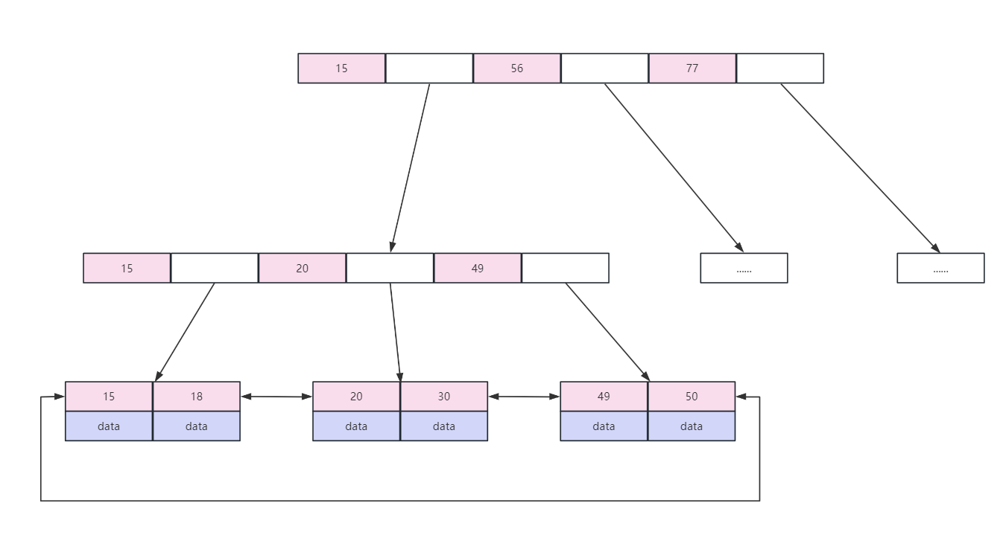

B-tree 索引（B+ 树实现）的一些特点：

- B+ 树叶子节点之间按索引数据的大小顺序建立了双向链表指针，适合按照范围查找
- 使用 B+ 树非叶子节点只存储索引，在 B 树中，每个节点的索引和数据都在一起，因此使用 B+ 树时，通过一次磁盘 IO 拿到相同大小的存储页，B+ 树可以比 B 树拿到的索引更多，因此减少了磁盘 IO 的次数。
- B+ 树查询性能更稳定，因为数据只保存在叶子节点，每次查询数据，磁盘 IO 的次数是稳定的


## 为什么索引能提高查询速度？

答：

索引可以让服务器快速定位到表的指定位置，索引有以下几个优点：

- 索引大大减少了服务器需要扫描的数据量
- 索引可以帮助服务器避免排序和临时表
- 索引可以将随机 IO 变为顺序 IO

## 前缀索引和索引的选择性？

答：

**索引的选择性：**指的是不重复的索引值与数据表的记录总数的比值。

索引的选择性越高，查询效率也越高，因为选择性高的索引可以让 mysql 在查找时过滤掉更多的行。`唯一索引`的选择性是1，这也是最好的索引选择性，性能也是最好的


**前缀索引：**

有时候为了提高索引的性能，并且节省索引的空间，只对字段的前一部分字符进行索引，但是存在的缺点就是：`降低了索引的选择性`


**如何选择前缀索引的长度呢？**

前缀索引的长度选择我们要兼顾索引的选择性和存储索引的空间两个方面，因此既不能太长也不能太短，可以通过计算`不同前缀索引长度的选择性`，找到最接近`完整列的选择性`的前缀长度，通过以下 sql 进行计算`不同前缀索引长度的选择性`：

```sql
select 
count(distinct left(title, 6)) / count(*) as sel6,
count(distinct left(title, 7)) / count(*) as sel7,
count(distinct left(title, 8)) / count(*) as sel8,
count(distinct left(title, 9)) / count(*) as sel9,
count(distinct left(title, 10)) / count(*) as sel10,
count(distinct left(title, 11)) / count(*) as sel11,
count(distinct left(title, 12)) / count(*) as sel12,
count(distinct left(title, 13)) / count(*) as sel13,
count(distinct left(title, 14)) / count(*) as sel14,
count(distinct left(title, 15)) / count(*) as sel15,
count(distinct left(title, 16)) / count(*) as sel16,
count(distinct left(title, 17)) / count(*) as sel17,
count(distinct left(title, 18)) / count(*) as sel18,
count(distinct left(title, 19)) / count(*) as sel19,
count(distinct left(title, 20)) / count(*) as sel20,
count(distinct left(title, 21)) / count(*) as sel21
from interview_experience_article 
```

计算结果如下：

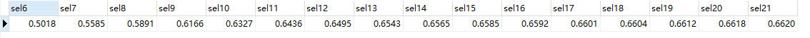

再计算`完整列的选择性`：

```sql
select count(distinct title)/count(*)  from interview_experience_article 
```

计算结果如下：


完整列的选择性是 0.6627，而前缀索引在长度为 16 的时候选择性为（`sel16=0.6592`），就已经很接近完整列的选择性了，此使再增加前缀索引的长度，选择性的提升幅度就已经很小了，因此在本例中，可以选择前缀索引长度为 16


**本例中的数据是随便找的一些文本数据，类型是 text**


**如何创建前缀索引：**

```sql
alter table table_name add key(title(16))
```


## 如何选择合适的索引顺序？

答：

来源于《高性能MySQL》（第4版）

对于选择合适的索引顺序来说，有一条重要的`经验法则`：**将选择性最高的列放到索引的最前列**

在通常境况下，这条法则会有所帮助，但是存在一些特殊情况：

对于下面这个查询语句来说：

```sql
select count(distinct threadId) as count_value
from message
where (groupId = 10137) and (userId = 1288826) and (anonymous = 0)
order by priority desc, modifiedDate desc
```

explain 的结果如下（只列出使用了哪个索引）：

```yaml
id: 1
key: ix_groupId_userId
```

可以看出选择了索引（groupId, userId），看起来比较合理，但是我们还没有考虑（groupId、userId）所匹配到的数据的行数：

```sql
select count(*), sum(groupId=10137), sum(userId=1288826), sum(anonymous=0)
from message
```

结果如下：

```sql
count(*): 4142217
sum(groupId=10137): 4092654
sum(userId=1288826): 1288496
sum(anonymous=0): 4141934
```

可以发现通过 groupId 和 userId 基本上没有筛选出来多少条数据

 **因此上边说的经验法则一般情况下都适用，但是在特殊形况下，可能会摧毁整个应用的性能**


上边这种情况的出现是因为这些数据是从其他应用迁移过来的，迁移的时候把所有的消息都赋予了管理组的用户，因此导致这样查询出来的数据量非常大，这个案例的解决情况是修改应用程序的代码：**区分这类特殊用户和组，禁止针对这类用户和组执行这个查询**


## 聚簇索引和非聚簇索引的区别？非聚集索引一定回表查询吗？

答：

聚簇索引并不是一种单独的索引类型，而是一种数据存储方式。

当表里有聚簇索引时，它的数据行实际上存放在索引的叶子节点中。

`聚簇`表示数据行和相邻和键值存储在一起

InnoDB 根据主键来聚簇数据，如果没有定义主键的话，InnoDB 会隐式定义一个主键来作为聚簇索引，

**聚簇索引的优点：**

- 数据访问更快。聚簇索引将数据和索引保存在同一个 B-tree 中，获取数据比非聚簇索引更快
- 使用覆盖索引扫描的查询可以直接使用叶节点的主键值

**聚簇索引的缺点：**

- 提升了 IO 密集型应用的性能。（如果数据全部放在内存中的话，不需要执行 IO 操作，聚集索引就没有什么优势了）

- 插入速度严重依赖于插入顺序。按照主键的顺序插入行是将数据加载到 InnoDB 表中最快的方式。

  如果不是按照逐渐顺序加载数据，在加载完之后最好使用 `optimize table` 重新组织一下表，该操作会重建表。重建操作能更新索引统计数据并释放聚簇索引中的未使用的空间。

  可以使用`show table status like '[table_name]' `查看优化前后表占用的存储空间

- 更新聚集索引的代价很高。因为会强制 InnoDB 将每个被更新的行移动到新的位置

- 基于聚簇索引的表在插入新行是或者主键被更新到只需要移动行的时候，可能面临 `页分裂` 的问题，当行的主键值需要插入某个已经满了的页中时，存储引擎会将该页分裂成两个页面来存储，也就是页分裂操作，页分裂会导致`表占用更多的磁盘空间`

- 聚簇索引可能会导致全表扫描变慢，尤其是行比较稀疏或者由于页分裂导致数据存储不连续的时候

- 二级索引（也是非聚簇索引）可能比想象的要更大，因为在二级索引的叶子节点存储了指向行的主键列。

- 二级索引访问需要两次索引查找，而不是一次。

  二级索引中，叶子节点保存的是指向行的主键值，那么如果通过二级索引进行查找，找到二级索引的叶子节点，会先获取对应数据的主键值，然后再根据这个值去聚簇索引中查找对应的行数据。（`两次索引查找`）

## 二级索引是什么？为什么已经有了聚集索引还需要使用二级索引？

答：

`二级索引`是非主键索引，也是`非聚集索引`（索引和数据分开存放），也就是在非主键的字段上创建的索引就是二级索引。

比如我们给一张表里的 name 字段加了一个索引，在插入数据的时候，就会重新创建一棵 B+ 树，在这棵 B+ 树中，就来存放 name 的二级索引。

即在二级索引中，索引是 name 值，数据（data）存放的是主键的值，第一次索引查找获取了主键值，之后根据主键值再去聚集索引中进行第二次查找，才可以找到对应的数据。

**常见的二级索引：**

- 唯一索引
- 普通索引
- 前缀索引：只适用于字符串类型的字段，取字符串的前几位字符作为前缀索引。


**为什么已经有了聚簇索引还需要使用二级索引？**

聚簇索引的叶子节点存储了完整的数据，而二级索引只存储了主键值，因此二级索引更节省空间。

如果需要为表建立多个索引的话，都是用聚簇索引的话，将占用大量的存储空间。


## 为什么在 InnoDB 表中按逐渐顺序插入行速度更快呢？

答：

向表里插入数据，主键可以选择整数自增 ID 或者 UUID。

- 如果选择自增 ID 作为主键

那么在向表中插入数据时，插入的每一条新数据都在上一条数据的后边，当达到页的最大填充因子（InnoDB 默认的最大填充因子是页大小的 15/16，留出部分空间用于以后修改）时，下一条记录就会被写入到新的页中。


- 如果选择 UUID 作为主键

在插入数据时，由于新插入的数据的主键的不一定比之前的大，所以 InnoDB 需要为新插入的数据找到一个合适的位置——通常是已有数据的中间位置，有以下缺点：

1. 写入的目标也可能已经刷到磁盘上并从内存中删除，或者还没有被加载到内存中，那么 InnoDB 在插入之前，需要先将目标页读取到内存中。`这会导致大量随机 IO`
2. 写入数据是乱序的，所以 InnoDB 会频繁执行页分裂操作
3. 由于频繁的页分裂，页会变得稀疏并且被不规则地填充，最终数据会有碎片

**什么时候使用自增 ID 作为主键反而更糟？**

在高并发地工作负载中，并发插入可能导致间隙锁竞争。


## 了解覆盖索引吗？

答：

覆盖索引：一个索引包含（或说覆盖）所有需要查询的字段的值，我们就称之为“覆盖索引”。

覆盖索引是非常有用的工具，能够极大的提高性能，只需要查询索引而不需要回表，好处有很多：


Mysql回表指的是在InnoDB存储引擎下，二级索引查询到的索引列，如果需要查找所有列的数据，则需要到[主键](https://so.csdn.net/so/search?q=%E4%B8%BB%E9%94%AE&spm=1001.2101.3001.7020)索引里面去取出数据。这个过程就称为回表

- **索引条目通常远小于数据行的大小，如果只需要读取索引，mysql可以大幅减少数据访问量。**对缓存的负载很重要，可以减少数据拷贝花费的时间。覆盖索引对IO密集型应用也很有帮助，索引比数据更小，放到内存中更节省空间。
- 因为索引是按照顺序存放的（至少在单个页内是如此），所以对于IO密集型的范围查询，会比随机从磁盘读取每一行数据的IO要少得多。
- 由于InnoDB的聚簇索引，覆盖索引对InnoDB表特别有用。InnoDB的二级索引在叶子节点中保存了行的主键值，所以如果二级索引能够覆盖查询，则可以避免对主键索引的二次查询。


## 了解索引扫描吗？

答：

MySQL有两种方法生成有序结果：

- 通过排序操作
- 按照索引顺序扫描

如果 explain 出来的 type 列值为 "index" 的话，说明是按照索引扫描了。


**索引扫描本身的速度是很快的。但是如果索引不能覆盖查询所需的全部列的话，那在每次查询索引时都需要回表再查询其他字段，这样的话，按索引顺序读取的速度通常比顺序地全表扫描要慢。如下图，select \*时没有使用索引，select age时使用了索引。**


```sql
explain select age from user order by age; # 结果1
explain select * from user order by age; # 结果2
```


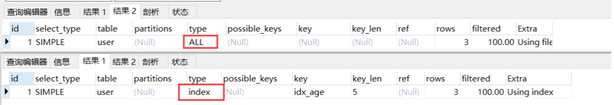


**设计：**设计的时候，尽可能让同一个索引既满足排序，又用于查找行，这样是最好的。

只有当索引的列顺序和`order by`子句的顺序完全一致时，MySQL才能使用索引来对结果进行排序，如果查询需要关联多张表时，只有`order by`子句引用的字段全部为第一个表时，才能使用索引做排序。

`order by`查询时，需要满足索引的最左前缀要求，否则MySQL需要执行排序操作，无法利用索引进行排序。

`order by`有一种情况可以不满足索引的最左前缀的要求：前导列为常量。（即如果age,name为索引列，那么`select * from user where age = 30 order by name`，使用where将age指定为常量，这时也是可以使用索引排序的）


## 索引这么多优点，为什么不对表中的每一个列创建一个索引呢？使用索引一定提高查询性能吗？

答：

如果出现过多的重复索引和未使用索引，会影响插入、删除、更新的性能。

例如，如果创建了一个主键id，再去向id上添加索引，那么就添加了重复的索引，因为MySQL的主键限制也是通过索引实现的。

冗余索引是：如果创建了索引（A, B），再创建索引（A）就是冗余索引，因为（A）是（A, B）的前缀索引。

还有一种情况是，（A, ID）其中ID是主键，也是冗余索引，因为在 InnoDB 中，二级索引的叶子节点中已经包含主键值了。


**使用索引一定提高查询性能吗？**

不一定

- 在数据量比较小的表中，使用全表扫描比使用索引扫描速度更快，并且可以直接获取到全量数据
- 索引虽然提高了查询性能，但是在插入、删除、更新的过程中也是需要进行维护的


## 最左前缀匹配原则？

答：

最左前缀原则：规定了联合索引在何种查询中才能生效。

规则如下：

- 如果想使用联合索引，联合索引的最左边的列必须作为过滤条件，否则联合索引不生效

如下图：

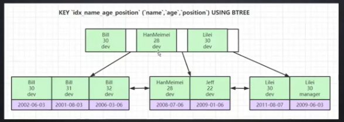

```sql
假如索引为：(name, age, position)
select * from employee where name = 'Bill' and age = 31;
select * from employee where age = 30 and position = 'dev';
select * from employee where position = 'manager';
```

对于上边三条 sql 语句，只有第一条 sql 语句走了联合索引。

**为什么联合索引需要遵循最左前缀原则呢？**

因为索引的排序是根据第一个索引、第二个索引依次排序的，假如我们单独使用第二个索引 age 而不使用第一个索引 name 的话，我们去查询age为30的数据，会发现age为30的数据散落在链表中，并不是有序的，所以使用联合索引需要遵循最左前缀原则。


## 索引下推？

答：

在索引遍历过程中，对索引中包含的所有字段先做判断，过滤掉不符合条件的记录之后再回表，可以有效减少回表次数

比如：

```sql
索引：（name, age, positioni）
SELECT * FROM employees WHERE name like 'LiLei%' AND age = 22 AND position ='manager';
```

对上面这条 sql 语句就是用了`索引下推`，经过索引下推优化后，在联合索引（name，age，position）中，匹配到名字是 LiLei 开头的索引之后，同时还会在索引中过滤 age、position 两个字段的值是否符合，最后会拿着过滤完剩下的索引对应的主键进行回表，查询完整数据

（MySQL5.6 之前没有索引下推，因此匹配到 name 为 LiLei 开头的索引之后，会直接拿到主键，进行回表查询）


**优点：**

- 索引下推可以有效减少回表次数
- 对于 InnoDB 引擎的表，索引下推只能`用于二级索引`，因为 InnoDB 的主键索引的叶子节点存储的是全行数据，如果在主键索引上使用索引下推并不会减少回表次数 


## 了解 Explain 执行计划吗？

答：

explain 语句可以帮助我们查看查询语句的具体执行计划。


explain 查出来的各列含义如下：

- id：在一个大的查询语句中，每个 select 关键字都对应一个唯一的 id

- select_type：select 关键字对应的那个查询的类型

  - simple：简单查询。表示查询不包含子查询和union

  - primary：复杂查询中最外层的 select

  - subquery：包含在 select 中的子查询（不在 from 子句中）

  - derived：包含在 from 子句中的子查询。MySQL会将结果存放在一个临时表中，也称为派生表（derived的英文含义）

    ```sql
    set session optimizer_switch='derived_merge=off';  #关闭 mysql5.7 新特性对衍生表的合并优化
    explain select (select 1 from employees where id = 5) from (select * from account where id = 3) der;
    set session optimizer_switch='derived_merge=on'; #还原默认配置
    ```

    

  - union：在 union 中的第二个和随后的 select

    ```sql
    explain select 1 union all select 1;
    ```

    ​

- partitions：匹配的分区信息

- type：表示访问类型，即 MySQL 决定如何查找表中的行。从最优到最差分别为：`system > const > eq_ref > ref > range > index > ALL`

  一般来说得保证查询达到 range 级别，最好达到 ref

  - Null：表示 MySQL 在优化阶段分解查询语句，执行时不需要再访问表或索引。例如 `explain select min(id) from account;` 在索引列中取最小值，单独查询索引即可，执行时不需要再访问表

  - system：当表中只有一条记录并且该表使用的存储引擎的统计数据是精确的，比如 `explain select * from test;` 在 `test` 表中只有一条数据，如果 test 表使用 MyISAM 存储引擎，则 type 为 system；如果 test 表使用 InnoDB 存储引擎，则 type 为 ALL

  - const：const 表示代价时常数级别，当根据主键索引、唯一索引、二级索引与常数进行等值匹配时，对单表访问就是 const，只匹配到一行数据，很快.

    `explain select * from account where id = 1 `

  - eq_ref：primary key 或 unique key 索引的所有部分被连接使用 ，最多只会返回一条符合条件的记录。这可能是在 const 之外最好的联接类型了，简单的 select 查询不会出现这种 type。

    `explain select * from t1 left join t2 on t1.id=t2.id`

  - ref：相比于 eq_ref，不使用唯一索引，使用普通索引或者唯一索引的部分前缀，索引值和某个值相比较，可能找到多个符合条件的行

    name 是普通索引（非唯一索引），`explain select * from account where name = 'abc'`

  - range：范围扫描通常出现在 `in()`、`between`、`>`、`<`等操作

  - index：扫描全索引就能拿到结果，一般是扫描某个二级索引，会直接对二级索引的叶子节点遍历和扫描。这种查询一般为使用了覆盖索引，二级索引比较小，所以通常比 ALL 快一些

  - ALL：全表扫描，扫描聚簇索引的所有叶子节点，通常情况下这需要增加索引来进行优化

- possible_keys：可能用到的索引

  查询时可能出现 possible_keys 有列，但是 key 显示 Null 的情况，这是因为表中数据不多，MySQL 认为索引帮助不大，选择了全表扫描

  如果该列是 Null，说明没有相关索引，可以通过添加索引来提高查询性能

- key：实际上使用的索引

  如果为 Null 表示没有使用索引，可以使用 `force index`、`ignore index` 来强制使用索引

- key_len：实际使用到的索引长度

  key_len 计算规则如下：

  - 字符串，char(n)、varchar(n) 在 5.0.3 之后，n 代表字符数，而不是字节数，如果是 utf-8，一个数字或字母占 1 个字节，1 个汉字占 3 个字节
    - char(n)：如果存汉字，长度为 3n 字节
    - varchar(n)：
      - 如果存汉字（utf8），长度为 3n+2 字节，加的 2 字节用来存储字符串长度（varchar 是变长字符串）
      - 如果存汉字（utf8-mb4），长度为 4n+2 字节
  - 数值类型
    - tinyint：1 字节
    - smallint：2 字节
    - int：4 字节
    - bigint：8 字节
  - 时间类型：
    - date：3 字节
    - timestamp：4 字节
    - datetime：8 字节
  - 如果字段允许为 Null，则还需要 1 字节记录是否为 Null

  **计算示例：**

  - 设置索引：`idx_balance(balance)`，`explain select name from account where balance = '111' ;`

    该 SQL key_len = 5，4 个字节用于存储 balance（int，4B），1 个字节记录是否为 Null

  - 设置索引：idx_name(name)，name 字段编码为 uft8-mb4，长度为varchar(10)，`explain select name from account where name = 'abc';`

    该 SQL key_len = 43，name 索引长度为 10，使用 utf8-mb4 存储汉字的话，1 个汉字占 4 个字节，长度为 10 所占用字节为 4 * 10 = `40`，还需要 `2` 个字节存储 varchar 的长度，name 字段可以为空，因此还需要 `1` 个字节记录是否为 Null，因此 name 索引的长度为 `40 + 2 + 1 = 43`

    如果是 utf-8 编码，1 个汉字是占 3 个字节的。

- ref：当使用索引列等值查询时，与索引列进行等值匹配的对象信息，常见的 ref 值有：const（常量），字段名（例如：film.id）

- rows：预估的需要读取的记录条数，并不是结果集中的行数

- Extra：—些额外的信息，常见的重要值如下：

  - Using index：使用覆盖索引
  - Using where：使用 where 语句来处理结果，并且查询的列未被索引覆盖
  - Using index condition：查询的列不完全被索引覆盖，where 条件中是一个前导列的范围
    - 示例：索引（name，balance） `explain select *from account where name > 'a';`
  - Using temporary：mysql 需要创建一张临时表来处理查询。出现这种情况需要使用索引进行优化
    - 示例：name 字段没有索引，此时创建一张临时表来 distinct，`explain select distinct name from account`
  - Using filesort：使用外部排序而不是索引排序，数据较少时在内存中排序，数据较大时在磁盘中排序，一般情况下也是需要考虑使用索引进行优化
    - 示例：name 字段没有索引，`explain select name from account order by name`
  - Select tables optimized away：使用聚合函数来访问存在索引的某个字段
    - 示例：`explain select min(id) from account;`

## MySQL 的锁

答：

MySQL 的锁

从数据操作的粒度分的话，分为`表锁`和`行锁`

从数据操作的类型分的话，分为`读锁`和`写锁`


### 表锁

每次操作锁住整张表，锁粒度大，性能低


- 手动增加表锁（可以给表加读锁或写锁，如果加读锁，其他会话可以读，但是无法写；如果加写锁。其他会话的读写都会被阻塞）

`lock table 表名 read(write);` 

- 查看表上加过的锁

`show open tables;`

- 删除表锁

`unlock tables;`


### 行锁

每次操作锁住一行数据，锁力度小，性能高


**InnoDB与MYISAM的最大不同有两点：**

- InnoDB支持事务
- InnoDB支持行级锁


### 总结

- MyISAM 在执行查询语句 select 前，会自动给涉及的所有表加读锁,在执行 update、insert、delete 操作会自动给涉及的表加写锁。

- InnoDB 在执行查询语句 select  时(非串行隔离级别)，不会加锁。但是 update、insert、delete 操作会加行锁。

- 简而言之，就是读锁会阻塞写，但是不会阻塞读。而写锁则会把读和写都阻塞。

- **锁主要是加在索引上，如果对非索引字段更新，行锁可能会变表锁：**

  假如 account 表有 3 个字段（id, name, balance），我们在 name、balance 字段上并没有设置索引

  session1 执行：

  ```sql
  mysql> begin;
  Query OK, 0 rows affected (0.00 sec)

  mysql> select * from account;
  +----+------+---------+
  | id | name | balance |
  +----+------+---------+
  |  1 | zs   |     777 |
  |  2 | ls   |     800 |
  |  3 | ww   |     777 |
  |  4 | abc  |     999 |
  | 10 | zzz  |    2000 |
  | 20 | mc   |    1500 |
  +----+------+---------+
  6 rows in set (0.01 sec)

  mysql> update account set balance = 666 where name='zs';
  Query OK, 1 row affected (0.00 sec)
  Rows matched: 1  Changed: 1  Warnings: 0
  ```

  此时 session2 执行（发现执行阻塞，经过一段时间后，返回结果锁等待超时，证明 session1 在没有索引的字段上加锁，导致`行锁升级为表锁`，因此 session2 无法对表中其他数据做修改）：

  ```sql
  mysql> begin;
  Query OK, 0 rows affected (0.00 sec)

  mysql> update account set balance = 111 where name='abc';
  RROR 1205 (HY000): Lock wait timeout exceeded; try restarting transaction
  ```

  **`InnoDB 的行锁是针对索引加的锁，不是针对记录加的锁。并且该索引不能失效，否则会从行锁升级为表锁`**


## select for update 了解吗？

答：

`select for update` 即排他锁，根据 where 条件的不同，对数据加的锁又分为行锁和表锁：

- 如果 where 字段使用到了索引，则会添加行锁
- 如果 where 字段没有使用索引，则会添加表锁


## 并发事务带来的问题

答：

- `脏写：`多个事务更新同一行，每个事务不知道其他事务的存在，最后的更新覆盖了其他事务所做的更新
- `脏读：`事务 A 读取到了事务 B 已经修改但是没有提交的数据，此时如果事务 B 回滚，事务 A 读取的则为脏数据
- `不可重复读：`事务 A 内部相同的查询语句在不同时刻读出的结果不一致，在事务 A 的两次相同的查询期间，有其他事务修改了数据并且提交了
- `幻读：`当事务 A 读取到了事务 B 提交的新增数据

**不可重复读和幻读很类似，都是事务 A 读取到了事务 B 新提交的数据，区别为：**

- 不可重复读是读取了其他事务更改的数据，针对 `update` 操作
- 幻读是读取了其他事务新增的数据，针对 `insert` 和 `delete` 操作


**不同的事务隔离级别可能带来的问题：**

| 隔离级别                   | 脏读（Dirty Read） | 不可重复读（NonRepeatable Read） | 幻读（Phantom Read） |
| ---------------------- | -------------- | ------------------------- | ---------------- |
| 未提交读（Read uncommitted） | 可能             | 可能                        | 可能               |
| 已提交读（Read committed）   | 不可能            | 可能                        | 可能               |
| 可重复读（Repeatable read）  | 不可能            | 不可能                       | 可能               |
| 可串行化（Serializable ）    | 不可能            | 不可能                       | 不可能              |


## MySQL 的事务隔离级别了解吗？

答：

MySQL 的事务隔离级别分为：

- 读未提交：事务 A 会读取到事务 B 更新但没有提交的数据。如果事务 B 回滚，事务 A 产生了脏读

- 读已提交：事务 A 会读取到事务 B 更新且提交的数据。事务 A 在事务 B 提交前后两次查询结果不同，产生不可重复读

- 可重复读：保证事务 A 中多次查询数据一致。**`可重复读是 MySQL 的默认事务隔离级别`**。可重复读可能会造成`幻读` ，事务A进行了多次查询，但是事务B在事务A查询过程中新增了数据，事务A虽然查询不到事务B中的数据，但是可以对事务B中的数据进行更新

  演示可重复读：

  1. 先创建一个事务 A，查询表

     ```bash
     mysql> start transaction;
     Query OK, 0 rows affected (0.00 sec)

     mysql> select * from account;
     +----+------+---------+
     | id | name | balance |
     +----+------+---------+
     |  1 | zs   |     150 |
     |  2 | ls   |     200 |
     +----+------+---------+
     2 rows in set (0.00 sec)
     ```

     ​

  2. 此时再去创建事务 B，修改数据让第一条数据的 balance 减去 50，并且提交事务

     ```bash
     mysql> start transaction;
     Query OK, 0 rows affected (0.00 sec)

     mysql> update account set balance = balance - 50 where id = 1;
     Query OK, 1 row affected (0.00 sec)
     Rows matched: 1  Changed: 1  Warnings: 0

     mysql> select * from account;
     +----+------+---------+
     | id | name | balance |
     +----+------+---------+
     |  1 | zs   |     100 |
     |  2 | ls   |     200 |
     +----+------+---------+
     2 rows in set (0.00 sec)

     mysql> commit;
     Query OK, 0 rows affected (0.00 sec)

     ```

  3. 在事务 B 提交之后，在事务 A 中查询数据，发现与上次查询数据一致（可重复读）

     ```bash
     mysql> select * from account;
     +----+------+---------+
     | id | name | balance |
     +----+------+---------+
     |  1 | zs   |     150 |
     |  2 | ls   |     200 |
     +----+------+---------+
     2 rows in set (0.00 sec)
     ```

  4. 在事务 A 中让第一条数据的 balance 减去 50，由于在事务 B 中已经减去 1 次 50 了，所以在事务 A 中的 update account set balance = balance - 50 where id = 1 语句中的 balance 值使用的是上边步骤 2 中的 100，所以事务 A 中更新之后的 balance 值为 50。`可重复读的隔离级别下使用了 MVCC 机制，select 操作不会更新版本号，是快照读（历史版本）；insert、update 和 delete 会更新版本号，是当前读（当前版本）` 

     ```bash
     mysql> select * from account;
     +----+------+---------+
     | id | name | balance |
     +----+------+---------+
     |  1 | zs   |     150 |
     |  2 | ls   |     200 |
     +----+------+---------+
     2 rows in set (0.01 sec)

     mysql> update account set balance = balance - 50 where id = 1;
     Query OK, 1 row affected (0.00 sec)
     Rows matched: 1  Changed: 1  Warnings: 0

     mysql> select * from account;
     +----+------+---------+
     | id | name | balance |
     +----+------+---------+
     |  1 | zs   |      50 |
     |  2 | ls   |     200 |
     +----+------+---------+
     2 rows in set (0.00 sec)

     ```

  5. 验证出现幻读，重新打开事务 B，插入一条数据

     ```bash
     mysql> start transaction;
     Query OK, 0 rows affected (0.00 sec)

     mysql> select * from account;
     +----+------+---------+
     | id | name | balance |
     +----+------+---------+
     |  1 | zs   |      50 |
     |  2 | ls   |     200 |
     +----+------+---------+
     2 rows in set (0.00 sec)

     mysql> insert into account values(4, 'abc', 300);
     Query OK, 1 row affected (0.00 sec)
     mysql> select * from account;
     +----+------+---------+
     | id | name | balance |
     +----+------+---------+
     |  1 | zs   |      50 |
     |  2 | ls   |     200 |
     |  4 | abc  |     300 |
     +----+------+---------+
     3 rows in set (0.00 sec)

     mysql> commit;
     Query OK, 0 rows affected (0.01 sec)
     ```

  6. 在事务 A 中查询，发现没有看到事务 B 新插入的数据，但是事务 A 可以直接更新事务 B 中插入的数据（`说明事务 A 是可以感知到事务 B 插入的数据，因此发生了幻读`），更新之后，事务 A 再次查询就查询到了事务 B 的数据。

     ```bash
     mysql> select * from account;
     +----+------+---------+
     | id | name | balance |
     +----+------+---------+
     |  1 | zs   |      50 |
     |  2 | ls   |     200 |
     +----+------+---------+
     2 rows in set (0.00 sec)

     mysql> update account set balance = 888 where id = 4;
     Query OK, 1 row affected (0.00 sec)
     Rows matched: 1  Changed: 1  Warnings: 0

     mysql> select * from account;
     +----+------+---------+
     | id | name | balance |
     +----+------+---------+
     |  1 | zs   |      50 |
     |  2 | ls   |     200 |
     |  4 | abc  |     888 |
     +----+------+---------+
     3 rows in set (0.00 sec)
     ```

     ​

- 可串行化：并发性能低，不常使用


## MySQL 的间隙锁了解吗？

答：

间隙锁，用于锁两个值之间的空隙，在 InnoDB 中，默认的隔离级别是可重复读，并且`通过间隙锁来防止在这个隔离级别上产生幻读`

间隙锁：InnoDB 不仅锁定在查询中涉及的行，还会对索引结构中的间隙进行锁定，在一些情况下可以解决幻读情况


假设表中数据如下：

```bash
mysql> select * from account;
+----+------+---------+
| id | name | balance |
+----+------+---------+
|  1 | zs   |      50 |
|  2 | ls   |     200 |
|  3 | ww   |     210 |
|  4 | abc  |     888 |
| 10 | zzz  |    2000 |
| 20 | mc   |    1500 |
+----+------+---------+
6 rows in set (0.01 sec)
```


那么间隙就有 3 个区间：(4, 10), (10, 20), (20, 正无穷)

如果在事务 A 中执行更新语句：`update account set name = 'hello' where id > 8 and id < 18;`，则在其他事务中就无法在这个范围所包含的所有行记录以及行记录所在的间隙里插入或修改数据，即 id 在 `(4, 20]` 区间，都无法修改数据。


**间隙锁在可重复隔离级别下才会生效**


演示过程如下：

1. 事务 A 先开启事务，并且更新

   ```bash
   mysql> start transaction;
   Query OK, 0 rows affected (0.00 sec)

   mysql> select * from account;
   +----+------+---------+
   | id | name | balance |
   +----+------+---------+
   |  1 | zs   |      50 |
   |  2 | ls   |     200 |
   |  3 | ww   |     210 |
   |  4 | abc  |     888 |
   | 10 | zzz  |    2000 |
   | 20 | mc   |    1500 |
   +----+------+---------+
   6 rows in set (0.00 sec)

   mysql> update account set name = hello where id > 8 and id < 18;
   ERROR 1054 (42S22): Unknown column 'hello' in 'field list'
   mysql> update account set name = 'hello' where id > 8 and id < 18;
   Query OK, 1 row affected (0.00 sec)
   Rows matched: 1  Changed: 1  Warnings: 0
   ```

2. 事务 B 开启事务，在间隙中插入数据，发现插入被阻塞

   ```bash
   mysql> start transaction;
   Query OK, 0 rows affected (0.00 sec)

   mysql> select * from account;
   +----+------+---------+
   | id | name | balance |
   +----+------+---------+
   |  1 | zs   |      50 |
   |  2 | ls   |     200 |
   |  3 | ww   |     210 |
   |  4 | abc  |     888 |
   | 10 | zzz  |    2000 |
   | 20 | mc   |    1500 |
   +----+------+---------+
   6 rows in set (0.00 sec)

   mysql> insert into account values(6, 'world', 150);
   ERROR 1205 (HY000): Lock wait timeout exceeded; try restarting transaction
   mysql> insert into account values(6, 'world', 150);
   ```

   ​


## 设置 MySQL 的事务隔离级别

答：

通过以下命令设置：

```sql
show variables like 'tx_isolation'; # 查看事务隔离级别
set tx_isolation='read-uncommitted'; # 设置读未提交
set tx_isolation='read-committed'; # 设置读已提交
set tx_isolation='repeatable-read'; # 设置可重复读
set tx_isolation='serializable'; # 设置可串行化
```


## 什么是慢 sql，如何查找，如何优化？

答：


> 1. mysql 的三大日志？

> 1. mysql 的事务隔离级别？各自解决了什么问题？mvcc的流程？

> 1. mysql 性能怎么优化？

索引（比如覆盖索引、最左前缀匹配原则）、表结构（选择合适的字段属性和数据类型）、SQL基本编写规范、优化慢SQL（慢SQL定位、Explain 命令使用）、分库分表和读写分离、加强运维（比如通过一些监控工具监控慢 SQL）

可以先聊慢SQL定位以及EXPLAIN 命令的应用，再聊索引、表结构以及SQL基本编写规范，分库分表和读写分离这些最后考虑。如非迫不得已，一定不需要选择分库分表，带来的问题不少

读写分离：https://javaguide.cn/high-performance/read-and-write-separation-and-library-subtable.html

https://javaguide.cn/database/mysql/mysql-high-performance-optimization-specification-recommendations.html

> 1. 索引失效七种？


> 1. mysql 的三大 log 的执行时机？redolog刷盘时机？


> 1. 一条模糊查询语句，查询速度越来越慢怎么排查？

从两个方面进行排查：

1. 确认是否建立了索引
2. 确认索引是否生效

> 1. MySQL如何保证事务的一致性？


> 1. 一张 MySQL 数据库表存多少条数据合适？


> 1. B+ 树索引有哪些好处？还有哪些数据结构索引？


> 1. InnoDB 怎么实现的事务？


> 1. MySQL 执行一个 update 语句的全流程？（客户端到服务器）


> 1. MySQL ACID 怎么实现的？


> 1. MySQL 新旧数据同步，怎么切流量使同步更平滑？


> 1. 分布式数据库的主从怎么做的？（读写分离）


> 1. 如果主数据库崩了怎么办？


## 介绍一下 join、left join、right join 区别？

答：

- join 和 inner join 是相同的，inner join 可以简写为 join，表示两个表的交集
- left join 是左连接，以左表为主，查询左表所有数据，显示右表与左表相关联部分的数据
- right join 是右连接，以右表为主，查询右表所有数据，显示左表与右表相关联部分的数据

下边我们为测试数据：

**t1 表数据：** 

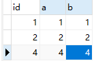

**t2 表数据：**


**测试结果：**

```sql
select * from t1 join t2 on t1.id = t2.id; # 结果1
select * from t1 left join t2 on t1.id = t2.id; # 结果2
select * from t1 right join t2 on t1.id = t2.id; # 结果3
```


## 介绍一下Union和union all的区别？

答：

使用union关键字时，可以给出多条select 语句，并将它们的结果合成单个结果集合并时两个表对应的列数和数据类型必须相同。

- union 对两个结果集进行并集操作，并且去重和排序
- union all 只是合并多个查询结果，不会进行去重和排序，效率比 union 高

> 1. mysql 什么语句会触发什么样的锁？（这里挖坑了，说select查询时会用表锁，实际上比较少用，alter这种ddl语句会用）


> 1. 什么是幻读？脏读等等，，，


> 1. 加行锁一定要设计索引吗？


> 1. 知道项目用的什么事务模型吗？


> 1. b+树与b树区别，为什么选择b+树

实际场景中，我们需要的是一个时间复杂度稳定的数据结构，而不是忽高忽低


> 1. select for update


> 1. 数据库如何做乐观锁？


> 1. 如何保证mysql的RR（用锁和MVCC）


> 1. 调试过数据库参数吗


> 1. 讲讲红黑树


> 1. mysql主从数据库设计


> 1. mydql刷盘原理


> 1. 什么情况下加什么行锁


> 1. SELECT COUNT(*)怎么走索引


> 1. 已经用了MQ了为什么还会出现mysql连接数过高，怎么优化mysql的性能瓶颈，怎么分库分表？

mysql 连接数过高的原因？？？


> 1. MySql怎么删除数据。


> 1. delete和truncate的区别（不会）


> 1. 写查询语句的时候应该从哪些方面考虑来注意性能。


> 1. 什么是联合索引，为什么要建联合索引？


> 1. a,b,c,d，四个字段，查询语句的where条件a=b，orderby c。（mysql翻页越翻越慢怎么优化，满足a=b的字段很多，怎么高效的排序，分页查询）


> 1. SQL explain 会输出哪些信息？


> 1. sql怎么手动加锁


## 如何判断是否使用索引？

答：

### 建表 SQL

```sql
CREATE TABLE `employees` (
`id` int(11) NOT NULL AUTO_INCREMENT,
`name` varchar(24) NOT NULL DEFAULT '' COMMENT '姓名',
`age` int(11) NOT NULL DEFAULT '0' COMMENT '年龄',
`position` varchar(20) NOT NULL DEFAULT '' COMMENT '职位',
`hire_time` timestamp NOT NULL DEFAULT CURRENT_TIMESTAMP COMMENT '入职时间',
PRIMARY KEY (`id`),
KEY `idx_name_age_position` (`name`,`age`,`position`) USING BTREE
) ENGINE=InnoDB AUTO_INCREMENT=1 DEFAULT CHARSET=utf8 COMMENT='员工记录表';

INSERT INTO employees(name,age,position,hire_time) VALUES('LiLei',22,'manager',NOW());
INSERT INTO employees(name,age,position,hire_time) VALUES('HanMeimei', 23,'dev',NOW());
INSERT INTO employees(name,age,position,hire_time) VALUES('Lucy',23,'dev',NOW());

 ‐‐ 插入一些示例数据
drop procedure if exists insert_emp;
delimiter ;;
create procedure insert_emp()
begin
declare i int;
set i=1;
while(i<=100000)do
insert into employees(name,age,position) values(CONCAT('zqy',i),i,'dev');
set i=i+1;
end while;
end;;
delimiter ;
call insert_emp()
```


### 1、联合索引第一个字段用范围不走索引

```sql
EXPLAIN SELECT * FROM employees WHERE name > 'LiLei' AND age = 22 AND position ='manager';
```


`结论：`type 为 ALL 表示进行了全表扫描，mysql 内部可能认为第一个字段使用范围，结果集可能会很大，如果走索引的话需要回表导致效率不高，因此直接使用全表扫描


### 2、强制走索引

```sql
EXPLAIN SELECT * FROM employees force index(idx_name_age_position) WHERE name > 'LiLei' AND age = 22 AND position ='manager';
```


`结论：`虽然走了索引，扫描了 50103 行，相比于上边不走索引扫描的行数少了一半，但是查找效率不一定比全表扫描高，因为回表导致效率不高。


**可以使用以下代码测试：**

```sql
set global query_cache_size=0;
set global query_cache_type=0;
SELECT * FROM employees WHERE name > 'LiLei' limit 1000;
> OK
> 时间: 0.408s
SELECT * FROM employees force index(idx_name_age_position) WHERE name > 'LiLei' limit 1000;
> OK
> 时间: 0.479s
SELECT * FROM employees WHERE name > 'LiLei' limit 5000;
> OK
> 时间: 0.969s
SELECT * FROM employees force index(idx_name_age_position) WHERE name > 'LiLei' limit 5000;
> OK
> 时间: 0.827s
```

`结论：`在查询 1000 条数据的话，全表扫描还是比走索引消耗时间短的，但是当查询 5000 条数据时，还是走索引效率高


### 3、覆盖索引优化

```sql
EXPLAIN SELECT name,age,position FROM employees WHERE name > 'LiLei' AND age = 22 AND position ='manager';
```


`结论：`使用覆盖索引不需要回表，效率更高


### 4、in、or

in和or在表数据量比较大的情况会走索引，在表记录不多的情况下会选择全表扫描

```sql
EXPLAIN SELECT * FROM employees WHERE name in ('LiLei','HanMeimei','Lucy') AND age = 22 AND position='manager'; # 结果1
EXPLAIN SELECT * FROM employees WHERE (name = 'LiLei' or name = 'HanMeimei') AND age = 22 AND position='manager'; # 结果2
```


`结论：`in、or 的查询的 type 都是 range，表示使用一个索引来检索给定范围的行


给原来的 employee 表复制为一张新表 employee_copy ，里边只保留 3 条记录

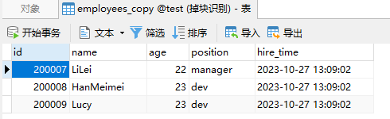

```sql
EXPLAIN SELECT * FROM employees_copy WHERE name in ('LiLei','HanMeimei','Lucy') AND age = 22 AND position ='manager';
EXPLAIN SELECT * FROM employees_copy WHERE (name = 'LiLei' or name = 'HanMeimei') AND age = 22 AND position ='manager';
```


`结论：`in、or 的查询的 type 都是 ALL，表示进行了全表扫描，没有走索引


### 5、like KK% 一般情况都会走索引

```sql
 EXPLAIN SELECT * FROM employees WHERE name like 'LiLei%' AND age = 22 AND position ='manager';
```


```sql
EXPLAIN SELECT * FROM employees_copy WHERE name like 'LiLei%' AND age = 22 AND position ='manager';
```


## 常见的 SQL 优化

答：

### order by、group by 优化

下边是 8 种使用 order by 的情况，我们通过分析以下案例，可以判断出如何使用 order by 和 where 进行配合可以走`using index condition（索引排序）`而不是 `using filesort（文件排序）`


- **case1**

```sql
EXPLAIN SELECT * FROM employees WHERE name = 'LiLei' and position = 'dev' order by age;
```


`分析：`查询用到了 name 索引，从 key_len=74 也能看出，age 索引列用在排序过程中，因此 Extra 字段里没有 using filesort


- **case2**

```sql
EXPLAIN SELECT * FROM employees WHERE name = 'LiLei' order by position;
```

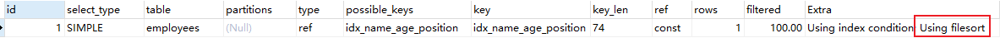


`分析：`从 explain 执行结果来看，key_len = 74，查询使用了 name 索引，由于用了 position 进行排序，跳过了 age，出现了 Using filesort


- **case3**

```sql
EXPLAIN SELECT * FROM employees WHERE name = 'LiLei' order by age, position;
```


`分析：`查找只用到索引name，age和position用于排序，与联合索引顺序一致，因此无 using filesort。


- **case4**

```sql
EXPLAIN SELECT * FROM employees WHERE name = 'LiLei' order by position, age;
```


`分析：`因为索引的创建顺序为 name,age,position，但是排序的时候 age 和 position 颠倒位置了，和索引创建顺序不一致，因此出现了 using filesort


- **case5**

```sql
EXPLAIN SELECT * FROM employees WHERE name = 'LiLei' and age = 18 order by position, age;
```


`分析：`与 case 4 相比，Extra 中并未出现 using filesort，并且查询使用索引 name，age，排序先根据 position 索引排序，索引使用顺序与联合索引顺序一致，因此使用了索引排序


- **case6**

```sql
EXPLAIN SELECT * FROM employees WHERE name = 'zqy' order by age asc, position desc;
```


`分析：`虽然排序字段列与联合索引顺序一样，但是这里的 position desc 变成了降序排序，`导致与联合索引的排序方式不同`，因此产生了 using filesort


- **case7**

```sql
EXPLAIN SELECT * FROM employees WHERE name in ('LiLei', 'zqy') order by age, position;
```


`分析：`先使用索引 name 拿到 LiLei，zqy 的数据，之后需要根据 age、position 排序，但是根据 name 所拿到的数据对于 age、position 两个字段来说是无序的，所以需要使用到 filesort。

> 为什么根据 name in 拿到的数据对于 age、position 来说是无序的：
>
> 对于下图来说，如果取出 name in (Bill, LiLei) 的数据，那么对于 age、position 字段显然不是有序的，因此肯定无法使用索引扫描排序


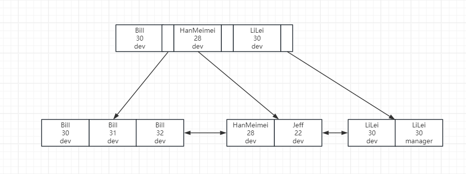


- **case8**

```sql
EXPLAIN SELECT * FROM employees WHERE name > 'a' order by name;
```


`分析：`对于上边这条 sql 来说，是 select * 因此 mysql 判断不走索引，直接全表扫描更快，因此出现了 using filesort

```sql
EXPLAIN SELECT name FROM employees WHERE name > 'a' order by name;
```


`分析：`因此可以使用`覆盖索引`来优化，只通过索引查询就可以查出我们需要的数据，不需要回表，通过覆盖索引优化，因此没有出现 using filesort


#### 优化总结

1. MySQL支持两种方式的排序 filesort 和 index，Using index 是指 MySQL 扫描索引本身完成排序。index 效率高，filesort 效率低。
2. order by满足两种情况会使用Using index。
   - order by语句使用索引最左前列。
   - 使用where子句与order by子句条件列组合满足索引最左前列。
3. 尽量在索引列上完成排序，遵循索引建立（索引创建的顺序）时的最左前缀法则。
4. 如果order by的条件不在索引列上，就会产生Using filesort。
5. 能用覆盖索引尽量用覆盖索引
6. group by 与 order by 很类似，其实质是先排序后分组，遵照索引创建顺序的最左前缀法则。对于 group by 的优化如果不需要排序的可以加上 order by null 禁止排序。注意，where 高于 having，能写在 where 中的限定条件就不要去 having 限定了。


### 分页查询优化

我们实现分页功能可能会用以下 sql：

```sql
select * from employees limit 10000, 10;
```

该 sql 表示从 employees 表的第 10001 行开始的 10 行数据，虽然只查询了 10 条数据，但是会先去读取 10010 条记录，再抛弃前 10000 条数据，因此如果查询的数据比较靠后，效率非常低


#### 1、根据自增且连续的主键排序的分页查询

该优化必须保证主键是自增的，并且主键连续，中间没有断层。


**未优化 sql** 

```sql
select * from employees limit 9000, 5;
```

**结果：**

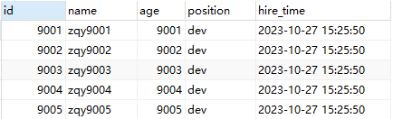

**执行计划：**


因为 id 是连续且自增的，所以可以直接通过 id 判断拿到 id 比 9000 大的 5 条数据，效率更高：


**优化后 sql**

```sql
select * from employees where id > 9000 limit 5;
```


**结果**

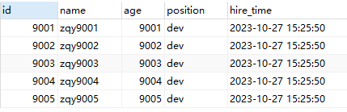

**执行计划：** 


**总结**

- 如果主键空缺，则不能使用该优化方法

#### 2、根据非主键字段排序的分页查询


**未优化 sql**

```sql
select * from employees order by name limit 9000, 5;
> OK
> 时间: 0.066s
```

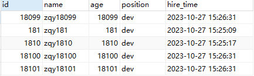

```sql
explain select * from employees order by name limit 9000, 5;
```


根据`执行计划`得，使用了全表扫描（type=ALL），并且 Extra 列为 using filesort，原因是联合索引为（name，age，position），但是使用了 select \* 中有的列并不在联合索引中，如果使用索引还需要回表，因此 mysql 直接进行全表扫描


**优化 sql**

`优化的点在于：`让在排序时返回的字段尽量为覆盖索引，这样就会走索引并且还会使用索引排序

先让排序和分页操作查出主键，再根据主键查到对应记录

```sql
select * from employees e inner join (select id from employees order by name limit 9000, 5) ed on e.id = ed.id;
> OK
> 时间: 0.032s
```

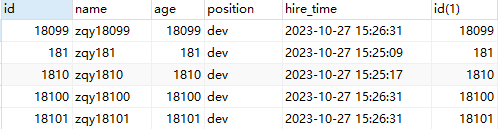

```sql
explain select * from employees e inner join (select id from employees order by name limit 9000, 5) ed on e.id = ed.id;
```

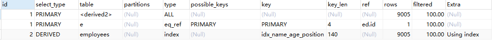

根据`执行计划`得，优化后查询走了索引，并且排序使用了索引排序


**总结**

- 优化后，sql 语句的执行时间时原 sql 的一半

```sql
CREATE TABLE `t1` (
    `id` int(11) NOT NULL AUTO_INCREMENT,
    `a` int(11) DEFAULT NULL,
    `b` int(11) DEFAULT NULL,
    PRIMARY KEY (`id`),
    KEY `idx_a` (`a`)
) ENGINE=InnoDB DEFAULT CHARSET=utf8;

create table t2 like t1;  
‐‐ 插入一些示例数据
‐‐ 往t1表插入1万行记录
drop procedure if exists insert_t1;
delimiter ;;
create procedure insert_t1()
begin
	declare i int;
	set i=1;
	while(i<=10000)do
		insert into t1(a,b) values(i,i);
		set i=i+1;
	end while;
end;;
delimiter ;
call insert_t1();

‐‐ 往t2表插入100行记录
drop procedure if exists insert_t2;
delimiter ;;
create procedure insert_t2()
begin
	declare i int;
	set i=1;
	while(i<=100)do
		insert into t2(a,b) values(i,i);
		set i=i+1;
	end while;
end;;
delimiter ;
call insert_t2();
```


### in 和 exists 优化

原则：小表驱动大表

`in：`当 B 表的数据集小于 A 表的数据集时，使用 `in`

```sql
select * from A where id in (select id from B)
```


`exists：`当 A 表的数据集小于 B 表的数据集时，使用 `exists`

将主查询 A 的数据放到子查询 B 中做条件验证，根据验证结果（true 或 false）来决定主查询的数据是否保留

```sql
select * from A where exists (select 1 from B where B.id = A.id)
```


**总结**

- exists 只返回 true 或 false，因此子查询中的 select * 也可以用 select 1 替换


### count(\*)查询优化

```sql
‐‐ 临时关闭mysql查询缓存，为了查看sql多次执行的真实时间
set global query_cache_size=0;
set global query_cache_type=0;
EXPLAIN select count(1) from employees;
EXPLAIN select count(id) from employees;
EXPLAIN select count(name) from employees;
EXPLAIN select count(*) from employees;
```


`分析：`4 条 sql 语句的执行计划一样，说明这 4 个 sql 的执行效率差不多


**总结**

- 当字段有索引，执行效率：`count(*) ≈ count(1) > count(字段) > count(主键id)`

  如果字段有索引，走二级索引，二级索引存储的数据比主键索引少，所以 `count(字段)` 比 `count(主键id)` 效率更高

- 当字段无索引，执行效率：`count(*) ≈ count(1) > count(主键id) > count(字段)`

- `count(1)` 和 `count(*)` 比较

  - `count(1)` 不需要取出字段统计，使用常量 1 做统计，`count(字段)` 还需要取出字段，所以理论上 `count(1)` 比 `count(字段)` 快

  - `count(*)` 是例外，mysql 并不会把全部字段取出来，会忽略所有的列直接，效率很高，所以不需要用

    `count(字段)` 或 `count(常量)` 来替代 `count(*)`

- 为什么对于 `count(id)`，mysql最终选择辅助索引而不是主键聚集索引？因为二级索引相对主键索引存储数据更少，检索

  性能应该更高，mysql内部做了点优化（应该是在5.7版本才优化）。


## 了解 MVCC 吗？

答：

MVCC（Multi-Version Concurrency Control） 是用来保证 MySQL 的事务隔离性的，对一行数据的读和写两个操作默认是不会通过加锁互斥来保证隔离性，避免了频繁加锁互斥，而在串行化隔离级别为了保证较高的隔离性是通过将所有操作加锁互斥来实现的。


**MySQL 在`读已提交`和`可重复读`隔离级别下都实现了 MVCC 机制，ReadView 生成规则为：**

- 在读已提交隔离级别下，ReadView 生成的时机是每个 Select 生成一个 ReadView
- 在可重复读隔离级别下，ReadView 生成的时机是每个事务生成一个 ReadView

MVCC 是基于 **undolog**、**版本链**、**readview** 实现的。

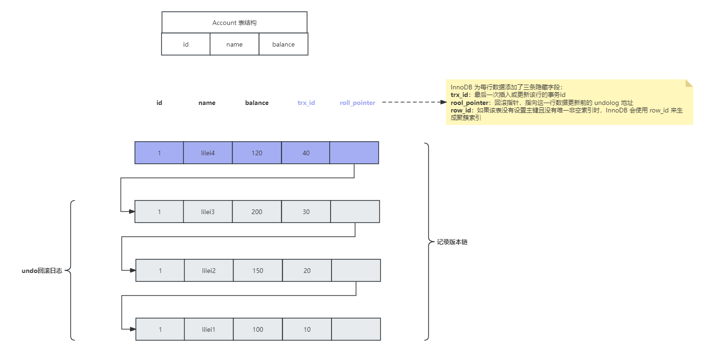

在每次更新或者删除数据时，都会将操作记录在 `undo 日志`中，每条 `undo 日志` 通过 `roll_pointer` 进行关联，构成了数据的`版本链`


**ReadView** 中包含以下参数：

- m_ids：表示生成 ReadView 时，当前系统中活跃（未提交）的事务 id 数组
- min_trx_id：表示生成 ReadView 时，当前系统中活跃的事务中最小的事务 id，也就是 m_ids 中的最小值
- max_trx_id：表示生成 ReadView 时，已经创建的最大事务 id`（事务创建时，事务 id 是自增的）`
- creator_trx_id：表示生成 ReadView 的事务的事务 id

那么在事务里的 sql 查询会和 ReadView 进行对比，来判断是否取该行的数据：

1. 如果 row 的 trx_id < min_trx_id，表示这一行数据的事务 id 比 ReadView 中活跃事务的最小 id 还要小，表示这行数据是已提交事务生成的，因此该行数据可见
2. 如果 row 的 trx_id > max_id，表示这一行数据是由将来启动的事务生成的，不可见（如果 row 的 trx_id 就是当前事务自己的 id，则可见）
3. 如果 row 的 min_id <= trx_id <= max_id，则有两种情况：
   1. 如果 trx_id 在 ReadView 的活跃事务 id 数组（m_ids）中，则表明该事务还未提交，则该行数据不可见
   2. 如果不在，则表明该事务已经提交，可见

**注意：**

- 执行 start transaction 之后，并不会立即生成事务 id，而是在该事务中，第一次修改 InnoDB 时才会为该事务生成事务 id
- MVCC 机制就是通过 ReadView 和 undo 日志进行对比，拿到当前事务可见的数据


## 了解 BufferPool 缓存机制吗？

https://blog.csdn.net/mingyuli/article/details/120347093

https://www.processon.com/view/6080de691e08534b2ef0218b

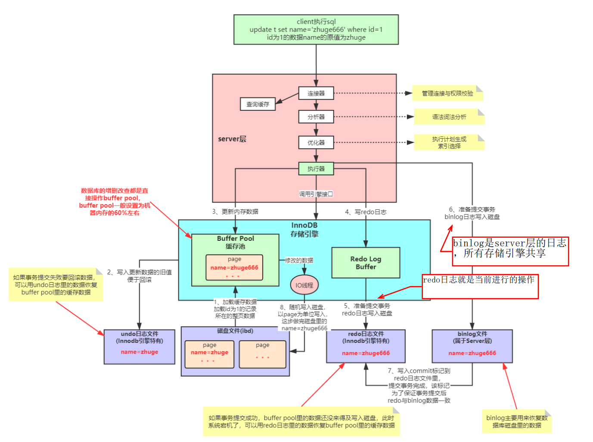

答：

Buffer Pool 本质就是数据库的一个内存组件，MySQL 的增删改查都是直接操作 BufferPool 的，一般设置 BufferPool 的大小为机器内存的 60% ，Buffer Pool 的大小在 `/etc/my.cnf` 中进行配置：

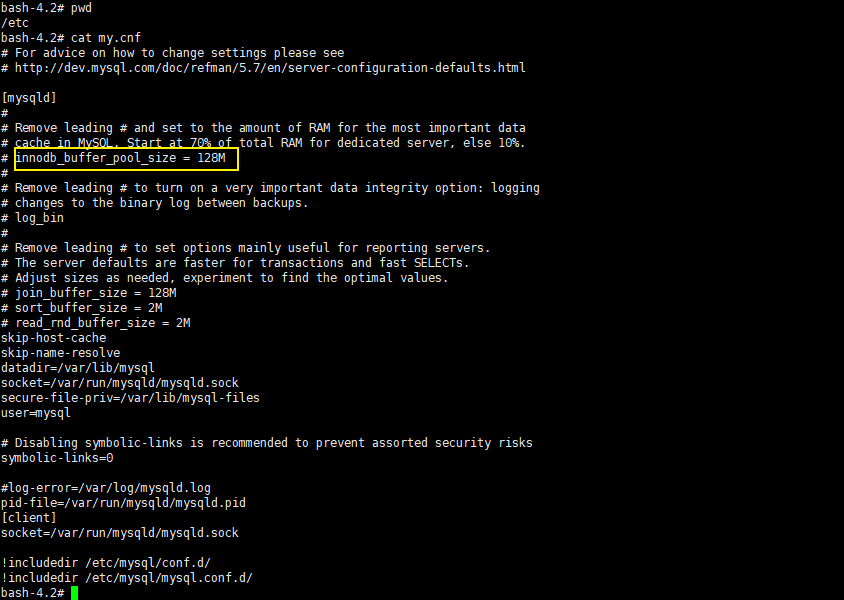


**为什么不直接更新磁盘上的数据，而是需要设置一套复杂的机制来执行 SQL 呢？**

因为针对数据库数据的读写其实是随机的读写，而对于日志文件的读写是顺序的读写，而顺序读写和随机读写速度差距在 2~3 个数量级，磁盘的顺序 IO 几乎可以和操作内存相媲美。

通过 BufferPool 可以保证每个更新请求都是更新内存 BufferPool，然后顺序写日志文件，同时可以保证各种异常情况下的数据一致性，正是通过这套配置，才能让我们的 MySQL 数据库在较高配置的机器上每秒可以抗下几千的读写请求


**为什么数据库数据的读写是随机 IO 呢？**

因为数据库存储在磁盘中的数据是会被删除的，我们在写的时候就算一直顺序写，但是如果后边删除了中间的一些数据，那么在之后读就不能顺序读了，因为中间有一些数据已经不存在了


**InnoDB SQL 执行流程：**

1. 加载数据页，把需要修改数据所在的数据页，缓存到 BufferPool，`BufferPool 中缓存的其实就是一个个的数据页`

2. 修改前记录，写 undo 日志，记录更改前数据，如果事务执行失败，使用 undo 日志进行数据回滚

3. 更新 Buffer Pool 中的数据

4. 准备提交事务，写  redo 日志，保存操作记录。redo 日志用来恢复 BufferPool 中的数据

5. 准备提交事务，写 bin-log 日志，保存操作记录。bin-log 日志用来恢复磁盘数据

6. 事务提交完成，此时 bin-log 日志写入成功，并在 redo 日志中记录 commit 标记

   redo 日志作用：`恢复 BufferPool 中的数据`，bin-log 日志是用于恢复磁盘中的数据，其中 redo 日志和 undo 日志是 InnoDB 引擎特有的，而 bin-log 是属于 Server 层的，与引擎无关

   在 redo 日志中记录 commit 标记是为了保证事务提交之后，redo 与 binlog 数据一致，那么想一下如果 BufferPool 缓存中数据更新完毕，但是在数据库将修改后的数据刷到磁盘之前，数据库宕机了，会不会造成 BufferPool 和磁盘的数据不一致呢？

   其实不会，因此当数据库宕机恢复之后，会使用 redo 日志中的数据恢复 BufferPool 中的数据，那么 BufferPool 的数据就是更新后的数据了，等待刷回磁盘即可

7. 数据持久化，IO 线程不定期把 Buffer Pool 中的数据随机写入到磁盘，完成持久化


**MySQL 的预读机制：**

当从磁盘上加载一个数据页时，MySQL 可能会连带着把这个数据页相邻的其他数据页也加载到缓存里去。


**触发 MySQL 的预读机制的场景？**

1. 线性预读：参数 `innodb_read_ahead_threshold` 默认值是 56，表示如果顺序的访问了一个区里的多个数据页，访问的数据页的数量超过了这个阈值，就会触发预读机制，把下一个相邻区中的所有数据页都加载到缓存里去

   查看默认值：`show variables like 'innodb_read_ahead_threshold'`

   

2. 随机预读：如果 Buffer Pool 里缓存了一个区里的 13 个连续的数据页，而且这些数据页都是比较频繁会被访问的，此时就会直接触发预读机制，把这个区里的其他的数据页都加载到缓存里去。`性能不稳定，在 5.5 中已经被废弃，默认是 OFF`

   `show variables like 'innodb_random_read_ahead'`

   

   ​

**LRU 优化——冷热分离**

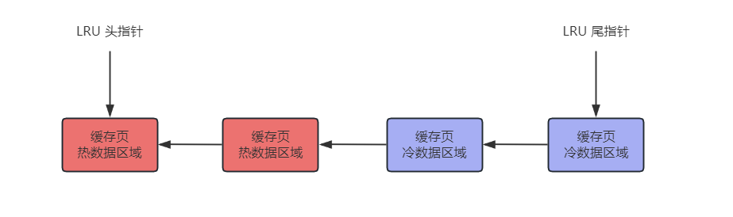

MySQL 通过使用 LRU 来判断哪些缓存页经常访问，哪些缓存页不常访问，来判断当 BufferPool 缓存被占满之后去淘汰哪些缓存页。

在 MySQL 的 LRU 链表中，采取了 `冷热数据分离的思想` ，LRU 链表被拆为了两部分，一部分是热数据，一部分是冷数据，冷数据默认占比 37%，由 `innodb_old_blocks_pct` 参数控制

> 查看参数：`show variables like 'innodb_old_blocks_pct'`，默认是37


`原理：数据页第一次被加载到缓存页之后，这个缓存页被放在 LRU 链表的冷数据区域的头部，在 1s（可配置） 之后，如果这个缓存页再次配访问，该缓存页才会被移动到热数据区域的头部。`

> 查看参数：`show variables like 'innodb_old_blocks_time'` ，默认是 1000 毫秒（配置多长时间之后访问该缓存页，才将该缓存页加入热数据区域头部）


**为什么 LRU 要进行冷热分离？**

如果不这样优化，在 LRU 只使用一个链表，那么在预读机制中多加载的一些缓存页，可能就在刚加载进缓存时使用一下，之后就不再使用了，如果被放在 LRU 链表头部了，会将频繁访问的缓存页挤在 LRU 链表尾部，最后被淘汰。预读机制和全表扫描加载进来的一大堆缓存页，此时都在冷数据区域里，跟热数据区域里的频繁访问的缓存页时没有关系的。


**LRU 中热数据区域访问的一些优化：**

一般在热数据区域头部的缓存页可能是经常被访问的，所以频繁移动性能不太好，所以 MySQL 对于热数据区域的访问优化了一下，只有在热数据区域的后 3/4 部分的缓存页被访问了，才会被移动到链表头部去（这样就

不会出现链表头部数据频繁交替访问，导致频繁移动链表头部数据）。


**什么时间将缓存页刷入磁盘呢？**

会有一个后台线程运行定时任务，定时将 LRU 链表的冷数据区域尾部的一些缓存页刷入磁盘里去，清空这几个缓存页，将他们加入到 free 链表中（free 链表存放的就是 BufferPool 中的空缓存页的地址）

并且这个后台线程也会在 MySQL 空闲时，将 flush 链表（flush 链表存放的是 BufferPool 中被修改过的缓存页，也称为脏页，脏页都是需要刷回磁盘的）中的缓存页都刷入磁盘中


# SQL语句

https://javaguide.cn/database/sql/sql-questions-01.html#%E6%A3%80%E7%B4%A2%E9%A1%BE%E5%AE%A2%E5%90%8D%E7%A7%B0%E5%B9%B6%E4%B8%94%E6%8E%92%E5%BA%8F


