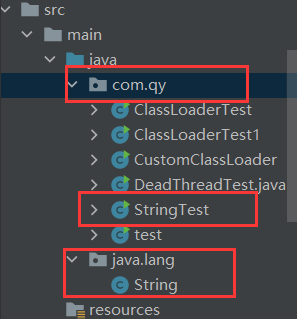
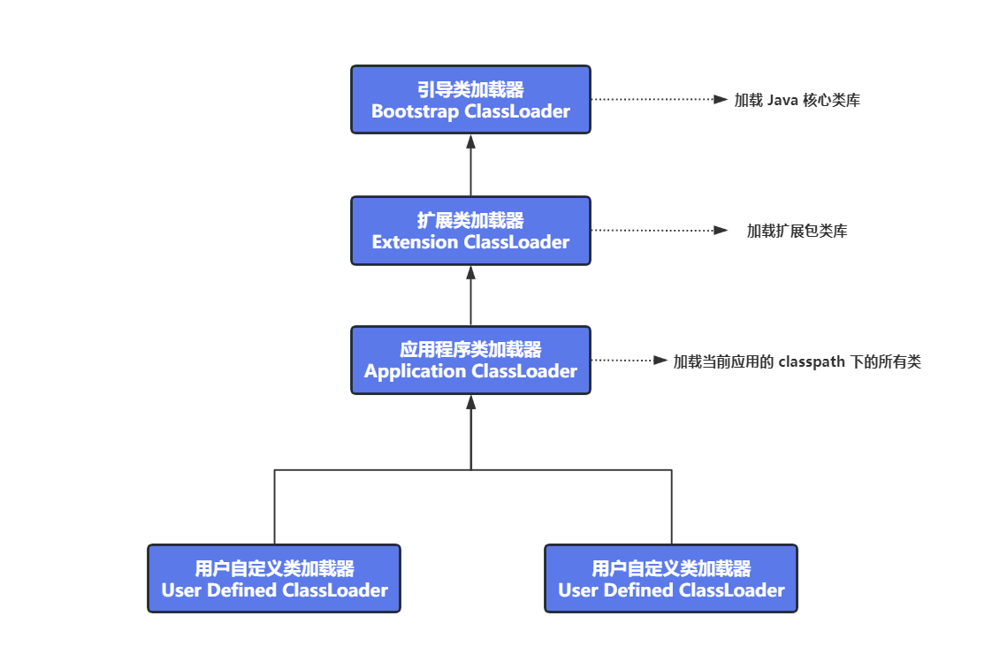

七牛云实习生工作职责：

工作职责:

```
参与七牛云账号、CRM 平台的设计、开发和优化工作。

任职资格:

本科及以上学历，计算机相关专业，基础扎实；

熟悉 HTTP、TCP/IP 等常见网络协议，熟悉 WEB 开发相关技术；

熟悉关系型数据 MySQL 或非关系型数据库 Redis、MongoDB 等；

熟悉分布式系统的设计和应用，熟悉微服务、缓存、消息等机制；

学习能力强，热爱编程，对新技术感兴趣，具有良好的语言表达能力、团队合作意识及高度的责任心；

至少 3 个月的实习期，可长期实习的学生优先；

有 Java web /go 开发经验者优先，参与过大型项目者优先

```


**因为收到了七牛云的面试，所以在这里把网上搜集到的关于七牛云的面试题给整理一下**


参考文章：

https://blog.csdn.net/java_cch/article/details/120594747

https://www.nowcoder.com/discuss/519612829402398720

## 1.Tcp三次握手/四次挥手

[CSDN博客：详细版](https://blog.csdn.net/qq_45260619/article/details/134274099?spm=1001.2014.3001.5501)


## 2.OSI 七层模型？

OSI 七层模型：应用层、表示层、会话层、传输层、网络层、数据链路层、物理层

TCP/IP 五层模型：应用层、传输层、网络层、链路层、物理层


**应用层**

应用层是由网络应用程序使用的，是离用户最近的一层

应用层通过各种协议，为网络应用提供服务，常见协议如下：

- FTP - 文件传输协议
- HTTP/S - 超文本传输（安全）协议
- SMTP - 邮件发送协议：用于与邮件服务器建立通信，并处理电子邮件的发送操作
- POP3 - 邮件接收协议：用于与邮件服务器建立通信，并且从服务器中检索邮件
- Telnet ： 与虚拟段之间的通信协议


**表示层**

表示层从应用层接收数据，这些数据以字符和数字的形式出现，表示层将这些`字符和数据`转成`二进制`

在传输数据之前，表示层将原始数据进行压缩，可以加快传输，并且保证完整性数据传输前的数据加密

在发送端，数据在表示层会被加密，在接收端，数据在表示层会进行解密操作


**会话层**

会话层用于建立连接、管理连接、发送和接收数据

在客户端和服务器建立会话之前，服务端会对客户端进行身份验证并且授权


**传输层**

传输层通过分段、流量控制、差错控制来控制通信的可靠性


**网络层**

网络层将从传输层接收到的数据段从一台计算机传输到不同网络的另一台计算机中

网络层的数据单元成为数据包

网络层的功能是：逻辑寻址、路由、路径确定


**数据链路层**

数据链路层从网络层接收数据包，数据包包含了发送方和接收方的 IP 地址

逻辑寻址在网络层已经完成，即添加了 IP 地址，形成 IP 数据包

物理寻址在数据链路层中完成，在 IP 数据包中添加发送方和接收方计算机的物理地址，从而形成一个数据帧

MAC 地址是由计算机制造商嵌入到计算机中的，是唯一的


**物理层**

物理层将二进制序列转成信号在本地戒指（铜缆、光纤、无线信号）上传输 


## 3.发送邮件属于哪一层，基于什么协议？

利用 E-mail 收发电子邮件，需要设置 POP3 服务器和 SMTP 服务器的地址

用户要从邮件服务提供商提供的电子邮箱中获取自己的电子邮件，就需要通过邮件服务提供商的POP3邮件服务器来帮助完成。

发送邮件即 SMTP（Simple Mail Transfer Protocol）协议，属于应用层，SMTP、POP3 都是基于 `TCP/IP` 的应用层协议


## 4.各层协议了解吗？

网络层协议：

- IP 协议
- ICMP 协议
- ARP 协议 
- RARP 协议


传输层协议：

- TCP 协议
- UDP 协议


应用层协议：

- FTP
- Telnet
- SMTP
- HTTP
- RIP
- NFS
- DNS
- RSTP


## 5.TCP 和 UDP 的区别？

当网络出现拥塞时，TCP 能够减少向网络诸如数据的速率和数量，缓解拥塞

UDP 没有拥塞控制，会导致在网络不好的情况下会丢包，但是如果在实时性要求较高的场景下，就需要使用 UDP 而不是 HTTP


TCP：

- 面向连接
- 可靠传输，可以流量控制和拥塞控制
- 一对一
- 面向字节流

UDP：

- 无连接
- 不可靠传输
- 支持 一对一、一对多、多对一、多对多
- 面向报文


##  6.流量控制是什么？

流量控制：让发送方根据接收方的实际接收能力，来控制发送的数据量

接收方每次收到数据包时，在发送确认报文的时候，告诉发送方自己的缓冲区还有多少时空闲的，那么当发送方收到之后，就会调整自己的发送窗口的大小

那么当接收方缓存满了之后，发送方该什么时候去继续发送数据呢？

可以让接收方处理完数据之后，发送通知给发送方，表示可以继续接收数据

但是如果这个通知存在丢失的风险，因此我们也可以让发送方启动一个定时器，每隔一段时间就去询问接收方，是否可以继续发送数据


**接收窗口大小固定吗？**

在现在的 TCP 中，接收窗口的大小是会动态调整的

一般情况下，接收窗口 >= 发送窗口


## 7.TCP 的四种拥塞控制算法

名词解释：

cwnd = 拥塞窗口

swnd = 发送窗口

rwnd = 接收窗口

ssthresh：慢启动门限

1. 慢开始

连接建立完成后，初始 cwnd = 1，表示发送方可以传输 1 个报文段

当发送方接收到 1 个 ACK 应答后，表示接收方已经成功接收报文，于是发送方 cwnd += 1，表示发送方可以传输 2 个报文段

当发送方接收到 2 个 ACK 应答后， cwnd += 2，表示发送方可以传输 4 个报文段

当发送方接收到 4 个 ACK 应答后， cwnd += 4，表示发送方可以传输 8 个报文段

在慢开始中，发送方可以发送的包的数量是`指数级的增长`

2. 拥塞避免

当 cwnd >= ssthresh 时，就会使用拥塞避免算法，一般来说 `ssthresh = 65535字节`

此时，接收方每接收到一个 ACK 时，cwnd 就会增加 1/cwnd

即，假设 `ssthresh=8`，那么当接收方收到 8 个 ACK 时，每次确认增加 1/8 个 cwnd，当 8 个 ACK 全部收到之后，一共可以增加 1 个 cwnd，于是下一次接受方可以发送 9 个数据包

在拥塞避免中，发送方可以发送的包的数量是`线性增长`

3. 拥塞发生

当发送方可以发送包的数量一直增长，网络就会慢慢进入拥塞的状态，于是会出现丢包现象，那么此时发送方就需要对丢失的数据包进行重传

当触发了重传机制，就会使用拥塞发生算法

重传机制分为两种：

- 超时重传
- 快速重传

当发生超时重传时，此时会更新 `ssthresh` 和 `cwnd` 的值： `ssthresh=cwnd/2，cwnd=1（cwnd恢复为初始化的值） `

这种情况下，会导致拥塞窗口一下子变为初始值，发送方发送数据速率突然下降很多，那么又会从慢开始再进入到拥塞避免阶段，这期间发送速率太慢，会导致网络卡顿

当发生快重传时，即接收方发现丢了一个中间包的时候，发送 3 个前一个包的 ACK ，那么就触发了快速重传，不需要等待超时再重传

此时更新 `ssthresh` 和 `cwnd` 的值：`cwnd = cwnd / 2，ssthresh = cwnd`，会进入到快速恢复算法

4. 快速恢复

快速恢复和快速重传一般会同时使用，在快速恢复算法中，先让 `cwnd = ssthresh + 3`，之后发送端重传丢失的数据包，如果再收到重复的 ACK，令 cwnd += 1，如果收到新数据的 ACK 后，令 cwnd = ssthresh


**为什么收到重复的 ACK，cwnd 反而增加呢？** 

收到重复的 ACK 表明发送端发送的数据包接收端还没有收到，因此让 cwnd + 1 ，有快速重传机制的存在，那么客户端如果一直触发 `快速重传` 那么就一直增加 cwnd，从而将丢失的数据包尽快发送给接收端

参考：[小林 TCP 讲解](https://www.xiaolincoding.com/network/3_tcp/tcp_feature.html#%E5%BF%AB%E9%80%9F%E6%81%A2%E5%A4%8D)


## 8.有了流量控制，为什么还需要拥塞控制？

流量控制的目的是控制发送方速率，避免接收端没有缓存接收数据

但是，计算机网络是一个共享的环境，那么传输的数据包丢失可能不仅仅是因为接收方没有缓存，而是网络不稳定或者网络因为其他主机之间的通信而变得拥堵

那么此时，就不能只根据接收方的缓存来控制发送方的发送速率了，因此需要拥塞控制

**拥塞控制就是避免发送方的数据填满整个网络**


## 9.哪些排序是稳定的，哪些是不稳定的？

稳定的含义：排序前后，两个相等的数的相对位置不会发生变化

堆排序、快速排序、希尔排序、直接选择排序是不稳定的

基数排序、冒泡排序、直接插入排序、折半插入排序、归并排序是稳定的


冒泡排序：两个相邻元素比较，小的元素向前调或大的元素向后调

选择排序：每次都选择当前位置最小的，`5 8 5 2 9`，第一次会选择第一个 5 和 2 交换，`2 8 5 5 9`，那么第二次选择 8 和第三个 5 交换，那么两个 5 的相对位置发生了变化

插入排序：将想要插入的元素和已经有序的最大者比较，如果比他大，则插在后边；如果比他小，则一直向前找，直至找到该插入的位置，如果碰见一个和插入元素像等的，就放在后边即可


## 10.手写快速排序

输入样例

```
5
3 1 2 4 5
```

输出样例

```
1 2 3 4 5
```

代码

```java
import java.util.*;

public class Main{
    public static void main(String[] args) {
        Scanner sc = new Scanner(System.in);
        int n = sc.nextInt();
        int[] arr = new int[n];
        for (int i = 0; i < n; i ++) {
            arr[i] = sc.nextInt();
        }
        quickSort(arr, 0, n - 1);
        for (int i = 0; i < n; i ++) {
            System.out.print(arr[i] + " ");
        }
    }
    public static void quickSort(int[] arr, int l, int r) {
        if (l >= r) return;
        int x = arr[l + r >> 1];
        int i = l - 1, j = r + 1;
        while(i < j) {
            do i ++; while(arr[i] < x);
            do j --; while(arr[j] > x);
            if(i < j) {
                int tmp = arr[i];
                arr[i] = arr[j];
                arr[j] = tmp;
            }
        }
        quickSort(arr, l, j);
        quickSort(arr, j + 1, r);
    }
}
```


## 11.事务隔离级别

- 读未提交：事务 A 会读取到事务 B 更新但没有提交的数据。如果事务 B 回滚，事务 A 产生了脏读
- 读已提交：事务 A 会读取到事务 B 更新且提交的数据。事务 A 在事务 B 提交前后两次查询结果不同，产生不可重复读
- 可重复读：保证事务 A 中多次查询数据一致。**`可重复读是 MySQL 的默认事务隔离级别`**。可重复读可能会造成`幻读` ，事务A进行了多次查询，但是事务B在事务A查询过程中新增了数据，事务A虽然查询不到事务B中的数据，但是可以对事务B中的数据进行更新
- 串行化


## 12.并发事务带来的问题

- `脏写：`多个事务更新同一行，每个事务不知道其他事务的存在，最后的更新覆盖了其他事务所做的更新
- `脏读：`事务 A 读取到了事务 B 已经修改但是没有提交的数据，此时如果事务 B 回滚，事务 A 读取的则为脏数据
- `不可重复读：`事务 A 内部相同的查询语句在不同时刻读出的结果不一致，在事务 A 的两次相同的查询期间，有其他事务修改了数据并且提交了
- `幻读：`当事务 A 读取到了事务 B 提交的新增数据


## 13.如何停止一个线程，会发生什么事情

1. **通过自定义中断标识符**

```java
public class test1 {
    // 自定义的中断标识符
    private static volatile boolean isInterrupt = false;

    public static void main(String[] args) throws InterruptedException {
        // 创建可中断的线程实例
        Thread thread = new Thread(() -> {
            while (!isInterrupt) { // 如果 isInterrupt=true 则停止线程
                System.out.println("thread 执行步骤1：线程即将进入休眠状态");
                try {
                    // 休眠 1s
                    Thread.sleep(1000);
                } catch (InterruptedException e) {
                    e.printStackTrace();
                }
                System.out.println("thread 执行步骤2：线程执行了任务");
            }
        });
        thread.start(); // 启动线程

        // 休眠 100ms，等待 thread 线程运行起来
        Thread.sleep(100);
        System.out.println("主线程：试图终止线程 thread");
        // 修改中断标识符，中断线程
        isInterrupt = true;
    }
}
/**
 * 输出：
 * thread 执行步骤1：线程即将进入休眠状态
 * 主线程：试图终止线程 thread
 * thread 执行步骤2：线程执行了任务
 */
```

我们通过自定义标识符 `isInterrupt` 来判断，需要给该标识符加上 volatile 关键字

这种方式中断线程的执行就不太及时，比如我们先在 while 循环中判断是否中断，发现中断标识并没有中断，就进入到 while 循环中进行执行，那么此时主线程修改中断标识符，想要中断线程，线程内必须等  while 循环的这一轮执行完毕，才可以再次判断中断标识符是否需要中断，因此不够及时！


2. **interrupt 中断线程**

通过调用线程的 `interrupt()` 方法，中断更及时

```java
public class test1 {
    public static void main(String[] args) throws InterruptedException {
        // 创建可中断的线程实例
        Thread thread = new Thread(() -> {
            while (!Thread.currentThread().isInterrupted()) {
                System.out.println("thread 执行步骤1：线程即将进入休眠状态");
                try {
                    // 休眠 1s
                    Thread.sleep(1000);
                } catch (InterruptedException e) {
                    System.out.println("thread 线程接收到中断指令，执行中断操作");
                    // 中断当前线程的任务执行
                    break;
                }
                System.out.println("thread 执行步骤2：线程执行了任务");
            }
        });
        thread.start(); // 启动线程

        // 休眠 100ms，等待 thread 线程运行起来
        Thread.sleep(100);
        System.out.println("主线程：试图终止线程 thread");
        // 修改中断标识符，中断线程
        thread.interrupt();
    }
/**
 * 输出：
 * thread 执行步骤1：线程即将进入休眠状态
 * 主线程：试图终止线程 thread
 * thread 线程接收到中断指令，执行中断操作
 */
}
```


**扩展：**

什么时候需要关闭一个线程？

- 多个线程同时抢一个东西，如果其中一个抢到了，那么需要通知关闭其他线程
- 线程一直去执行某一个任务，我们希望在限定时间拿到结果，如果限定时间内拿不到，就中断该线程


**thread.interrupt() 方法调用后线程会立即中断吗？**

不会，调用 interrupt 只是将被中断线程的中断状态设置为 true，通知被中断的线程自己处理中断，而不是立即强制的让线程直接中断（强制中断不安全）

当外部调用线程进行中断的命令时，如果该线程处于被阻塞的状态，如 Thread.sleep()，Object.wait()，BlockingQueue#put，BlockingQueue#take 等等时，那么此时调用该线程的 `interrupt` 方法就会抛出 `InterruptedException` 异常 

## 14.碰到过哪些异常，OOM可以被捕获吗

参考文章：https://blog.csdn.net/weixin_44588186/article/details/129173861

OOM 可以被捕获，常见的 OOM 有以下三种：

- java.lang.OutOfMemoryError: Java heap space

  一般造成原因是堆内存中加载太多对象，导致堆内存被占满

- java.lang.OutOfMemoryError: PermGen space

  即方法区溢出，一般是因为加载大量 Class 对象或者加载的 Class 对象体积太大

- java.lang.StackOverflowError

  一般是因为深度递归调用而导致的


## 15.反射了解吗

反射可以用于直接操作类的属性和方法，主要是作为一个工具，让我们可以对类的所有成员和方法进行访问，为程序提供了更大的灵活性

创建一个 Class 对象，有三种方法：

- `Class clzz1 = Class.forName("com.zqy.Test");`

- `Class clzz2 = Student.class;`

- ```java
  Student stu = new Student();
  Class clzz3 = stu.getClass();
  ```


反射的优点在于让 Java 成为了一个准动态语言，即可以动态获取类的信息并且动态调用类的方法，缺点就是执行反射速度太慢，并且带来了不安全性


## 16.注解了解吗

注解就是用于对代码进行说明的

Java 中自带的标准注解有：`@Override` `@Deprecated` `@SuppressWarnings`


元注解是用于定义注解的注解，包含：

- `@Retension`：表明注解的生命周期
  - RetentionPolicy.SOURCE：表示注解仅在源代码中保留，编译器编译时会将其忽略，不会保存在编译后的字节码中。
  - RetentionPolicy.CLASS：表示注解在编译后的字节码中保留，但在运行时不会被加载到 JVM 中。这是默认的保留策略。
  - RetentionPolicy.RUNTIME：表示注解在编译后的字节码中保留，并在运行时被加载到 JVM 中。可以使用反射机制来访问该注解。
    ​
- `@Target`：表明注解的使用范围（类还是方法）
- `@Inherited`：表明父类的注解是否可以被子类继承
- `@Documented`：表明在生成 Java 文档时，会将注解也给生成，[参考](https://blog.csdn.net/weixin_43888891/article/details/126981711)


## 17.Redis 底层数据结构了解吗？

[CSDN Redis 底层数据结构 SDS、ZipList、ListPack 讲解](https://blog.csdn.net/qq_45260619/article/details/134358759?spm=1001.2014.3001.5501)


## 18.分布式锁

[CSDN 分布式锁](https://blog.csdn.net/qq_45260619/article/details/134354433?csdn_share_tail=%7B%22type%22%3A%22blog%22%2C%22rType%22%3A%22article%22%2C%22rId%22%3A%22134354433%22%2C%22source%22%3A%22qq_45260619%22%7D)


## 19.Docker、K8s


## 20.统计视频直播一天中哪个时间段人数最多

那么我们如果根据每个小时进行分割的话，还是比较好统计的，我们分时间段进行统计，beginTime 和 endTime 相隔 1 个小时，如果用户在这期间上线，就加 1 统计该时间段在线人数

**个人能力有限，如果有更好的方案欢迎补充！**


## 21.Java 多态

Java 中的多态即同一个行为根据实例的不同从而可以执行不同的操作

多态3个条件：继承，方法重写，父类引用指向子类对象

```java
public class Animal {
    void eat(){}
    void work(){}
}

public class Cat extends Animal {
    public void eat(){
        System.out.println("吃鱼");
    }

    public void work(){
        System.out.println("抓老鼠");
    }
    
    public void test(){
        System.out.println("test");
    }
}

public class Dog extends Animal {
    public void eat(){
        System.out.println("吃肉");
    }

    public void work(){
        System.out.println("看门");
    }
}

public class exe {
    public static void main(String[] args) {
        Animal cat = new Cat();
        Animal dog = new Dog();
        cat.eat();
        cat.work();
        dog.eat();
        dog.work();
        /**
         * 输出：
         * 吃鱼
         * 抓老鼠
         * 吃肉
         * 看门
         */
    }
}
```


## 22.Java 重载

Java 的重载即在一个类中，可以有多个名称相同，但是参数不同的方法，在调用重载的方法时，会根据传递参数的不同，来执行不同的方法

**为什么要使用重载？**

通过重载，可以将一系列功能相似，但是参数不同的方法，使用同一个名字命名，增加程序可读性

重载要求方法名称相同，参数类型或者参数个数不同即可，与方法的返回值以及访问修饰符无关

```java
public void eat(String food) {}
public void eat(String food, String name) {}
```


**重写是什么？**

重写：发生在父子类，方法名、参数列表必须相同，返回值范围小于等于父类，抛出的异常范围小于等于父类，访问修饰符范围大于等于父类；如果父类方法访问修饰符为private则子类就不能重写该方法


## 23.了解 HashCode 吗？

hashCode()的作用是获取哈希码，也成为散列码，它实际上是返回一个 int 整数，这个哈希码的作用是确定该对象在哈希表中的索引位置（即数据在堆中存放的地址）

hashCode() 定义在 JDK 的 Object.java 中，Java 中的任何类都包含有 hashCode() 函数。散列表存储的是键值对（key-value），它的特点是：能根据`键`快速检索出对应的`值`。


**如何使用 hashCode 获取到对象在堆中的存放地址？**

```java
public static void main(String[] args) throws Exception {
    Object str = new Object();
    // 将对象的 hashCode 转为 16 进制
    String addr = Object.class.getName() + "@" + Integer.toHexString(System.identityHashCode(str));
    System.out.println(addr);
    System.out.println(str);
}
/**
 * 输出
 * java.lang.Object@2a84aee7
 * java.lang.Object@2a84aee7
 */
```


**为什么要有 hashCode**

HashCode的存在主要是为了查找的快捷性


**以`HashSet如何检查重复`为例子来说明如何去使用 hashCode？**

对象加入 HashSet 时，HashSet 会先计算对象的 hashCode 值来判断对象加入的位置，看该位置是否有值，如果没有，HashSet 会假设对象没有重复出现。但是如果发现有值，这是会调用`equals()`方法来检查两个对象是否真的相同，如果两者相同，HashSet 就不会让其加入集合，如果不同，就会再次散列到其他位置，这样就大大减少了调用 equals 的次数，大大提高了执行速度，因此在 Set 中添加对象，需要遵循下边两个准则：

- 如果两个对象相同，就适用于`equals(java.lang.Object)`方法，那么这两个对象的 hashCode 一定要相同
- 如果对象的 equals 方法被重写，那么对象的 hashCode 方法也要重写，并且产生 hashCode 使用的对象一定要和 equals 方法中使用的一致，否则会违反上一条原则


**equals() 和 hashCode() 的联系？重写了 equals() 必须要重写 hashCode() 吗？**

首先，equals() 是比较两个对象是否相等（在 Object 类中，equals() 里比较两个对象相等是根据对象的地址进行比较的，String 中就重写了 equals 方法），而 hashCode() 返回的是对象的内存地址，`所以 hashCode 主要是用于查找使用的，而 equals() 是用于比较两个对象是否相等的`。


因此 equals() 和 hashCode() 联系为：

- 如果两个对象 equals() 为 true，那么这两个对象的 hashCode() 一定相同
- 如果两个对象的 hashCode() 相同，并不代表两个对象的 equals() 为 true，hashCode 相同只能代表这两个对象在散列表中是在数组的同一个位置中（即这两个对象发生了哈希冲突）


**关于 hashCode 和 equals 的准则：**

- 如果重写 equals，就必须重写 hashCode
- 因为 Set 存储不重复的对象，是依据 hashCode 和 equals 进行判断，所以 Set 存储的对象必须重写这两个方法
- 如果自定义对象作为 Map 的键，则必须重写 hashCode 和 equals


## 24.类加载机制

Java 类加载机制指的是在 Java 程序运行时，将类文件加载到内存中的一系列步骤

类的加载过程分为：`加载、验证、准备、解析、初始化`


## 25.双亲委派模型

class 文件是通过 `类加载器` 装在到 JVM 中的，为了防止内存中存在多份同样的字节码，使用了双亲委派模型

双亲委派模型对于保证 Java 程序的稳定运行至关重要


**双亲委派模型的原理为：**

（1）如果一个类加载器收到了类加载请求，会先将请求委托给父类的加载器去执行

（2）如果父类加载器还存在父类，则继续向上委托，直至到达顶层的引导类加载器

（3）如果父类加载器可以完成类加载，就返回；否则，子类加载器才会尝试自己去加载


**双亲委派模型演示：**

1. 创建一个java.lang包，包下创建一个String类
2. 我们来测试创建String对象的时候加载的是系统的String类，还是我们创建的String类



```java
package java.lang;

// 自己创建的java.lang.String类
public class String {
   static {
      System.out.println("我是自己创建的String类中的静态代码块！");
   }
}

package com.qy;

// 测试类
public class StringTest {
   public static void main(String[] args) {
      String str = new String();
      /**
      测试结果：并没有输出，说明加载的是系统中的String类，而不是自定义的
      */
   }
}
```


**那么为什么加载的不是自定义的String类呢？**

根据双亲委派的工作原理，加载 String 类的时候，`系统类加载器`收到了类加载的请求，会向上委托给`扩展类加载器`，扩展类加载器会再向上委托给`引导类加载器`，`引导类加载器`会加载java包下的类，因此 String 类由引导类加载器加载，所以不会加载自定义的 String 类。

如果需要加载 StringTest 类的话，会一直向上委派到引导类加载器，但是该加载器并不加载 StringTest 类，所以最终仍然由系统类加载器完成对 StringTest 类的加载。


**使用双亲委派模型的优势是什么呢？**

- 避免类的重复加载
- 可以保护程序安全，防止核心 API 被随意篡改（如上例中我们自定义 java.lang.String 类，如果没有双亲委派机制，导致加载了我们自定义的 String 类，会导致程序不安全）


**扩展：类加载器的分类**

虚拟机默认提供了 3 个类加载器，为：`引导类加载器（Bootstrap ClassLoader）、扩展类加载器（Extension ClassLoader）、应用程序类加载器（Application ClassLoader）`

除了这三种类加载器之外，还有一种`用户自定义类加载器（User Defined ClassLoader）`



查看类加载器层级关系：

```java
public class ClassLoaderTest {
   public static void main(String[] args) {

      // 获取系统类加载器
      ClassLoader systemClassLoader = ClassLoader.getSystemClassLoader();
      System.out.println(systemClassLoader); // sun.misc.Launcher$AppClassLoader@18b4aac2

      // 获取其上层：扩展类加载器
      ClassLoader extClassLoader = systemClassLoader.getParent();
      System.out.println(extClassLoader); // sun.misc.Launcher$ExtClassLoader@1b6d3586

      // 获取其上层：获取不到引导类加载器
      ClassLoader bootstrapClassLoader = extClassLoader.getParent();
      System.out.println(bootstrapClassLoader); // null

      // 对于用户自定义类来说：默认使用系统类加载器进行加载
      ClassLoader classLoader = ClassLoaderTest.class.getClassLoader();
      System.out.println(classLoader); // sun.misc.Launcher$AppClassLoader@18b4aac2

      // String类使用引导类加载器进行加载的 ---> java的核心类库都是使用引导类加载器进行加载的
      ClassLoader classLoader1 = String.class.getClassLoader();
      System.out.println(classLoader1); // null
   }
}
```


## 25.Spring 的 aop 和 ioc 怎么实现？

**Spring 的 IOC 是如何实现的呢？**

Spring 的 IOC 是通过 `工厂 + 反射` 去实现的， 在 IOC 中，Spring 会将创建的 Bean 都放在工厂中，我们可以通过 `@Configuration` 来定义配置类，在配置类中通过 `@Bean` 来将 Bean 创建在 Bean 工厂中，在对 Bean 进行实例化时，使用的就是`反射`。


**扩展：BeanFactory 和 ApplicationContext 这两个接口都是 Spring 提供用于实现 IOC 容器的接口，他们两个有什么区别呢？**

- BeanFactory 时 Spring 里面最底层的接口，包含了 bean 的定义、读取 bean 配置、管理 bean 加载、实例化、控制 bean 的生命周期 等功能，ApplicationContext 是 BeanFactory 的子接口
- BeanFactory 的功能简单，采用延迟加载注入 bean
- 在 BeanFactory 中，需要显示调用 addBeanPostProcessor() 来注册后置处理器，而在 ApplicationContext 中，容器会自动寻找实现了 BeanPostProcessor 接口的 Bean，然后自动注册
- ApplicationContext 提供了更为完整的功能，包含了 BeanFactory 的全部功能
- ApplicationContext 在初始化应用上下文时就实例化所有单实例的Bean，因此在前期初始化 Bean 时开销较大，并且较为占用内存空间


**Spring 的 aop 是如何实现的呢？**

Spring 的 AOP 是通过动态代理实现的，如果对 Spring 的某个 Bean 配置了切面，那么 Spring 在创建这个 bean 的时候，其实创建的是这个 Bean 的代理对象，之后在调用这个 bean 的方法的时候，其实调用的是这个代理对象中重写的代理方法，Spring AOP 使用了 JDK 动态代理和 CGLIB 动态代理

如果需要代理的类实现了接口，Spring 就会使用 JDK 动态代理实现 AOP，如果没有实现接口，则 Spring 会使用 CGLIB 动态代理来实现 AOP

[cglib 和 jdk 动态代理使用及原理](https://blog.csdn.net/qq_45260619/article/details/134361337)


## 26.依赖注入原理

参考文章：https://www.51cto.com/article/716969.html

Spring 中的依赖注入是通过反射来实现的，当 IOC 容器创建 Bean 的时候，会检查 Bean 中定义的依赖关系，并且尝试通过反射来注入这些依赖关系


Spring 的依赖注入有三种方式：

- **属性注入**

  ```java
  @RestController
  public class UserController {
      // 属性对象
      @Autowired
      private UserService userService;

      @RequestMapping("/add")
      public UserInfo add(String username, String password) {
          return userService.add(username, password);
      }
  }
  ```

  优点：

  - 使用简单，添加 `@Autowired` 即可

  缺点：

  - 无法注入一个不可变对象（final 修饰），因为 Java 中的 final 对象，要么初始直接赋值，要么在构造方法中赋值，如果使用属性注入 final 对象，不符合 Java 的 final 使用规范

    ```java
    @Autowired
    private final UserService userService;
    ```

  - 与 IOC 容器耦合度过高，只能适用于 IOC 容器，其他非 IOC 框架不一定支持属性注入

  - 可能违背单一职责原则，通过属性注入比较简单，可能造成滥用，在一个类中引入多个属性依赖，引入的越多则承担了越多的责任，违背单一职责原则的可能性越大


- **Setter 注入**

  ```java
  @RestController
  public class UserController {
      // Setter 注入
      private UserService userService;

      @Autowired
      public void setUserService(UserService userService) {
          this.userService = userService;
      }

      @RequestMapping("/add")
      public UserInfo add(String username, String password) {
          return userService.add(username, password);
      }
  }
  ```

  优点：

  - setter 注入只针对一个对象，符合单一职责原则

  缺点：

  - 不能注入不可变对象（final 修饰的对象）
  - 注入的对象可被修改（在注入之后，如果在其他地方调用 setXX 会改变注入的对象）


- **构造方法注入**

  Spring 4.x 之后推荐的注入方式

  如果只有一个构造方法，可以不用在构造方法上添加 `@Autowired`，如下边代码，可以去掉 `@Autowired` 注解：

  ```java
  @RestController
  public class UserController {
      // 构造方法注入
      private UserService userService;

      @Autowired
      public UserController(UserService userService) {
          this.userService = userService;
      }

      @RequestMapping("/add")
      public UserInfo add(String username, String password) {
          return userService.add(username, password);
      }
  }
  ```

  优点：

  - 可以注入不可变对象
  - 注入对象不会被修改
  - 通用性更好，无论是 IOC 框架还是非 IOC 框架，构造方法注入的代码都是通用的


## 27.单例模式在 Spring 中的使用

Spring 在获取 Bean 实例时，使用了双重检锁实现的单例模式，getSingleton 在获取 Bean 对象时会进行调用：

```java
 public Object getSingleton(String beanName){
     //参数true设置标识允许早期依赖
     return getSingleton(beanName,true);
 }
 protected Object getSingleton(String beanName, boolean allowEarlyReference) {
     //检查缓存中是否存在实例
     Object singletonObject = this.singletonObjects.get(beanName);
     if (singletonObject == null && isSingletonCurrentlyInCreation(beanName)) {
         //如果为空，则锁定全局变量并进行处理  双重检锁
         synchronized (this.singletonObjects) {
             //如果此bean正在加载，则不处理
             singletonObject = this.earlySingletonObjects.get(beanName);
             if (singletonObject == null && allowEarlyReference) {
                 //当某些方法需要提前初始化的时候则会调用addSingleFactory 方法将对应的ObjectFactory初始化策略存储在singletonFactories
                 ObjectFactory<?> singletonFactory = this.singletonFactories.get(beanName);
                 if (singletonFactory != null) {
                     //调用预先设定的getObject方法
                     singletonObject = singletonFactory.getObject();
                     //记录在缓存中，earlysingletonObjects和singletonFactories互斥
                     this.earlySingletonObjects.put(beanName, singletonObject);
                     this.singletonFactories.remove(beanName);
                 }
             }
         }
     }
     return (singletonObject != NULL_OBJECT ? singletonObject : null);
 }
```


双重检锁模板：

```java
private volatile  static DoubleCheckSingleton instance;
    //私有的构造方法
    private DoubleCheckSingleton() {}
    public static DoubleCheckSingleton getInstance(){
        if(instance==null){ //第一层检查
            synchronized (DoubleCheckSingleton.class){
                if(instance==null){ //第二层检查
                    instance=new DoubleCheckSingleton();
                }
            }
        }
        return instance;
    }
}
```


**在双重检锁中，第二个 if 什么作用呢？**

因为可能多处同时调用 `getInstance()` 方法，那么在初始时，instance 为 null，因此可能多个线程判断为 null，之后开始竞争 synchronized 锁，那么在第一个线程拿到锁，并且初始化 instance 之后，其他线程再拿到锁进入之后就不需要再次进行初始化了，所以再使用 if 判断一次，看看是否已经被初始化过了


## 28.为什么属性要添加 private？

首先，属性添加上 private 表示这个属性只能在本类中进行访问，就可以保证这个属性的安全，使用者只能通过定制好的方法来访问数据，并且限制对属性的不合理操作

比如给属性添加 private 之后，通过 setXX() 来设置这个属性值，我们可以在 setXX() 中添加逻辑判断，来过滤掉不合适的属性值设置


**扩展：Java 的访问修饰符**

Java 有四种访问修饰符：public、protected、default、private

- private 修饰的类成员，只能被该类自身访问，private 具有最高的保护级别
- default 修饰的类成员，可以被同包下的类、同包下的子类访问
- protected 修饰的类成员，可以被同包的类、同包的子类、其他包的子类访问
- public 修饰的类成员，在任何地方都可以访问


## 29.如果不加访问修饰符，默认是什么呢？

如果不加访问修饰符，默认是 default，可以被包内的类和子类访问，其他包的类和子类不可以访问


## 30.下边这段代码的输出为？

```java
class Grandpa { 
	static { 
		System.out.println("1"); 
	}
}
class Father extends Grandpa { 
	static { 
		System.out.println("2"); 
	}
	public static int factor = 25; 
	public Father() { 
		System.out.println("3"); 
	}
}
class Son extends Father {
	static {
		System.out.println("4"); 
	}
   public Son() {
		System.out.println("5"); 
	}
}
public class Main {
	public static void main(String[] args) {
		System.out.println(Son.factor);
	}
}
/**输出**/
1
2
25
```


## 31.详细谈一下 MVCC？

**MVCC 是什么？**

MVCC 是用来保证 MySQL 的事务的隔离性的

**为什么需要 MVCC？**

默认在 `读已提交` 和 `可重复读` 两个隔离级别中，都实现了 MVCC 机制，使用了 MVCC 之后，对于数据的读写操作就不需要通过加锁互持来保证隔离性了

**MVCC 怎么实现的？**

MVCC 是基于 undo 日志、版本链、readview 来实现的

在 readview 中会记录：

- m_ids：表示生成 ReadView 时，当前系统中活跃（未提交）的事务 id 数组
- min_trx_id：表示生成 ReadView 时，当前系统中活跃的事务中最小的事务 id，也就是 m_ids 中的最小值
- max_trx_id：表示生成 ReadView 时，已经创建的最大事务 id`（事务创建时，事务 id 是自增的）`
- creator_trx_id：表示生成 ReadView 的事务的事务 id

之后，在事务里的 sql 查询到一行的数据时，会和 readview 进行对比，拿这一行数据的事务 id 和 readview 中的事务 id 数组进行比较，再来决定这一行数据对于当前事务来说是否可见


[MVCC 详细原理](https://blog.csdn.net/qq_45260619/article/details/134236223?spm=1001.2014.3001.5501)


## 32.explain 关键字关键看哪几项，分别有什么意义？

explain 可以帮助我们查看查询语句的具体执行计划

主要看 type、possible_keys、key、Extra 这三个列


- type 表示访问类型，即 MySQL 决定如何查找表中的行。从最优到最差分别为：`system > const > eq_ref > ref > range > index > ALL`

  一般来说得保证查询达到 range 级别，最好达到 ref

  ALL 级别表示进行全表扫描（扫描聚集索引的所有叶子节点）

  index：表示扫描全索引就可以拿到结果，一般是扫描二级索引就拿到了结果

  range：范围扫描通常出现在 `in()`、`between`、`>`、`<`等操作

  ref：使用了普通索引或者唯一索引的部分前缀

- possible_keys 表示可能使用的索引

- key 表示使用的索引

  有时 possible_keys 有列，但是 key 为null 是什么原因呢？这是因为 MySQL 认为表中数据并不多，不需要走索引，因为如果走二级索引的话，还需要再次回表查询聚集索引，没必要使用索引，所以直接进行全表扫描

- Extra，主要看使用 order by 进行排序时有没有出现 Using filesort 和 Using index

  **尽量通过 order by 和 where 配合，可以出现 Using index，避免 Using filesort**

  - Using index 表示使用了覆盖索引，速度比较快
  - Using filesort 表示使用了外部排序，而不是使用索引进行排序

  那么什么时候会出现 Using index 呢？

  - order by 语句满足索引最左前缀
  - where 和 order by 条件列组合满足索引最左前缀

  ​


## 33.extra 可能出现哪些信息？

会出现以下几种信息：

> 但是应该也记不住这么多，Using index 和 Using filesort 是 mysql 选择排序的方式，我猜面试官可能是想问这两个

- Using index：使用覆盖索引
- Using where：使用 where 语句来处理结果，并且查询的列未被索引覆盖
- Using index condition：查询的列不完全被索引覆盖，where 条件中是一个前导列的范围
  - 示例：索引（name，balance） `explain select *from account where name > 'a';`
- Using temporary：mysql 需要创建一张临时表来处理查询。出现这种情况需要使用索引进行优化
  - 示例：name 字段没有索引，此时创建一张临时表来 distinct，`explain select distinct name from account`
- Using filesort：使用外部排序而不是索引排序，数据较少时在内存中排序，数据较大时在磁盘中排序，一般情况下也是需要考虑使用索引进行优化
  - 示例：name 字段没有索引，`explain select name from account order by name`
- Select tables optimized away：使用聚合函数来访问存在索引的某个字段
  - 示例：`explain select min(id) from account;`


## 34.如何查看一个 sql 每一个阶段的耗时

可以使用 Performance Schema 来查看，

Performance Schema 是在 5.5 引入的，在5.7.x及其以上版本中默认启用(5.6.x 及其以下版本默认关闭)，如果要显式启用或关闭时，我们需要使用参数 performance_schema = ON|OFF 设置


**Performance Schema 是什么呢？**

Performance Schema 提供了有关 MySQL 服务器内部运行的操作上的底层指标

https://developer.aliyun.com/article/1232631

这里未整理完


https://www.nowcoder.com/discuss/519612829402398720

redis 常见数据结构

跳表数据结构及原理

redis 底层的统一结构体是什么样？让你设计你会怎么做？

实习经历中单点登录如何实现的？

单点登录原理

有没有其他的方式

实习经历中的权限控制怎么做的？

除了RABC之外还有权限系统设计方式吗？（ACL）

实习经历中的分布式锁是怎么实现的？

如何解决的缓存击穿？

还有别的实现分布式锁的方式吗？（MySQL）

这种实现方式在sql上有什么要求吗？（for update）

还有别的实现方式吗？（zookeeper）

什么是 cap

redis 满足cap的哪几项？

MySQL 呢？

zookeeper 呢？

对于未来的规划

对于转 go 什么看法？

https://www.nowcoder.com/discuss/519612829402398720


4.缓存三大问题以及解决方案

5.springboot用的版本是多少

6.springboot自动配置

7.让我解释面向对象三大特性，延伸了好多

8.String类的底层实现 String类为什么设置成不可变

9.maven git 用没用过

10.Linux docker k8s CI/CD有了解过吗

11.场景题

12.网络协议Http TCP UDP

13.链表这个数据结构你了解吗

14.做一道链表的算法题吧

15.反问环节


作者：耐耐求offer
链接：<https://ac.nowcoder.com/discuss/421071?type=2>
来源：牛客网

1.项目框架，技术栈
 2.Spring和Springboot区别
 3.用什么和数据库链接
  4. java什么样的类不能被继承
    5.讲一下进程和线程
     5.多线程几种状态，yield方法，sleep方法，sleep是否会释放cpu资源
  5. GC介绍一下
    7.hashmap结构，放进去一个数怎么放
     8.JVM内存分析，具体的堆内存实现
     9.了解快速排序算法吗？具体实现，复杂度分析，底层结构
     10.http格式，http属于哪个协议
     11.TCP协议三次握手四次挥手具体实现


之前的实习介绍
除了java了解过其他语言吗
Go里面的切片了解吗？内部如何实现？
Java多态什么概念
运行时多态和编译时多态
重载和重写
Java类加载机制
Aop和Ioc
循环依赖问题
设计模式
讲一下单例类的场景，手写单例类
Java类修饰符有哪些
简历上Raft项目介绍
CAP介绍
Mysql事务有哪些
幻读解释一下，怎么解决幻读
索引结构
B和B+树区别
回表是什么意思
Tcp的Time wait状态是产生在什么时候
算法题：忘记题目了，就是一个字符串，遇到/b就把前面的第一个字母删除了。hn/box/b输出ho。ac了
全程一个多小时，常规八股，聊的很开心。

作者：南安__
链接：<https://www.nowcoder.com/feed/main/detail/9a32dec31a2d43fda8cd89665bcea277?sourceSSR=search>
来源：牛客网


# 一面 腾讯会议（75min）

- 微服务中拆分的力度怎么把控
- JWT和oauth2的区别
- oauth2的授权过程
- 为什么要使用授权码
- 使用了https还有必要使用授权码吗
- 微服务带来的挑战
- 切片的扩容机制
- Coding 使用go语言实现一个非阻塞锁
- mysql的隔离级别
- 分布式事务
- Coding 字符串处理

面后一周约二面

# 二面 腾讯会议（55min）

- git中rebase和merge的区别，什么时候用
- k8s ingress 实现机制
- grpc底层原理
- proto2和proto3的区别
- Coding 反射编程题，输出标签值和字段值

面后当天通过，约三面

# 三面 HR面

因已接其他offer，推掉后续面试

作者：lengcharles
链接：<https://www.nowcoder.com/feed/main/detail/22344ef5db54457abf26310caea26af3?sourceSSR=search>
来源：牛客网


# 七牛云后端开发，已OC

一面：

60min  不得不说，面试官是真的很可爱，也很优秀

（凭记忆写的，有点忘记了）

上来就先说一下LRU算法，给个例子然后演示一下

问了一下树的前序遍历和中序遍历，然后面试官给了一棵树，问你这两种遍历方式的结果

结合他们工作的内容，问了一个IP地址分类的问题

问了一下生产者和消费者的实现（操作系统）

开始详细拷打项目，问其中的实现

问了redis主从同步的步骤

缓存风暴（缓存雪崩）的解决方案

聊了一下分布式锁

如何保证一致（这里面试官还和我介绍了他们的解决方案）

问了mysql相关（索引那些）

还有些消息队列的问题有点忘了

最后一道简单算法题：反转二叉树

二面：

38min，感觉就是聊聊，可能是一面的面评比较高吧

问了我一下volatile在java中的用法

然后mysql索引（这块比较深，说到了页面结构那里）

然后谈了一下nginx

最后提到了跳表，然后就是与之相关的一系列的讨论与自我思考了（这块感觉面试官水平很高）

hr面：

（hr小姐姐的口头禅“好呀好呀”很可爱）

自我介绍

项目中遇到印象深刻的点

可以实习多久，多久可以入职等

然后就谈offer相关啦

总结：

（上述的点是lz按照自己残缺的记忆去补足的，牛客面经哇，可要给咱带来好运哇）

面试体验真的很好，遇到了几位很好很可爱的人，等待offer，许愿未来

https://www.nowcoder.com/discuss/505788633186590720?sourceSSR=search