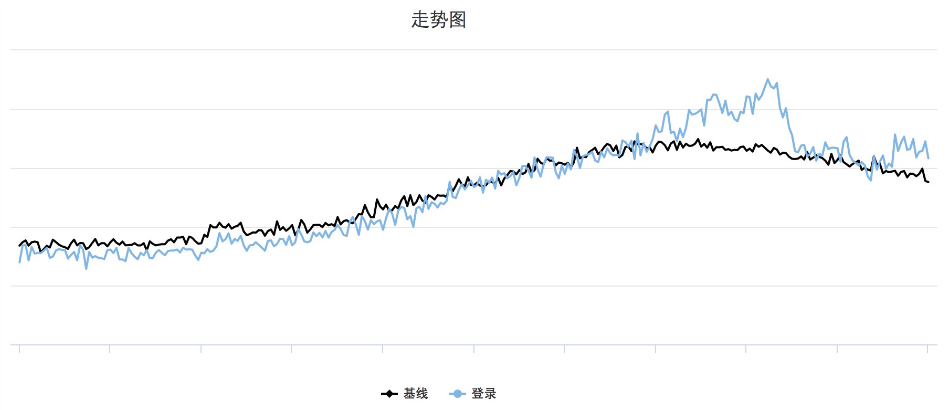
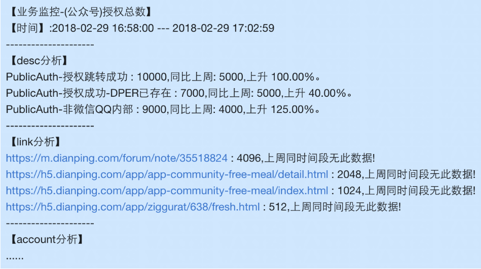
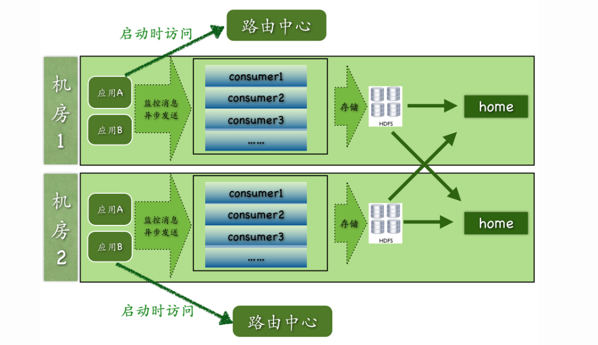
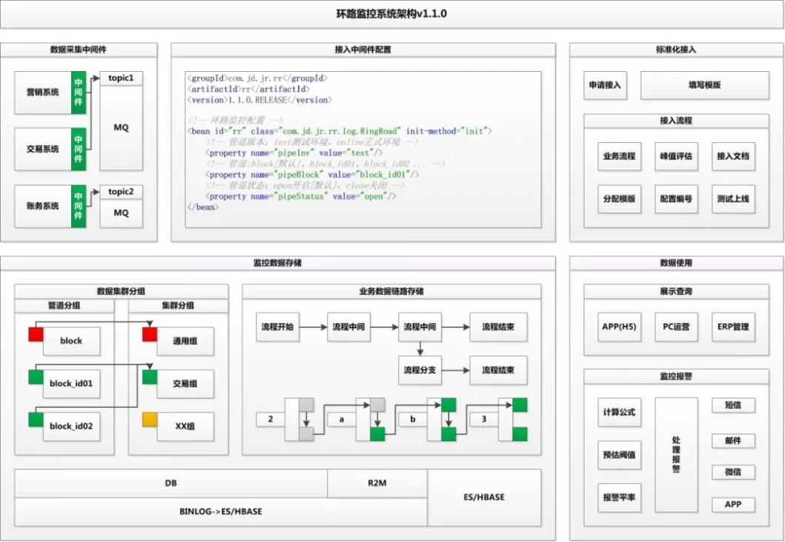

https://www.infoq.cn/article/pjt0nvei3jcradblqgjx


数据监控方案
一个流程单据走的过程，落在系统里是数据，单据是否合规以及执行的状态，需要通过数据巡检，然后进行异常体现
异常提醒，这时候需要一点前端页面去显示与回填数据


监控系统的好坏主要在于三个方面：

- 监控力度
- 监控指标完整性
- 监控实时性


在系统上分为：

- 业务层，对业务执行流程进行监控，及时发现业务流程中存在的问题以及数据流量的大小
- 平台层：对各种中间件以及计算引擎监控，如 Redis、Zookeeper、Kafka，常用的监控数据：JVM 堆内存、GC、CPU 使用率、线程数、TPS、吞吐量等
- 系统层：监控内存、CPU、磁盘、网络流量等指标


监控数据存储在哪里？

有风险如何告警？


监控系统组成：zabbix、Prometheus + Grafana

Zabbix 负责服务器的硬件监控

Prometheus+Grafana 负责集群状态监控，Prometheus 采集数据，Grafana 的 Datasource 链接 Prometheus url 可以将进行可视化


可用性：

- 数据库采用主从可以切换，并且主主之间做同步


## 数据巡检：

[美团数据巡检系统设计与应用](https://pdai.tech/md/db/sql-mysql/sql-mysql-xunjian-mt.html)

https://blog.csdn.net/qq_28959087/article/details/129816676

数据巡检的目的时保障上下游数据一致性（避免因为人为因素（上游变更，下游忘记）以及异常因素（系统宕机、重启、Full GC、CPU100%）所造成的数据不一致）


业务监控系统：

## 美团业务高可用进阶

参考链接：https://tech.meituan.com/2018/05/31/dp-account-high-avaliable-road.html

业务监控不同于其他监控系统，业务监控关注的是各个业务指标是否正常，比如账号的登录曲线。大众点评登录入口有很多，从终端上分有App、PC、M站，从登录类型上分有密码登录、快捷登录、第三方登录（微信/QQ/微博）、小程序登录等。需要监控的维度有登录总数、成功数、失败分类、用户地区、App版本号、浏览器类型、登录来源Referer、服务所在机房等等。业务监控最能从直观上告诉我们系统的运行状况。

由于业务监控的维度很多很杂，有时还要增加新的监控维度，并且告警分析需要频繁聚合不同维度的数据，因此我们采用ElasticSearch作为日志存储。

数据走向为：服务 ---> 日志收集服务 ---> kafka ---> ES ---> 可视化监控平台


**怎么判断业务异常呢？**

每条监控都会根据过去的业务曲线计算出一条基线（见下图），用来跟当前数据做对比，超出设定的阈值后就会触发告警。



每次收到告警，我们都要去找出背后的原因，如果是流量涨了，是有活动了还是被刷了？如果流量跌了，是日志延时了还是服务出问题了？另外值得重视的是告警的频次，如果告警太多就会稀释大家的警惕性。我们曾经踩过一次坑，因为告警太多就把告警关了，结果就在关告警的这段时间业务出问题了，我们没有及时发现。为了提高每条告警的定位速度，我们在每条告警后面加上维度分析。如下图（非真实数据），告警里直接给出分析结果。




## 美团-深度剖析开源分布式监控CAT - 2018-11-01

参考链接：https://tech.meituan.com/2018/11/01/cat-in-depth-java-application-monitoring.html

https://cloud.tencent.com/developer/article/1706632

CAT（Central Application Tracking）是一个实时和接近全量的监控系统，它侧重于对Java应用的监控，基本接入了美团上海侧所有核心应用。目前在中间件（MVC、RPC、数据库、缓存等）框架中得到广泛应用，为美团各业务线提供系统的性能指标、健康状况、监控告警等。


CAT 研发时背景：

适逢在eBay工作长达十几年的吴其敏加入大众点评成为首席架构师，他对eBay内部应用非常成功的CAL系统有深刻的理解。就在这样天时地利人和的情况下，我们开始研发了大众点评第一代监控系统——CAT。


CAT 模块划分：

- Cat-client 提供给业务以及中间层埋点的底层SDK。
- Cat-consumer 用于实时分析从客户端提供的数据。
- Cat-home 作为用户给用户提供展示的控制端。




### 客户端收集数据方案：

使用 `ThreadLocal`，因为在监控场景下，为用户提供服务都是Web容器，比如tomcat或者Jetty，后端的RPC服务端比如Dubbo或者Pigeon，也都是基于线程池来实现的。业务方在处理业务逻辑时基本都是在一个线程内部调用后端服务、数据库、缓存等，将这些数据拿回来再进行业务逻辑封装，最后将结果展示给用户。所以将所有的监控请求作为一个监控上下文存入线程变量就非常合适。


监控系统针对的场景：

- 一段代码的执行时间，一段代码可以是URL执行耗时，也可以是SQL的执行耗时。
- 一段代码的执行次数，比如Java抛出异常记录次数，或者一段逻辑的执行次数。
- 定期执行某段代码，比如定期上报一些核心指标：JVM内存、GC等指标。
- 关键的业务监控指标，比如监控订单数、交易额、支付成功率等。


CAT 的序列化和通信：

- 自定义序列化协议（高效，避免不必要的数据传输）
- 基于 Netty 通信


客户端埋点：

CAT 的埋点目标是以问题为中心，像程序抛出exception就是典型问题。

问题的定义：不符合预期结果、请求未完成、响应速度过快/慢、TPC 等等


监控中常出现的一些问题：

- 业务中容易出问题的地方在于：CPU、内存


### 服务端处理数据方案：

服务端处理流程：

- 消息接受是基于Netty的NIO实现。
- 消息接受到服务端就存放内存队列，然后程序开启一个线程会消费这个消息做消息分发。
- 每个消息都会有一批线程并发消费各自队列的数据，以做到消息处理的隔离。
- 消息存储是先存入本地磁盘，然后异步上传到HDFS文件，这也避免了强依赖HDFS。


服务端主要用于生成报表，将报表按消息的创建时间，一小时为单位分片，每小时产生一个报表

报表分为：

- 性能分析报表
- 故障发现报表


### 存储方案：

- CAT 报表存储
- CAT 原始 logview 存储

原始logview存储一天大约100TB的数据量，因为数据量比较大所以存储必须要要压缩，本身原始logview需要根据Message-ID读取，所以存储整体要求就是批量压缩以及随机读。在当时场景下，并没有特别合适成熟的系统以支持这样的特性，所以我们开发了一种基于文件的存储以支持CAT的场景，在存储上一直是最难的问题，我们一直在这块持续的改进和优化。


消息 ID 设计：

A 调用 B 时，A 生成一个 Message-ID，在A调用B的过程中，将Message-ID作为调用传递到B端，在B执行过程中，B用context传递的Message-ID作为当前监控消息的Message-ID。

CAT消息的Message-ID格式ShopWeb-0a010680-375030-2，CAT消息一共分为四段：

- 第一段是应用名shop-web。
- 第二段是当前这台机器的IP的16进制格式，0a01010680表示10.1.6.108。
- 第三段的375030，是系统当前时间除以小时得到的整点数。
- 第四段的2，是表示当前这个客户端在当前小时的顺序递增号。


## 京东云-环路监控  2018

参考链接：https://blog.csdn.net/JDDTechTalk/article/details/109615466

### v1.0版本

被监控的业务系统接入数据采集中间件




## 数据库设计

存储最大长度的字符：longtext > mediumtext > text

用 tinyint（1B） 存储 -128~127，用 int（4B） 的话，范围为 -2147483648 ~ 2147483647

tinyint(4) 后边的 4 是存储宽度，并不是存储 tinyint 所占用的字节数，如果该列需要用 0 填充显示，那么需要显示 `15` 时，会显示为 `0015`，左边自动补 0

```sql
CREATE TABLE `minor_log` (
  `id` bigint(20) NOT NULL AUTO_INCREMENT,
  `log_id` varchar(50) COLLATE utf8mb4_unicode_ci DEFAULT NULL COMMENT '监控日志唯一标识',
  `project_id` varchar(50) COLLATE utf8mb4_unicode_ci DEFAULT NULL COMMENT '项目唯一标识',
  `create_time` datetime DEFAULT NULL COMMENT '监控时间',
  `title` varchar(100) COLLATE utf8mb4_unicode_ci DEFAULT NULL COMMENT '异常描述',
  `content` mediumtext COLLATE utf8mb4_unicode_ci COMMENT '异常内容',
  `notify_style` tinyint(4) DEFAULT NULL COMMENT '通知方式',
  `notify_status` tinyint(4) DEFAULT NULL COMMENT '通知状态',
  `notify_error` mediumtext COLLATE utf8mb4_unicode_ci COMMENT '通知异常内容',
  PRIMARY KEY (`id`)
) ENGINE=InnoDB DEFAULT CHARSET=utf8mb4 COLLATE=utf8mb4_unicode_ci;
```

